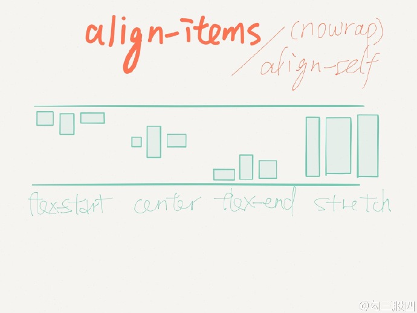
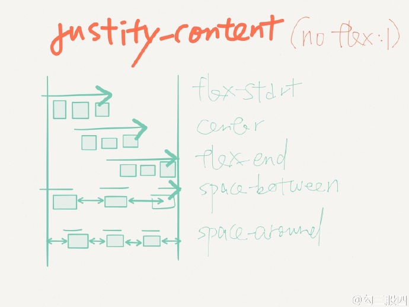
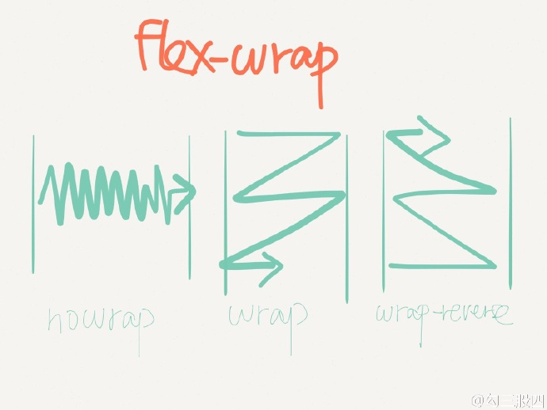

### Text组件

1.字体、文字颜色、文字对齐方式

```
<Text style={{fontSize:20, color:'red', {textAlign:'center'}}/>
```


2.背景：

```
<View style={{height:100, width:100, backgroundColor:'orange', borderRadius:5}}/>
```

3.圆角背景：

```
<View style={{height:100, width:100, backgroundColor:'orange', borderRadius:5}}>
  <Text style={{flex:1,backgroundColor:'transparent'}}>Text Content</Text>
</View>
```

## Flex 布局

### flex-direction


在组件的style中指定`flexDirection`可以决定布局的主轴。
子元素是应该沿着水平轴(`row`)方向排列，还是沿着竖直轴(`column`)方向排列呢？默认值是竖直轴(`column`)方向。

链接：[flex-direction](https://developer.mozilla.org/en-US/docs/Web/CSS/flex-direction)

### align-conent


链接：[align-content](https://developer.mozilla.org/en-US/docs/Web/CSS/align-content)

### align-items



在组件的style中指定`alignItems`可以决定其子元素沿着次轴（与主轴垂直的轴，比如若主轴方向为`row`，则次轴方向为`column`）的排列方式。
子元素是应该靠近次轴的起始端还是末尾段分布呢？亦或应该均匀分布？对应的这些可选项有：`flex-start`、`center`、`flex-end`以及`stretch`。

注意：要使`stretch`选项生效的话，子元素在次轴方向上不能有固定的尺寸。

链接：[align-items](https://developer.mozilla.org/en-US/docs/Web/CSS/align-items)

### justify-content



在组件的style中指定`justifyContent`可以决定其子元素沿着主轴的排列方式。
子元素是应该靠近主轴的起始端还是末尾段分布呢？亦或应该均匀分布？对应的这些可选项有：`flex-start`、`center`、`flex-end`、`space-around`以及`space-between`。

链接：[justify-content](https://developer.mozilla.org/en-US/docs/Web/CSS/justify-content)

### flex-wrap



链接：[flex-wrap](https://developer.mozilla.org/en-US/docs/Web/CSS/flex-wrap)

### 常用

```
<view>
    <view style="{{height:100,width:100,backgroundColor:'#eee',alignItems:'center'}}">
        <text>水平居中</text>
    </view>
    <view style="{{height:100,width:100,backgroundColor:'green',justifyContent:'center'}}">
        <text>垂直居中</text>
    </view>
    <view style="{{height:100,width:100,backgroundColor:'red',alignItems:'center',justifyContent:'center'}}">
        <text>水平垂直居中</text>
    </view>
</view>
```

## 其他属性

### 边框

`borderWidth` `borderTopWidth` `borderRightWidth` `borderLeftWidth` `borderBottomWidth`

和CSS上的`border-width`等表现一致

### flex

当flex为正整数值，它会按照比例来控制控件的大小，效果类似于Android里面的`layoutWeight`属性

### left right top 

left值是指将本组件定位到距离左边多少个逻辑像素（左边的定义取决于position属性）。

它的表现和CSS上的left类似，但注意在React Native上只能使用逻辑像素值（数字单位），而不能使用百分比、em或是任何其他单位。

https://developer.mozilla.org/en-US/docs/Web/CSS/left

### margin

margin marginBottom marginLeft marginRight marginTop marginVertical marginHorizontal 

### maxHeight maxWidth minHeight minWidth width 

### padding

paddingBottom paddingHorizontal paddingLeft paddingRight paddingTop paddingVertical

### position
