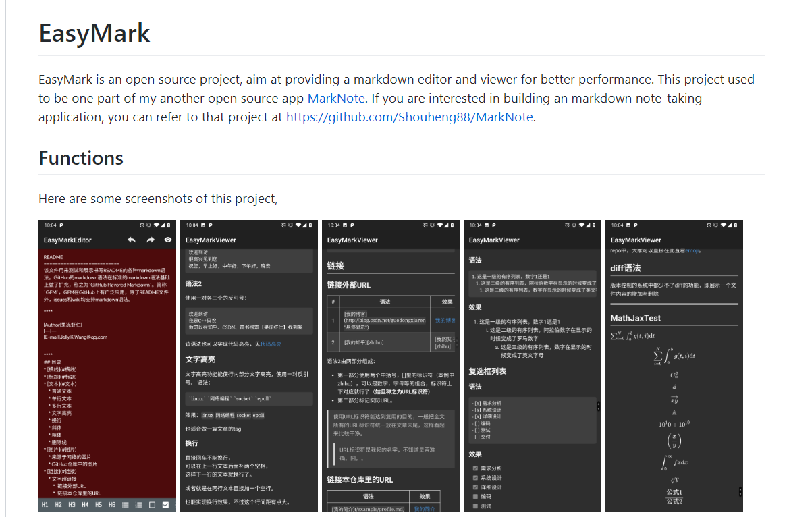
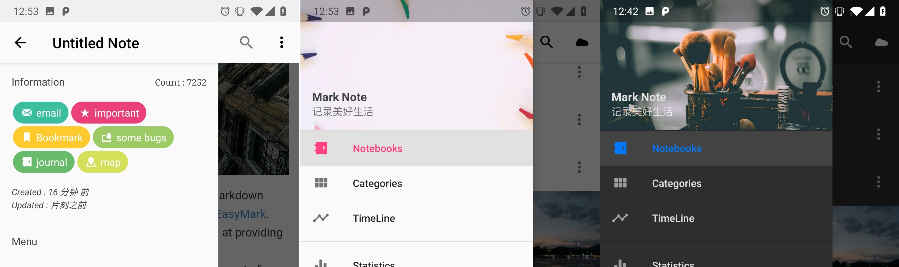

# 承上启下：Markdown 笔记应用 MarkNote 的重构之路

## 1、关于项目

**MarkNote** 是一款 Android 端的笔记应用，它支持非常多的 Markdown 基础语法，还包括了 MathJax, Html 等各种特性。此外，你还可以从相机或者相册中选择图象并将其添加到自己的笔记中。这很酷！因为你可以将自己的游记或者其他图片拍摄下来并将其作为自己笔记的一部分。这也是笔者开发这款软件的目的——希望 MarkNote 能够成为一款帮助用户记录自己生活的笔记应用。

下面是我自己制作的一张部分功能预览图。这里仅仅列举了其中的部分页面，当然，你可以在酷安网或者 Google Play Store 上面获取到这个应用程序，并进一步了解它的全部功能，也可以在 Github 上得到最新版的应用的全部源代码。

 

项目相关的**链接**：

1. [酷安网下载链接：https://www.coolapk.com/apk/178276](https://www.coolapk.com/apk/178276)
2. [Google Play Store 下载：https://play.google.com/store/apps/details?id=me.shouheng.notepal](https://play.google.com/store/apps/details?id=me.shouheng.notepal)
3. [Github 项目链接：https://github.com/Shouheng88/MarkNote](https://github.com/Shouheng88/MarkNote)

**最后**，之所以把这次重构称为 “承上启下” 的一个很重要的原因是：这次重构代码其实是为了后续功能的开发铺路。在未来，我会为这个应用增加更多有趣的功能。如果你对该项目感兴趣的话，可以 **Star** 或者 **Fork** 该项目，并为项目贡献代码。我们欢迎任何的、即使很小的贡献 :)

## 2、关于重构

在之前的版本中，MarkNote 在功能、界面和代码方面都存在一些不足，所以，前些日子我又专门抽了些时间对这些不足的地方进行了一些优化，时间大概从 11 月中旬直到 12 月中旬。这次重构也进行了大量的代码优化。经过这次重构，项目增加了大概 100 多次 commit. 下面我们列举一下本次重构所涉及的部分，其实也是这段时间以来学习到的东西的一些总结。

### 2.1 项目结构优化

#### 2.1.1 包结构优化

首先，在之前笔者已经对项目的整个结构做了一次调整，主要是将项目中各个模块的位置进行了调整。这部分内容主要是项目中的 Gradle 配置和项目文件的路径的修改。在 `settings.gradle` 里面，我按照下面的方式指定了依赖的各个模块的路径：

    include ':app', ':commons', ':data', ':pinlockview', ':fingerprint'
    project(':commons').projectDir = new File('../commons')
    project(':data').projectDir = new File('../data')
    project(':pinlockview').projectDir = new File('../pinlockview')
    project(':fingerprint').projectDir = new File('../fingerprint')

这种方式最大的好处就是，项目中的 `app`, `commons`, `data` 等模块的文件路径处于相同的层次中，即：

    --MarkNote
         |----client
         |----commons
         |----data
         ....

这个调整当然是为了组件化开发做准备啦，当然这样的结构相比于将各个模块全部放置在 `client` 下面清晰得多。

其次，我将项目中已经比较成熟的部分打包成了 `aar`，并直接引用该包，而不是继续将其作为一个依赖的形式。这样又进一步简化了项目的结构。

最后是项目中的功能模块的拆分。在之前的项目中，Markdown 编辑器和解析、渲染相关的代码都被我放置在项目所引用的一个模块中。而这次，我直接将这个部分拆成了一个单独的项目并将其开源到了 Github. 

这么做的主要目的是：

1. 将核心的功能模块从项目中独立出来单独开发，以实现更多的功能并提升该部分的性能；
2. 开源，希望能够帮助想实现一个 Markdown 笔记的开发者快速集成这个功能；
3. 开源，希望能够有开发者参与进行以提升这部分的功能。

关于 Markdown 处理的部分被开源到了 Github，其地址是：https://github.com/Shouheng88/EasyMark ，该项目中同时还包含了一个非常好用的编辑器菜单控件，感兴趣的同学可以关注一下这个项目。

#### 2.1.2 MVVM 调整

在该项目中，我们一直使用的是最新的 MVVM 设计模式，只是可惜的是在之前的版本中，笔者对 MVVM 的理解不够深入，所以导致程序的结构更像是 MVP. 本次，我们对这个部分做了优化，使其更符合 MVVM 设计原则。

以笔记列表界面为例，当我们获取了对应于 Fragment 的 ViewModel 之后，我们统一在 `addSubscriptions()` 方法中对其通知进行订阅：

        viewModel.getMutableLiveData().observe(this, resources -> {
            assert resources != null;
            switch (resources.status) {
                case SUCCESS:
                    adapter.setNewData(resources.data);
                    getBinding().ivEmpty.showEmptyIcon();
                    break;
                case LOADING:
                    getBinding().ivEmpty.showProgressBar();
                    break;
                case FAILED:
                    ToastUtils.makeToast(R.string.text_failed);
                    getBinding().ivEmpty.showEmptyIcon();
                    break;
            }
        });

这里返回的 resources，是封装的 `Resource` 的实例，是用来向观察者传递程序执行结果的包装类。然后，我们会使用 ViewModel 的 `fetchMultiItems()` 方法来根据之前传入的页面的状态信息拉取笔记记录：

    public Disposable fetchMultiItems() {
        if (mutableLiveData != null) {
            mutableLiveData.setValue(Resource.loading(null));
        }
        return Observable.create((ObservableOnSubscribe<List<NotesAdapter.MultiItem>>) emitter -> {
            List<NotesAdapter.MultiItem> multiItems = new LinkedList<>();
            List list;
            if (category != null) {
                switch (status) {
                    case ARCHIVED: list = ArchiveHelper.getNotebooksAndNotes(category);break;
                    case TRASHED: list = TrashHelper.getNotebooksAndNotes(category);break;
                    default: list = NotebookHelper.getNotesAndNotebooks(category);
                }
            } else {
                switch (status) {
                    case ARCHIVED: list = ArchiveHelper.getNotebooksAndNotes(notebook);break;
                    case TRASHED: list = TrashHelper.getNotebooksAndNotes(notebook);break;
                    default: list = NotebookHelper.getNotesAndNotebooks(notebook);
                }
            }
            for (Object obj : list) {
                if (obj instanceof Note) {
                    multiItems.add(new NotesAdapter.MultiItem((Note) obj));
                } else if (obj instanceof Notebook) {
                    multiItems.add(new NotesAdapter.MultiItem((Notebook) obj));
                }
            }
            emitter.onNext(multiItems);
        }).observeOn(Schedulers.io()).observeOn(AndroidSchedulers.mainThread()).subscribe(multiItems -> {
            if (mutableLiveData != null) {
                mutableLiveData.setValue(Resource.success(multiItems));
            }
        });
    }

从上面也可以看出，我们将从数据库中获取到数据的许多逻辑放在了 ViewModel 中，并且每当想要拉取数据的时候调用一下 `fetchMultiItems()` 方法即可。这样，我们可以大大地减少 View 层的代码量。 View 层的逻辑也因此变得清晰得多。

### 2.2 界面优化：更纯粹的质感设计

记得在 Material Design 刚推出的时候，笔者和许多其他开发者一样兴奋。不过，在实际的开发过程中我却总是感觉不得要领，总觉少了一些什么。不过，经过前段时间的学习，我对在应用中实现质感设计有了更多的认识。

#### 2.2.1 Toolbar 的阴影效果

在之前的版本中，为了实现工具栏下面的阴影效果，我使用了在 Toolbar 下面增加一个高度为 `5dp` 的控件并为设置一个渐变背景的实现方式。这种实现方式可以完美兼容 Android 系统的各个版本。但是，这种实现的效果没有系统自带的显得那么自然。在新的版本中，我使用了下面的方式来实现阴影的效果：

    <android.support.design.widget.CoordinatorLayout
        android:layout_width="match_parent"
        android:layout_height="match_parent"
        android:fitsSystemWindows="true"
        tools:context=".activity.SearchActivity">

        <me.shouheng.commons.widget.theme.SupportAppBarLayout
            android:id="@+id/bar_layout"
            android:layout_width="match_parent"
            android:layout_height="wrap_content"
            android:background="?attr/colorPrimary">

            <android.support.v7.widget.Toolbar
                android:id="@+id/toolbar"
                android:layout_width="match_parent"
                android:layout_height="?attr/actionBarSize"
                android:background="?attr/colorPrimary"/>

        </me.shouheng.commons.widget.theme.SupportAppBarLayout>

    ...

这里的 `SupportAppBarLayout` 继承自支持包的 `AppBarLayout`，主要用来实现日夜间主题的兼容。这样 Toolbar 下面就会带有一个漂亮的阴影，但是在比较低版本的手机上面是没有效果的，所以，为了兼容低版本的手机还要使用之前的那种使用控件填充的方式。（在新版本中暂时没有做这个处理）

#### 2.2.2 日夜间主题兼容

在之前的项目中，支持 20 多种主题颜色和强调色，不过最近随着 Google 在自己的项目中逐渐采用纯白色的设计，我也抛弃了之前的逻辑。现在整个项目中只支持三种主题：

1. 白色的主题 + 蓝色的强调色
2. 白色的主题 + 粉红的强调色
3. 黑色的主题 + 蓝色的强调色

对于主题的支持，我依然延续了之前的实现方式——通过重建 Activity 来实现主题的切换。同时，为了达到某些控件随着主题自适应调整的目的，我定义了一些自定义控件，并在其中根据当前的设置选择使用的颜色。而对于其他可以直接使用项目中的强调色或者主题色的部分，我们可以直接使用当前的主题的值，比如下面的 Toolbar 的背景颜色会使用当前主题中的 `主题色`：

    <android.support.v7.widget.Toolbar
        android:id="@+id/toolbar"
        android:layout_width="match_parent"
        android:layout_height="?attr/actionBarSize"
        android:background="?attr/colorPrimary"/>

#### 2.2.3 启动页优化

之前的版本中在第一次打开程序的时候会有一个启动页来展示程序的功能，新版本中直接移除了这个功能。取而代之的是使用启动页来进行优化，首秀定义一个主题。这个主题只应用于第一次打开的 Activity。

    

这里，我们将界面的背景更换成我们自己的项目的图标，因为项目图标中使用的颜色与状态栏的颜色不一致，所以，这里又重写了 `colorPrimaryDark` 属性以将状态栏的颜色和启动页的颜色设置成相同的效果：

    <layer-list xmlns:android="http://schemas.android.com/apk/res/android">
        <item>
            <color android:color="#00a0e9"/>
        </item>
        <item>
            <bitmap
                android:src="@drawable/mn"
                android:tileMode="disabled"
                android:gravity="center"/>
        </item>
    </layer-list>

这种实现方式的效果是，在程序打开的时候不会存在白屏。之前的白屏会被我们指定的启动页替换掉（因为这个启动页是该 Activity 的窗口的背景）。当然，当页面打开完毕之后你还要在程序中将启动页背景替换掉。这样优化之后程序打开的时候显得更加自然、流畅。

#### 2.2.4 动画优化

因为时间的原因，在当前的版本中，我并没有加入太多的动画，而只是对程序中的一些地方增加了动画的效果。

在笔记的列表中，我使用了下面的动画效果。这样当打开列表界面的时候各个条目会存在自底向上的进入动画。

    private int lastPosition = -1;

    @Override
    protected void convert(BaseViewHolder helper, MultiItem item) {
        // ... 
        /* Animations */
        if (PalmUtils.isLollipop()) {
            setAnimation(helper.itemView, helper.getAdapterPosition());
        } else {
            if (helper.getAdapterPosition() > 10) {
                setAnimation(helper.itemView, helper.getAdapterPosition());
            }
        }
    }

    private void setAnimation(View viewToAnimate, int position) {
        if (position > lastPosition) {
            Animation animation = AnimationUtils.loadAnimation(mContext, R.anim.anim_slide_in_bottom);
            viewToAnimate.startAnimation(animation);
            lastPosition = position;
        }
    }

不过，这种方式实现的并不是最理想的效果，因为当打开页面的时候，多条记录会以一个整体的形式进入到页面中。这也是以后的一个优化的地方。

### 2.3 使用 RxJava 重构

在之前的项目中，当进行异步的操作的时候，需要定义一个 `AsyncTask`. 这种实现方式存在一个明显的问题，当需要执行的异步任务比较多，又无法进行复用的时候，你需要定义大量的 `AsyncTask`。另外，在各个页面之间进行数据传递的时候，如果单纯地使用 `onActivityResult()` 或者进行接口回调（Fragment 和 Activity 之间）会使得代码繁琐、难以阅读。针对这些问题，我们可以使用 RxJava 来进行很好的优化。

首先是异步操作的问题，我们可以使用 RxJava 来实现线程的切换。以下面的这段代码为例，它被用来实现保存`快速笔记`的结果到文件系统和数据库中。在这段代码中，我们使用了 RxJava 的 `create()` 方法，并在其中进行逻辑的处理，然后使用 `subscribeOn()` 方法指定处理的线程是 IO 线程，并使用 `observeOn()` 方法指定最终处理的结果在主线程中进行处理：
 
    public Disposable saveQuickNote(@NonNull Note note, QuickNote quickNote, @Nullable Attachment attachment) {
        return Observable.create((ObservableOnSubscribe<Note>) emitter -> {
            /* Prepare note content. */
            String content = quickNote.getContent();
            if (attachment != null) {
                attachment.setModelCode(note.getCode());
                attachment.setModelType(ModelType.NOTE);
                AttachmentsStore.getInstance().saveModel(attachment);
                if (Constants.MIME_TYPE_IMAGE.equalsIgnoreCase(attachment.getMineType())
                        || Constants.MIME_TYPE_SKETCH.equalsIgnoreCase(attachment.getMineType())) {
                    content = content + " + ")";
                } else {
                    content = content + " + ")";
                }
            }
            note.setContent(content);
            note.setTitle(NoteManager.getTitle(quickNote.getContent(), quickNote.getContent()));
            note.setPreviewImage(quickNote.getPicture());
            note.setPreviewContent(NoteManager.getPreview(note.getContent()));

            /* Save note to the file system. */
            String extension = UserPreferences.getInstance().getNoteFileExtension();
            File noteFile = FileManager.createNewAttachmentFile(PalmApp.getContext(), extension);
            try {
                Attachment atFile = ModelFactory.getAttachment();
                FileUtils.writeStringToFile(noteFile, note.getContent(), Constants.NOTE_FILE_ENCODING);
                atFile.setUri(FileManager.getUriFromFile(PalmApp.getContext(), noteFile));
                atFile.setSize(FileUtils.sizeOf(noteFile));
                atFile.setPath(noteFile.getPath());
                atFile.setName(noteFile.getName());
                atFile.setModelType(ModelType.NOTE);
                atFile.setModelCode(note.getCode());
                AttachmentsStore.getInstance().saveModel(atFile);
                note.setContentCode(atFile.getCode());
            } catch (IOException e) {
                emitter.onError(e);
            }

            /* Save note. */
            NotesStore.getInstance().saveModel(note);

            emitter.onNext(note);
        }).subscribeOn(Schedulers.io()).observeOn(AndroidSchedulers.mainThread()).subscribe(note1 -> {
            if (saveNoteLiveData != null) {
                saveNoteLiveData.setValue(Resource.success(note1));
            }
        });
    }

另外是界面之间的结果传递的问题。对于 `onActivityResult()` 的执行结果，我们使用自定义的 `RxBus` 来传递信息，它的作用类似于 `EventBus`。然后，我们为此而封装了一个 `RxMessage` 对象来包装返回的结果。但是在程序中，我们尽量来简化和减少这种代码，因为过多的全局消息会让代码调试变得更加困难。我们希望代码逻辑更加简单、清晰。

RxJava 除了能够完成线程切换的任务之外，对代码的可读性的提升效果也是非常明显的。另外，它还非常适用于局部的优化，比如，我们可以很轻易地改变自己的代码来将某个耗时逻辑放在异步线程中执行来提升界面的响应速度。

### 2.4 增加新功能

#### 2.4.1 桌面快捷方式

桌面快捷方式并不是所有的 Android 桌面都支持的，我们在程序中有两个地方使用它。如下图所示，第一种方式是在笔记内部点击创建快捷方式的时候在桌面创建应用的快捷方式，我们可以通过点击快捷方式来快速打开笔记；第二种方式是长按应用图标的时候弹出一个菜单选项。

首先，第一种实现方式是在 7.0 之后加入的，之前我们也是可以创建快捷方式的，只是实现的方式与现在的方式不同而已。如下面这段代码所示，当 7.0 之后，我们使用 ShortcutManager 来创建快捷方式。之前，我们可以使用 "com.android.launcher.action.INSTALL_SHORTCUT" 这个 ACTION 并指定参数来创建快捷方式：

    public static void createShortcut(Context context, @NonNull Note note) {
        Context mContext = context.getApplicationContext();
        Intent shortcutIntent = new Intent(mContext, MainActivity.class);
        shortcutIntent.putExtra(SHORTCUT_EXTRA_NOTE_CODE, note.getCode());
        shortcutIntent.setAction(SHORTCUT_ACTION_VIEW_NOTE);

        if (VERSION.SDK_INT >= VERSION_CODES.N_MR1) {
            ShortcutManager mShortcutManager = context.getSystemService(ShortcutManager.class);
            if (mShortcutManager != null && VERSION.SDK_INT >= VERSION_CODES.O) {
                if (mShortcutManager.isRequestPinShortcutSupported()) {
                    ShortcutInfo pinShortcutInfo = new Builder(context, String.valueOf(note.getCode()))
                            .setShortLabel(note.getTitle())
                            .setLongLabel(note.getTitle())
                            .setIntent(shortcutIntent)
                            .setIcon(Icon.createWithResource(context, R.drawable.ic_launcher_round))
                            .build();

                    Intent pinnedShortcutCallbackIntent = mShortcutManager.createShortcutResultIntent(pinShortcutInfo);

                    PendingIntent successCallback = PendingIntent.getBroadcast(context, /* request code */ 0,
                            pinnedShortcutCallbackIntent, /* flags */ 0);

                    mShortcutManager.requestPinShortcut(pinShortcutInfo, successCallback.getIntentSender());
                }
            } else {
                createShortcutOld(context, shortcutIntent, note);
            }
        } else {
            createShortcutOld(context, shortcutIntent, note);
        }
    }

    private static void createShortcutOld(Context context, Intent shortcutIntent, Note note) {
        Intent addIntent = new Intent();
        addIntent.putExtra(Intent.EXTRA_SHORTCUT_INTENT, shortcutIntent);
        addIntent.putExtra(Intent.EXTRA_SHORTCUT_NAME, note.getTitle());
        addIntent.putExtra(Intent.EXTRA_SHORTCUT_ICON_RESOURCE,
                Intent.ShortcutIconResource.fromContext(context, R.drawable.ic_launcher_round));
        addIntent.setAction("com.android.launcher.action.INSTALL_SHORTCUT");
        context.sendBroadcast(addIntent);
    }

对于第二种实现方式，我们可以在 Manifest 文件中进行注册，并为其指定 ACTION 和启动类来实现各个选项被点击之后发送的事件。然后，我们在指定的 Activity 中对各个 ACTION 进行处理即可，具体可以参考源代码。另外，这里的快速创建笔记还是比较有意思的，可以打开一个背景透明的 Activity 并在其中弹出一个自定义对话框来快速编辑笔记。可以帮助我们快速地记录自己的笔记。

#### 2.4.2 指纹解锁 

当然，这部分功能，我们直接使用了一个开源的三方库。毕竟人家为还为各个系统的指纹解锁的支持做了处理，所以这里我们直接奉行拿来主义了。这个项目的地址是：https://github.com/uccmawei/FingerprintIdentify. 

#### 2.4.3 打开网页的各种问题

打开网页当然不难实现，我们使用一个自定义的 WebView 即可实现。不过，在这个项目的重构版本中，我们采用了一个开源的库 AgentWeb，它可以满足我们非常多场景的应用。

另外，因为在我们的新的重构版本中，将支持包和 targetApi 都提升到了 28，所以出现了一个问题：使用 `http` 的网页无法打开。为了解决这个问题，我们需要在 Manifest 文件中指定网络配置文件的地址：

    android:networkSecurityConfig="@xml/network_security_config"

然后，在该配置文件中指定我们可以访问的 http 白名单：

    <?xml version="1.0" encoding="utf-8"?>
    <network-security-config>
        <domain-config cleartextTrafficPermitted="true">
            <domain includeSubdomains="true">mikecrm.com</domain>
            <domain includeSubdomains="true">m.weibo.cn</domain>
        </domain-config>
    </network-security-config>

在这里我们还发现了一个其他的问题：我们打开网页的时候设置的 Weibo 的链接是 https 的，但是因为我们在移动设备上面使用，所以又被重定向到了 `http://m.weibo.cn`，导致我们的网页无法打开。解决的方式即按照上面那样，将重定向之后的地址添加到白名单之中即可。

#### 2.4.4 其他

1. 在新的版本中，为了帮助我们进一步优化程序，我们使用了友盟进行埋点。
2. 不注册支付宝和微信支付账号进行打赏；
3. 分享相关的逻辑等；
4. 其他：新版本中我们还增加了许多其他的逻辑，如果你感兴趣的话可以查看下代码。

## 3、总结

上面我们介绍了项目的一些内容和新版本重构时加入的新功能等。这些新加入的东西也算是这段时间以来学习成果的一个小集合。当然，因为毕竟业余时间有限，代码中可能仍然存在一些不足和设计不良的地方，如果你发现了这些不愉快的问题，可以在 Github 上面为项目提 issue，很乐意与你沟通和学习！

最后，重申一下项目相关的链接：

1. [酷安网下载链接：https://www.coolapk.com/apk/178276](https://www.coolapk.com/apk/178276)
2. [Google Play Store 下载：https://play.google.com/store/apps/details?id=me.shouheng.notepal](https://play.google.com/store/apps/details?id=me.shouheng.notepal)
3. [Github 项目链接：https://github.com/Shouheng88/MarkNote](https://github.com/Shouheng88/MarkNote)

------
**如果您喜欢我的文章，可以在以下平台关注我：**

- 博客：[https://shouheng88.github.io/](https://shouheng88.github.io/)
- 掘金：[https://juejin.im/user/585555e11b69e6006c907a2a](https://juejin.im/user/585555e11b69e6006c907a2a)
- Github：[https://github.com/Shouheng88](https://github.com/Shouheng88)
- CSDN：[https://blog.csdn.net/github_35186068](https://blog.csdn.net/github_35186068)
- 微博：[https://weibo.com/u/5401152113](https://weibo.com/u/5401152113)

更多文章：[Gihub: Android-notes](https://github.com/Shouheng88/Android-notes)
