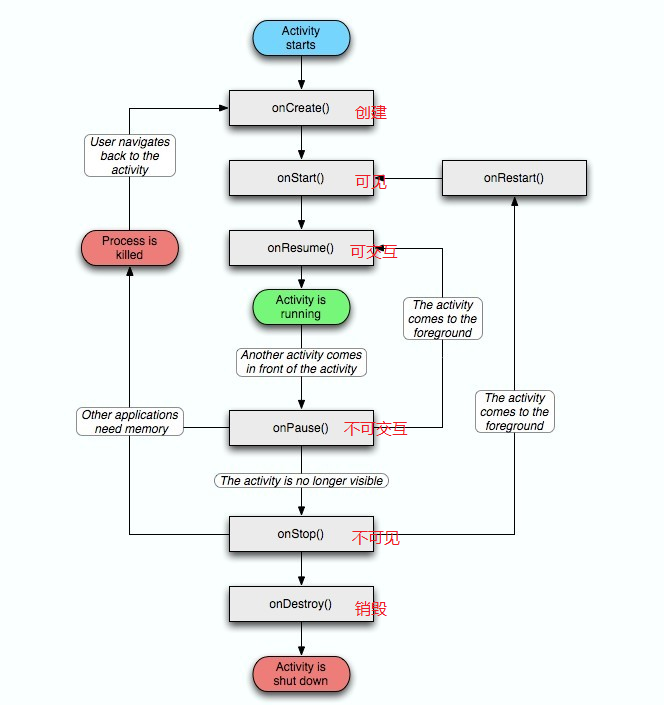

# Android 基础回顾：Activity 基础

## 1、Activity 的生命周期

### 1.1 一般情况下的生命周期

下图是一般情况下一个 Activity 将会经过的生命周期的流程图：

关于上图中生命周期方法的说明：

1. **onCreate() / onDestroy()**：onCreate() 表示 Activity 正在被创建，可以用来做初始化工作；onDestroy() 表示 Activity 正在被销毁，可以用来做释放资源的工作；
2. **onStart() / onStop()**：onStart() 在 Activity 从不可见变成可见的时候被调用；onStop() 在 Activity 从可见变成不可见的时候被调用；
3. **onRestart()**：在 Activity 从不可见到变成可见的过程中被调用；
4. **onResume() / onPause()**：onResume() 在 Activity() 可以与用户交互的时候被调用，onPause() 在 Activity 不可与用户交互的时候被调用。

所以根据上面的分析，我们可以将Activity的生命周期概况为：**创建->可见->可交互->不可交互->不可见->销毁**。因此，我们可以得到下面的这张图：

### 1.2 特殊情况下的生命周期

这里我们总结一下在实际的使用过程中可能会遇到的一些 Acitivity 的生命周期过程：

1. **当用户打开新的 Activity 或者切换回桌面**：会经过的生命周期为 `onPause()->onStop()`。因为此时 Activity 已经变成不可见了，当然，如果新打开的 Activity 用了透明主题，那么 onStop() 不会被调用，因此原来的 Activity 只是不能交互，但是仍然可见。
2. **从新的 Activity 回到之前的 Activity 或者从桌面回到之前的 Activity**：会经过的生命周期为 `onRestart()->onStart()-onResume()`。此时是从 onStop() 经 onRestart() 回到 onResume() 状态。
3. 如果在上述 1 的情况下，进入后台的 Activity 因为内存不足被销毁了，那么当再次回到该 Activity 的时候，生命周期方法将会从 onCreate() 开始执行到 onResume()。
4. **当用户按下 Back 键时**：如果当前 Activity 被销毁，那么经过的生命周期将会是 `onPause()->onStop()->onDestroy()`。

具体地，当存在两个 Activity，分别是 A 和 B 的时候，在各种情况下，它们的生命周期将会经过：

1. **Back 键 Home 键**
    1. 当用户点击 A 中按钮来到 B 时，假设 B 全部遮挡住了 A，将依次执行：`A.onPause()->B.onCreate()->B.onStart()->B.onResume->A.onStop()`。
    2. 接1，此时如果点击 Back 键，将依次执行：`B.onPause()->A.onRestart()->A.onStart()->A.onResume()->B.onStop()->B.onDestroy()`。
    3. 接2，此时如果按下 Back 键，系统返回到桌面，并依次执行：`A.onPause()->A.onStop()->A.onDestroy()`。
    4. 接2，此时如果按下 Home 键（非长按），系统返回到桌面，并依次执行`A.onPause()->A.onStop()`。由此可见，Back 键和 Home 键主要区别在于是否会执行 onDestroy()。
    5. 接2，此时如果长按 Home 键，不同手机可能弹出不同内容，Activity 生命周期未发生变化。
2. **横竖屏切换时 Activity 的生命周期**
    1. 不设置 Activity 的 `android:configChanges` 时，切屏会重新调用各个生命周期，切横屏时会执行一次，切竖屏时会执行两次。
    2. 设置 Activity 的 `android:configChanges=“orientation”` 时，切屏还是会重新调用各个生命周期，切横、竖屏时只会执行一次。
    3. 设置 Activity 的 `android:configChanges=“orientation|keyboardHidden”` 时，切屏不会重新调用各个生命周期，只会执行 onConfiguration() 方法。

### 1.3 onSaveInstanceState() 和 onRestoreInstanceState()

当 Activity 被销毁的时候回调用 `onSaveInstanceState()` 方法来存储当前的状态。这样当 Activity 被重建的时候，可以在 `onCreate()` 和 `onRestoreInstanceState()` 中恢复状态。

对于 targetAPI 为 28 及以后的应用，该方法会在 `onStop()` 方法之后调用，对于之前的设备，这方法会在 `onStop()` 之前调用，但是无法确定是在 `onPause()` 之前还是之后调用。

`onRestoreInstanceState()` 方法用来恢复之前存储的状态，它会在 `onStart()` 和 `onPostCreate()` 之间被调用。此外，你也可以直接在 `onCreate()` 方法中进行恢复，但是基于这个方法调用的时机，如果有特别需求，可以在这个方法中进行处理。

## 2、Activity 的启动模式

Activity 共有四种启动模式：

1. **standard**：默认，每次启动的时候会创建一个新的实例，并且被创建的实例所在的栈与启动它的 Activity 是同一个栈。比如，A 启动了 B，那么 B 将会与 A 处在同一个栈。假如，我们使用 Application 的 Context 启动一个 Activity 的时候会抛出异常，这是因为新启动的 Activity 不知道自己将会处于哪个栈。可以在启动 Activity 的时候使用 `FLAG_ACTIVITY_NEW_TASK`。这样新启动的 Acitivyt 将会创建一个新的栈。
2. **singleTop**：栈顶复用，如果将要启动的 Activity 已经位于栈顶，那么将会复用栈顶的 Activity，并且会调用它的 `onNewIntent()`。常见的应用场景是从通知打开 Activity 时。
3. **singleTask**：单例，如果启动它的任务栈中存在该 Activity，那么将会复用该 Activity，并且会将栈内的、它之上的所有的 Activity 清理出去，以使得该 Activity 位于栈顶。常见的应用场景是启动页面、购物界面、确认订单界面和付款界面等。
4. **singleInstance**：这种启动模式会在启动的时候为其指定一个单独的栈来执行。如果用同样的intent 再次启动这个 Activity，那么这个 Activity 会被调到前台，并且会调用其 `onNewIntent()` 方法。

## 3、Activity 的 Flags

1. **FLAG_ACTIVITY_CLEAR_TOP** : 会清理掉该栈中位于 Activity 上面的所有的 Activity，通常与 FLAG_ACTIVITY_NEW_TASK 配合使用；
2. **FLAG_ACTIVITY_SINGLE_TOP**: 同样等同于 mainfest 中配置的 singleTop;
3. **FLAG_ACTIVITY_EXCLUDE_FROM_RECENTS**: 对应于 mainfest 中的属性为`android:excludeFromRecents="true"`，当用户按了 “最近任务列表” 时，该任务不会出现在最近任务列表中，可达到隐藏应用的目的。
4. **FLAG_ACTIVITY_NO_HISTORY**: 对应于 mainfest 中的 `android:noHistory="true"`。这个 FLAG 启动的 Activity，一旦退出，它不会存在于栈中。
5. **FLAG_ACTIVITY_NEW_TASK**: 等同于 mainfest 中配置的 singleTask.

