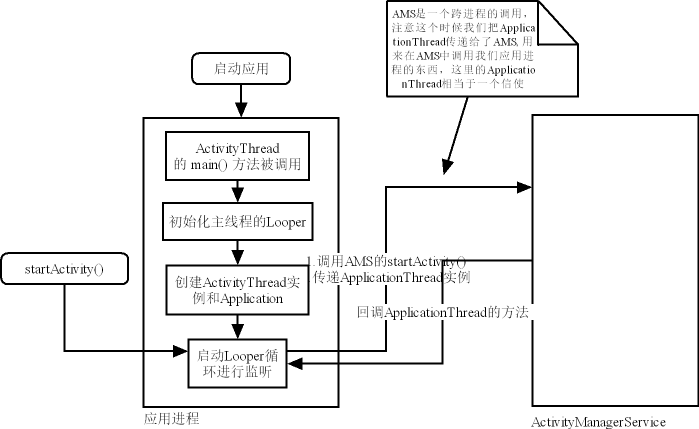

走马观花，把 Activity 看个明白

这篇文章中我们将来彻底梳理一下 Android 当中的 Activity. 

## Activity 

在讲 Activity 的工作流程之前应该先大体上讲一下其工作的流程，然后介绍一下与其相关的几个主要类的作用。



因为其涉及的类比较多，它们又分别在不同的时机扮演不同的角色，如果没有在开始的时候对其进行一一介绍的话，理解起来比较费力。

- ActivityManagerService ：https://android.googlesource.com/platform/frameworks/base/+/master/services/core/java/com/android/server/am/ActivityManagerService.java


我们首先分析下 Android 中非常常用的两种通信机制，一个是跨进程的通信机制 Binder，另一个是进程中的通信机制 Handler. Handler 会为每个线程创建一个消息队列，你的任务会被加入到消息队列中执行。同时它可以用来实现跨线程的调用。笔者在之前的文章中分析过 Handler 的用法，可以参考这篇文章 [《ssss》]()。笔者曾分析过 Binder 相关的东西，这里我们先简单介绍下：

通常我们不会直接创建 Binder 相关的类，而是使用 AIDL。在 Android 的 framework 层代码里包含了太多的 AIDL 调用。AIDL 是一种接口描述语言，用来简化 Binder 使用的。在 AIDL 中有几个重要的角色：

- Stub
- Proxy

实际上在 Android 的 framework 层中有许多跨进程的调用，只是它们往往被封装成了 Manager 的形式，所以你感受不到它的存在而已。


抛开系统启动的过程不讲，这里我们分析下系统启动完毕，启动了某个应用之后的逻辑。当启动某个应用的时候，我们的 ActivityThread 的 main() 静态方法将会被触发。在这个方法中主要的工作有：

1. 准备主线程的 Looper；
2. 初始化一个 ActivityThread 实例，会同时创建 H；
3. 创建一个 Application 实例；？？？
4. 主线程的 Looper 开始循环监听。


startActivity 拥有多个重载方法，但是它们最后都将调用下面的这个方法：

## Procedure to start activity when app launched:

```java
    // android.app.Activity
    public void startActivityForResult(String who, Intent intent, int requestCode, @Nullable Bundle options) {
        Uri referrer = onProvideReferrer();
        if (referrer != null) {
            intent.putExtra(Intent.EXTRA_REFERRER, referrer);
        }
        options = transferSpringboardActivityOptions(options);
        Instrumentation.ActivityResult ar =
            mInstrumentation.execStartActivity(
                this, mMainThread.getApplicationThread(), mToken, who,
                intent, requestCode, options); // Here
        if (ar != null) {
            mMainThread.sendActivityResult(
                mToken, who, requestCode,
                ar.getResultCode(), ar.getResultData()); // Q: 发送结果，然后启动它的 Activity 在 onActivityResult() 中处理吗？
        }
        cancelInputsAndStartExitTransition(options);
    }

    // android.app.Instrumentation
    public ActivityResult execStartActivity(
        Context who, IBinder contextThread, IBinder token, String target,
        Intent intent, int requestCode, Bundle options) {
        IApplicationThread whoThread = (IApplicationThread) contextThread;
        if (mActivityMonitors != null) {
            synchronized (mSync) {
                final int N = mActivityMonitors.size();
                for (int i=0; i<N; i++) {
                    final ActivityMonitor am = mActivityMonitors.get(i);
                    ActivityResult result = null;
                    if (am.ignoreMatchingSpecificIntents()) {
                        result = am.onStartActivity(intent);
                    }
                    if (result != null) {
                        am.mHits++;
                        return result;
                    } else if (am.match(who, null, intent)) {
                        am.mHits++;
                        if (am.isBlocking()) {
                            return requestCode >= 0 ? am.getResult() : null;
                        }
                        break;
                    }
                }
            }
        }
        try {
            intent.migrateExtraStreamToClipData();
            intent.prepareToLeaveProcess(who);
            int result = ActivityManager.getService()
                .startActivity(whoThread, who.getBasePackageName(), intent,
                        intent.resolveTypeIfNeeded(who.getContentResolver()),
                        token, target, requestCode, 0, null, options); // Here, Go to AMS
            checkStartActivityResult(result, intent); // Q: 是启动检查结果吗？YES!
        } catch (RemoteException e) {
            throw new RuntimeException("Failure from system", e);
        }
        return null;
    }

    // android.app.ActivityManager
    public static IActivityManager getService() {
        return IActivityManagerSingleton.get();
    }

    // android.app.ActivityManager#IActivityManagerSingleton
    private static final Singleton<IActivityManager> IActivityManagerSingleton =
            new Singleton<IActivityManager>() {
                @Override
                protected IActivityManager create() {
                    final IBinder b = ServiceManager.getService(Context.ACTIVITY_SERVICE);
                    final IActivityManager am = IActivityManager.Stub.asInterface(b);
                    return am;
                }
            };

    // com.android.server.am.ActivityManagerService
    public final int startActivityAsUser(IApplicationThread caller, String callingPackage,
            Intent intent, String resolvedType, IBinder resultTo, String resultWho, int requestCode,
            int startFlags, ProfilerInfo profilerInfo, Bundle bOptions, int userId,
            boolean validateIncomingUser) {
        enforceNotIsolatedCaller("startActivity");

        // 检查用户信息
        userId = mActivityStartController.checkTargetUser(userId, validateIncomingUser,
                Binder.getCallingPid(), Binder.getCallingUid(), "startActivityAsUser");

        // obtainStarter 将会返回 ActivityStarter 对象
        return mActivityStartController.obtainStarter(intent, "startActivityAsUser")
                .setCaller(caller)
                .setCallingPackage(callingPackage)
                .setResolvedType(resolvedType)
                .setResultTo(resultTo)
                .setResultWho(resultWho)
                .setRequestCode(requestCode)
                .setStartFlags(startFlags)
                .setProfilerInfo(profilerInfo)
                .setActivityOptions(bOptions)
                .setMayWait(userId)
                .execute();
    }

    // com.android.server.am.ActivityStarter#execute()
    int execute() {
        try {
            if (mRequest.mayWait) {
                return startActivityMayWait(mRequest.caller, mRequest.callingUid,
                        mRequest.callingPackage, mRequest.intent, mRequest.resolvedType,
                        mRequest.voiceSession, mRequest.voiceInteractor, mRequest.resultTo,
                        mRequest.resultWho, mRequest.requestCode, mRequest.startFlags,
                        mRequest.profilerInfo, mRequest.waitResult, mRequest.globalConfig,
                        mRequest.activityOptions, mRequest.ignoreTargetSecurity, mRequest.userId,
                        mRequest.inTask, mRequest.reason,
                        mRequest.allowPendingRemoteAnimationRegistryLookup);
            } else {
                return startActivity(mRequest.caller, mRequest.intent, mRequest.ephemeralIntent,
                        mRequest.resolvedType, mRequest.activityInfo, mRequest.resolveInfo,
                        mRequest.voiceSession, mRequest.voiceInteractor, mRequest.resultTo,
                        mRequest.resultWho, mRequest.requestCode, mRequest.callingPid,
                        mRequest.callingUid, mRequest.callingPackage, mRequest.realCallingPid,
                        mRequest.realCallingUid, mRequest.startFlags, mRequest.activityOptions,
                        mRequest.ignoreTargetSecurity, mRequest.componentSpecified,
                        mRequest.outActivity, mRequest.inTask, mRequest.reason,
                        mRequest.allowPendingRemoteAnimationRegistryLookup);
            }
        } finally {
            onExecutionComplete();
        }
    }

    // com.android.server.am.ActivityStarter#startActivityMayWait()
    private int startActivityMayWait(IApplicationThread caller, int callingUid,
            String callingPackage, Intent intent, String resolvedType,
            IVoiceInteractionSession voiceSession, IVoiceInteractor voiceInteractor,
            IBinder resultTo, String resultWho, int requestCode, int startFlags,
            ProfilerInfo profilerInfo, WaitResult outResult,
            Configuration globalConfig, SafeActivityOptions options, boolean ignoreTargetSecurity,
            int userId, TaskRecord inTask, String reason,
            boolean allowPendingRemoteAnimationRegistryLookup) {
        // Refuse possible leaked file descriptors
        if (intent != null && intent.hasFileDescriptors()) {
            throw new IllegalArgumentException("File descriptors passed in Intent");
        }
        mSupervisor.getActivityMetricsLogger().notifyActivityLaunching();
        boolean componentSpecified = intent.getComponent() != null;

        final int realCallingPid = Binder.getCallingPid();
        final int realCallingUid = Binder.getCallingUid();

        int callingPid;
        if (callingUid >= 0) {
            callingPid = -1;
        } else if (caller == null) {
            callingPid = realCallingPid;
            callingUid = realCallingUid;
        } else {
            callingPid = callingUid = -1;
        }

        // Save a copy in case ephemeral needs it
        final Intent ephemeralIntent = new Intent(intent);
        // Don't modify the client's object!
        intent = new Intent(intent);
        if (componentSpecified
                && !(Intent.ACTION_VIEW.equals(intent.getAction()) && intent.getData() == null)
                && !Intent.ACTION_INSTALL_INSTANT_APP_PACKAGE.equals(intent.getAction())
                && !Intent.ACTION_RESOLVE_INSTANT_APP_PACKAGE.equals(intent.getAction())
                && mService.getPackageManagerInternalLocked()
                        .isInstantAppInstallerComponent(intent.getComponent())) {
            intent.setComponent(null /*component*/);
            componentSpecified = false;
        }

        ResolveInfo rInfo = mSupervisor.resolveIntent(intent, resolvedType, userId, 0 /* matchFlags */,
                computeResolveFilterUid(callingUid, realCallingUid, mRequest.filterCallingUid));
        if (rInfo == null) {
            UserInfo userInfo = mSupervisor.getUserInfo(userId);
            if (userInfo != null && userInfo.isManagedProfile()) {
                UserManager userManager = UserManager.get(mService.mContext);
                boolean profileLockedAndParentUnlockingOrUnlocked = false;
                long token = Binder.clearCallingIdentity();
                try {
                    UserInfo parent = userManager.getProfileParent(userId);
                    profileLockedAndParentUnlockingOrUnlocked = (parent != null)
                            && userManager.isUserUnlockingOrUnlocked(parent.id)
                            && !userManager.isUserUnlockingOrUnlocked(userId);
                } finally {
                    Binder.restoreCallingIdentity(token);
                }
                if (profileLockedAndParentUnlockingOrUnlocked) {
                    rInfo = mSupervisor.resolveIntent(intent, resolvedType, userId,
                            PackageManager.MATCH_DIRECT_BOOT_AWARE
                                    | PackageManager.MATCH_DIRECT_BOOT_UNAWARE,
                            computeResolveFilterUid(
                                    callingUid, realCallingUid, mRequest.filterCallingUid));
                }
            }
        }
        // Collect information about the target of the Intent.
        ActivityInfo aInfo = mSupervisor.resolveActivity(intent, rInfo, startFlags, profilerInfo);

        synchronized (mService) {
            final ActivityStack stack = mSupervisor.mFocusedStack;
            stack.mConfigWillChange = globalConfig != null
                    && mService.getGlobalConfiguration().diff(globalConfig) != 0;

            final long origId = Binder.clearCallingIdentity();

            if (aInfo != null &&
                    (aInfo.applicationInfo.privateFlags
                            & ApplicationInfo.PRIVATE_FLAG_CANT_SAVE_STATE) != 0 &&
                    mService.mHasHeavyWeightFeature) {
                if (aInfo.processName.equals(aInfo.applicationInfo.packageName)) {
                    final ProcessRecord heavy = mService.mHeavyWeightProcess;
                    if (heavy != null && (heavy.info.uid != aInfo.applicationInfo.uid
                            || !heavy.processName.equals(aInfo.processName))) {
                        int appCallingUid = callingUid;
                        if (caller != null) {
                            ProcessRecord callerApp = mService.getRecordForAppLocked(caller);
                            if (callerApp != null) {
                                appCallingUid = callerApp.info.uid;
                            } else {
                                SafeActivityOptions.abort(options);
                                return ActivityManager.START_PERMISSION_DENIED;
                            }
                        }

                        IIntentSender target = mService.getIntentSenderLocked(
                                ActivityManager.INTENT_SENDER_ACTIVITY, "android",
                                appCallingUid, userId, null, null, 0, new Intent[] { intent },
                                new String[] { resolvedType }, PendingIntent.FLAG_CANCEL_CURRENT
                                        | PendingIntent.FLAG_ONE_SHOT, null);

                        Intent newIntent = new Intent();
                        if (requestCode >= 0) {
                            // Caller is requesting a result.
                            newIntent.putExtra(HeavyWeightSwitcherActivity.KEY_HAS_RESULT, true);
                        }
                        newIntent.putExtra(HeavyWeightSwitcherActivity.KEY_INTENT,
                                new IntentSender(target));
                        if (heavy.activities.size() > 0) {
                            ActivityRecord hist = heavy.activities.get(0);
                            newIntent.putExtra(HeavyWeightSwitcherActivity.KEY_CUR_APP,
                                    hist.packageName);
                            newIntent.putExtra(HeavyWeightSwitcherActivity.KEY_CUR_TASK,
                                    hist.getTask().taskId);
                        }
                        newIntent.putExtra(HeavyWeightSwitcherActivity.KEY_NEW_APP,
                                aInfo.packageName);
                        newIntent.setFlags(intent.getFlags());
                        newIntent.setClassName("android",
                                HeavyWeightSwitcherActivity.class.getName());
                        intent = newIntent;
                        resolvedType = null;
                        caller = null;
                        callingUid = Binder.getCallingUid();
                        callingPid = Binder.getCallingPid();
                        componentSpecified = true;
                        rInfo = mSupervisor.resolveIntent(intent, null /*resolvedType*/, userId,
                                0 /* matchFlags */, computeResolveFilterUid(
                                        callingUid, realCallingUid, mRequest.filterCallingUid));
                        aInfo = rInfo != null ? rInfo.activityInfo : null;
                        if (aInfo != null) {
                            aInfo = mService.getActivityInfoForUser(aInfo, userId);
                        }
                    }
                }
            }

            final ActivityRecord[] outRecord = new ActivityRecord[1];
            int res = startActivity(caller, intent, ephemeralIntent, resolvedType, aInfo, rInfo,
                    voiceSession, voiceInteractor, resultTo, resultWho, requestCode, callingPid,
                    callingUid, callingPackage, realCallingPid, realCallingUid, startFlags, options,
                    ignoreTargetSecurity, componentSpecified, outRecord, inTask, reason,
                    allowPendingRemoteAnimationRegistryLookup);

            Binder.restoreCallingIdentity(origId);

            if (stack.mConfigWillChange) {
                mService.enforceCallingPermission(android.Manifest.permission.CHANGE_CONFIGURATION,
                        "updateConfiguration()");
                stack.mConfigWillChange = false;
                mService.updateConfigurationLocked(globalConfig, null, false);
            }

            if (outResult != null) {
                outResult.result = res;

                final ActivityRecord r = outRecord[0];

                switch(res) {
                    case START_SUCCESS: {
                        mSupervisor.mWaitingActivityLaunched.add(outResult);
                        do {
                            try {
                                mService.wait();
                            } catch (InterruptedException e) {
                            }
                        } while (outResult.result != START_TASK_TO_FRONT
                                && !outResult.timeout && outResult.who == null);
                        if (outResult.result == START_TASK_TO_FRONT) {
                            res = START_TASK_TO_FRONT;
                        }
                        break;
                    }
                    case START_DELIVERED_TO_TOP: {
                        outResult.timeout = false;
                        outResult.who = r.realActivity;
                        outResult.totalTime = 0;
                        outResult.thisTime = 0;
                        break;
                    }
                    case START_TASK_TO_FRONT: {
                        if (r.nowVisible && r.isState(RESUMED)) {
                            outResult.timeout = false;
                            outResult.who = r.realActivity;
                            outResult.totalTime = 0;
                            outResult.thisTime = 0;
                        } else {
                            outResult.thisTime = SystemClock.uptimeMillis();
                            mSupervisor.waitActivityVisible(r.realActivity, outResult);
                            // Note: the timeout variable is not currently not ever set.
                            do {
                                try {
                                    mService.wait();
                                } catch (InterruptedException e) {
                                }
                            } while (!outResult.timeout && outResult.who == null);
                        }
                        break;
                    }
                }
            }

            mSupervisor.getActivityMetricsLogger().notifyActivityLaunched(res, outRecord[0]);
            return res;
        }
    }

    // com.android.server.am.ActivityStarter#startActivityMayWait()
    private int startActivity(final ActivityRecord r, ActivityRecord sourceRecord,
                IVoiceInteractionSession voiceSession, IVoiceInteractor voiceInteractor,
                int startFlags, boolean doResume, ActivityOptions options, TaskRecord inTask,
                ActivityRecord[] outActivity) {
        int result = START_CANCELED;
        try {
            mService.mWindowManager.deferSurfaceLayout();
            result = startActivityUnchecked(r, sourceRecord, voiceSession, voiceInteractor,
                    startFlags, doResume, options, inTask, outActivity); // HERE WE GO!!!
        } finally {
            final ActivityStack stack = mStartActivity.getStack();
            if (!ActivityManager.isStartResultSuccessful(result) && stack != null) {
                stack.finishActivityLocked(mStartActivity, RESULT_CANCELED,
                        null /* intentResultData */, "startActivity", true /* oomAdj */);
            }
            mService.mWindowManager.continueSurfaceLayout();
        }

        postStartActivityProcessing(r, result, mTargetStack);

        return result;
    }

    // com.android.server.am.ActivityStarter#startActivityUnchecked()
    private int startActivityUnchecked(final ActivityRecord r, ActivityRecord sourceRecord,
            IVoiceInteractionSession voiceSession, IVoiceInteractor voiceInteractor,
            int startFlags, boolean doResume, ActivityOptions options, TaskRecord inTask,
            ActivityRecord[] outActivity) {

        setInitialState(r, options, inTask, doResume, startFlags, sourceRecord, voiceSession,
                voiceInteractor);

        computeLaunchingTaskFlags();

        computeSourceStack();

        mIntent.setFlags(mLaunchFlags);

        ActivityRecord reusedActivity = getReusableIntentActivity();

        int preferredWindowingMode = WINDOWING_MODE_UNDEFINED;
        int preferredLaunchDisplayId = DEFAULT_DISPLAY;
        if (mOptions != null) {
            preferredWindowingMode = mOptions.getLaunchWindowingMode();
            preferredLaunchDisplayId = mOptions.getLaunchDisplayId();
        }

        if (!mLaunchParams.isEmpty()) {
            if (mLaunchParams.hasPreferredDisplay()) {
                preferredLaunchDisplayId = mLaunchParams.mPreferredDisplayId;
            }

            if (mLaunchParams.hasWindowingMode()) {
                preferredWindowingMode = mLaunchParams.mWindowingMode;
            }
        }

        if (reusedActivity != null) {
            if (mService.getLockTaskController().isLockTaskModeViolation(reusedActivity.getTask(),
                    (mLaunchFlags & (FLAG_ACTIVITY_NEW_TASK | FLAG_ACTIVITY_CLEAR_TASK))
                            == (FLAG_ACTIVITY_NEW_TASK | FLAG_ACTIVITY_CLEAR_TASK))) {
                return START_RETURN_LOCK_TASK_MODE_VIOLATION;
            }

            final boolean clearTopAndResetStandardLaunchMode =
                    (mLaunchFlags & (FLAG_ACTIVITY_CLEAR_TOP | FLAG_ACTIVITY_RESET_TASK_IF_NEEDED))
                            == (FLAG_ACTIVITY_CLEAR_TOP | FLAG_ACTIVITY_RESET_TASK_IF_NEEDED)
                    && mLaunchMode == LAUNCH_MULTIPLE;

            if (mStartActivity.getTask() == null && !clearTopAndResetStandardLaunchMode) {
                mStartActivity.setTask(reusedActivity.getTask());
            }

            if (reusedActivity.getTask().intent == null) {
                reusedActivity.getTask().setIntent(mStartActivity);
            }

            if ((mLaunchFlags & FLAG_ACTIVITY_CLEAR_TOP) != 0
                    || isDocumentLaunchesIntoExisting(mLaunchFlags)
                    || isLaunchModeOneOf(LAUNCH_SINGLE_INSTANCE, LAUNCH_SINGLE_TASK)) {
                final TaskRecord task = reusedActivity.getTask();

                final ActivityRecord top = task.performClearTaskForReuseLocked(mStartActivity,
                        mLaunchFlags);

                if (reusedActivity.getTask() == null) {
                    reusedActivity.setTask(task);
                }

                if (top != null) {
                    if (top.frontOfTask) {
                        top.getTask().setIntent(mStartActivity);
                    }
                    deliverNewIntent(top);
                }
            }

            mSupervisor.sendPowerHintForLaunchStartIfNeeded(false /* forceSend */, reusedActivity);

            reusedActivity = setTargetStackAndMoveToFrontIfNeeded(reusedActivity);

            final ActivityRecord outResult =
                    outActivity != null && outActivity.length > 0 ? outActivity[0] : null;

            if (outResult != null && (outResult.finishing || outResult.noDisplay)) {
                outActivity[0] = reusedActivity;
            }

            if ((mStartFlags & START_FLAG_ONLY_IF_NEEDED) != 0) {
                resumeTargetStackIfNeeded();
                return START_RETURN_INTENT_TO_CALLER;
            }

            if (reusedActivity != null) {
                setTaskFromIntentActivity(reusedActivity);

                if (!mAddingToTask && mReuseTask == null) {
                    resumeTargetStackIfNeeded();
                    if (outActivity != null && outActivity.length > 0) {
                        outActivity[0] = reusedActivity;
                    }

                    return mMovedToFront ? START_TASK_TO_FRONT : START_DELIVERED_TO_TOP;
                }
            }
        }

        if (mStartActivity.packageName == null) {
            final ActivityStack sourceStack = mStartActivity.resultTo != null
                    ? mStartActivity.resultTo.getStack() : null;
            if (sourceStack != null) {
                sourceStack.sendActivityResultLocked(-1 /* callingUid */, mStartActivity.resultTo,
                        mStartActivity.resultWho, mStartActivity.requestCode, RESULT_CANCELED,
                        null /* data */);
            }
            ActivityOptions.abort(mOptions);
            return START_CLASS_NOT_FOUND;
        }

        final ActivityStack topStack = mSupervisor.mFocusedStack;
        final ActivityRecord topFocused = topStack.getTopActivity();
        final ActivityRecord top = topStack.topRunningNonDelayedActivityLocked(mNotTop);
        final boolean dontStart = top != null && mStartActivity.resultTo == null
                && top.realActivity.equals(mStartActivity.realActivity)
                && top.userId == mStartActivity.userId
                && top.app != null && top.app.thread != null
                && ((mLaunchFlags & FLAG_ACTIVITY_SINGLE_TOP) != 0
                || isLaunchModeOneOf(LAUNCH_SINGLE_TOP, LAUNCH_SINGLE_TASK));
        if (dontStart) {
            topStack.mLastPausedActivity = null;
            if (mDoResume) {
                mSupervisor.resumeFocusedStackTopActivityLocked();
            }
            ActivityOptions.abort(mOptions);
            if ((mStartFlags & START_FLAG_ONLY_IF_NEEDED) != 0) {
                return START_RETURN_INTENT_TO_CALLER;
            }

            deliverNewIntent(top);

            mSupervisor.handleNonResizableTaskIfNeeded(top.getTask(), preferredWindowingMode,
                    preferredLaunchDisplayId, topStack);

            return START_DELIVERED_TO_TOP;
        }

        boolean newTask = false;
        final TaskRecord taskToAffiliate = (mLaunchTaskBehind && mSourceRecord != null)
                ? mSourceRecord.getTask() : null;

        int result = START_SUCCESS;
        if (mStartActivity.resultTo == null && mInTask == null && !mAddingToTask
                && (mLaunchFlags & FLAG_ACTIVITY_NEW_TASK) != 0) {
            newTask = true;
            result = setTaskFromReuseOrCreateNewTask(taskToAffiliate, topStack);
        } else if (mSourceRecord != null) {
            result = setTaskFromSourceRecord();
        } else if (mInTask != null) {
            result = setTaskFromInTask();
        } else {
            setTaskToCurrentTopOrCreateNewTask();
        }
        if (result != START_SUCCESS) {
            return result;
        }

        mService.grantUriPermissionFromIntentLocked(mCallingUid, mStartActivity.packageName,
                mIntent, mStartActivity.getUriPermissionsLocked(), mStartActivity.userId);
        mService.grantEphemeralAccessLocked(mStartActivity.userId, mIntent,
                mStartActivity.appInfo.uid, UserHandle.getAppId(mCallingUid));
        if (newTask) {
            EventLog.writeEvent(EventLogTags.AM_CREATE_TASK, mStartActivity.userId,
                    mStartActivity.getTask().taskId);
        }
        ActivityStack.logStartActivity(
                EventLogTags.AM_CREATE_ACTIVITY, mStartActivity, mStartActivity.getTask());
        mTargetStack.mLastPausedActivity = null;

        mSupervisor.sendPowerHintForLaunchStartIfNeeded(false /* forceSend */, mStartActivity);

        mTargetStack.startActivityLocked(mStartActivity, topFocused, newTask, mKeepCurTransition,
                mOptions);
        if (mDoResume) {
            final ActivityRecord topTaskActivity =
                    mStartActivity.getTask().topRunningActivityLocked();
            if (!mTargetStack.isFocusable()
                    || (topTaskActivity != null && topTaskActivity.mTaskOverlay
                    && mStartActivity != topTaskActivity)) {
                mTargetStack.ensureActivitiesVisibleLocked(null, 0, !PRESERVE_WINDOWS);
                mService.mWindowManager.executeAppTransition();
            } else {
                if (mTargetStack.isFocusable() && !mSupervisor.isFocusedStack(mTargetStack)) {
                    mTargetStack.moveToFront("startActivityUnchecked");
                }
                mSupervisor.resumeFocusedStackTopActivityLocked(mTargetStack, mStartActivity,
                        mOptions);
            }
        } else if (mStartActivity != null) {
            mSupervisor.mRecentTasks.add(mStartActivity.getTask());
        }
        mSupervisor.updateUserStackLocked(mStartActivity.userId, mTargetStack);

        mSupervisor.handleNonResizableTaskIfNeeded(mStartActivity.getTask(), preferredWindowingMode,
                preferredLaunchDisplayId, mTargetStack);

        return START_SUCCESS;
    }
```


然后，会调用 Instrumentation 的 execStartActivity() 方法，这里传入了主线程的 ApplicationThread. ApplicationThread 在实例化 ActivityThread 的时候会被初始化。它继承自 IApplicationThread.Stub，因此是一个运行在服务端的实例。显然，它在这里是将我们的应用进程当作服务端来给 AMS 进行调用了。（随后你将看到 AMS 中是如何调用 ApplicationThread 的方法来向主线程发送消息，从而回调 Activity 的生命周期方法的。）


在 9.0 的代码中回调 Activity 的生命周期的过程与以往的代码有所不同。你将看到书本上面讲到的那些 H 中定义的常量不存在了。改变的主要是 Activity 的生命周期回调的代码，因为 Android 在后来加入了 
