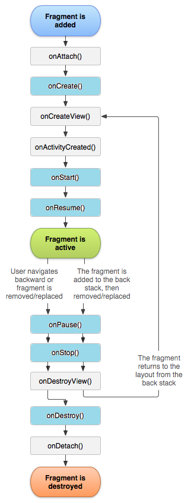
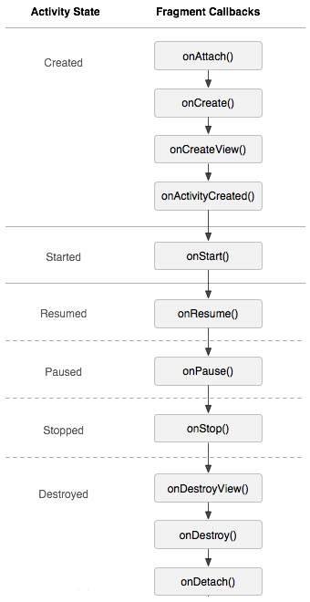

# Fragment 基础回顾：Fragment 基础

## 1、Fragment 的生命周期

### 1.1 Fragment 的生命周期

下面是 Fragment 的生命周期的流程图：

从上图可以看出，Fragment 的生命周期相比于 Activity，在创建的过程中增加了 `onAttach()`、`onCreateView()` 和 `onActivityCreated()` 三个方法，在销毁的过程中增加了 `onDestroyView()` 和 `onDetach()` 两个方法。

### 1.2 Activity 与 Fragment 生命周期对应关系

