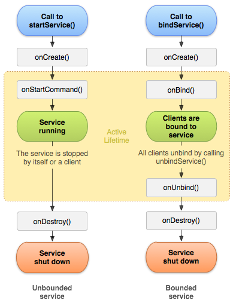

# 关于Service

它主要用于在后台处理一些耗时的逻辑，或者去执行某些需要长期运行的任务。必要的时候我们甚至可以在程序退出的情况下，让Service在后台继续保持运行状态。

## 1、简单使用步骤

首先，继承Service来定义Service：

    public class MyService extends Service {

        public static final String TAG = "MyService";

        @Override
        public void onCreate() {
            super.onCreate();
            Log.d(TAG, "onCreate() executed");
        }

        @Override
        public int onStartCommand(Intent intent, int flags, int startId) {
            Log.d(TAG, "onStartCommand() executed");
            return super.onStartCommand(intent, flags, startId);
        }

        @Override
        public void onDestroy() {
            super.onDestroy();
            Log.d(TAG, "onDestroy() executed");
        }

        @Override
        public IBinder onBind(Intent intent) {
            return new MyBinder();
        }

        class MyBinder extends Binder {  
            public void startDownload() {  
                Log.d("TAG", "startDownload() executed");  
            }   
        }  
    }

定义了Service之后还要在AndroidManifest.xml中注册：

    <service android:name="com.example.servicetest.MyService"/>  

然后，就可以使用该Service了：

    // 启动Service
    Intent startIntent = new Intent(this, MyService.class);
    startService(startIntent);  

    // 停止Service
    Intent stopIntent = new Intent(this, MyService.class);
    stopService(stopIntent);

    // 关联Service和Activity
    Intent bindIntent = new Intent(this, MyService.class);  
    bindService(bindIntent, connection, BIND_AUTO_CREATE);

    // 解除Service和Activity关联
    unbindService(connection);

    private ServiceConnection connection = new ServiceConnection() {  
  
        @Override  
        public void onServiceDisconnected(ComponentName name) {}  
  
        @Override  
        public void onServiceConnected(ComponentName name, IBinder service) {  
            myBinder = (MyService.MyBinder) service;  
            myBinder.startDownload();  
        }  
    };

### 总结

Service的生命周期图

1. 当第一次执行`startService(intent)`的时候，会调用该Service中的`onCreate()`和`onStartCommand()`方法。
2. 当第二次执行`startService(intent)`的时候，只会调用该Service中的onStartCommand()方法。（因此已经创建了服务，所以不需要再次调用onCreate()方法了）
3. `bindService()`方法的第三个参数是一个标志位，这里传入BIND_AUTO_CREATE表示在Activity和Service建立关联后自动创建Service，这会使得MyService中的`onCreate()`方法得到执行，但`onStartCommand()`方法不会执行。所以，在上面的程序中当调用了`bindService()`方法的时候，会执行的方法有，Service的`onCreate()`方法，以及ServiceConnection的`onServiceConnected()`方法。
4. 在3种中，如果想要停止Service，需要调用`unbindService()`才行。 
5. 如果我们既调用了`startService()`，又调用`bindService()`会怎么样呢？这时不管你是单独调用stopService()还是unbindService()，Service都不会被销毁，必要将两个方法都调用Service才会被销毁。也就是说，stopService()只会让Service停止，unbindService()只会让Service和Activity解除关联，一个Service必须要在既没有和任何Activity关联又处理停止状态的时候才会被销毁。

## 2、Service与线程

Service运行在主线程里的，也就是说如果你在Service里编写了非常耗时的代码，程序必定会出现ANR的。 

Service只意味着不需要前台UI的支持，即使Activity被销毁，或者程序被关闭，只要进程还在，Service就可以继续运行。但是我们可以在Service中再创建一个子线程，然后在这里去处理耗时逻辑。

虽然也可以在Activity中创建线程来执行耗时任务，但是它的缺点在于该线程只能与该Activity关联，其他Activity无法对其进行控制。

所以，标准的使用是：

    @Override
    public int onStartCommand(Intent intent, int flags, int startId) {
        new Thread(new Runnable() {
            @Override
            public void run() {
                // 开始执行后台任务  
            }
        }).start();
        return super.onStartCommand(intent, flags, startId);
    }

    class MyBinder extends Binder {

        public void startDownload() {
            new Thread(new Runnable() {
                @Override
                public void run() {
                    // 执行具体的下载任务  
                }
            }).start();
        }
    }

## 3、前台Service

因为Service的系统优先级较低，所以当系统出现内存不足情况时，就有可能会回收掉正在后台运行的Service。我们可以通过使用前台Service来解决Service可能被回收的问题。它的效果是在系统中显示一个驻留的通知。

前台服务的

    public class MyService extends Service {

        public static final String TAG = "MyService";

        @Override
        public void onCreate() {
            super.onCreate();
            Notification notification = new Notification(R.drawable.ic_launcher, 
                "Msg", System.currentTimeMillis());
            Intent intent = new Intent(this, MainActivity.class);
            PendingIntent pi = PendingIntent.getActivity(this, 0, intent, 0);
            notification.setLatestEventInfo(this, "Title", "Content", pi);
            startForeground(1, notification);
        }  
    }

## 4、远程Service

可以通过在AndroidManifest.xml中进行如下设置来将一个Service设置在非主线程中：

    <service  
        android:name="com.example.servicetest.MyService"  
        android:process=":remote" >  
    </service>  

也就说当前的Service运行在其他的进程了，不会阻碍主进行，从而也不会存在ANR了。但是这种方式中的Service是无法与Activity进行关联的，也就是说调用bindService()的时候会出现错误。如果我们想要将该Service与Activity进行关联，就需要使用AIDL进行跨进程通信了（IPC）。

要实现跨进程调用，我们可以按照如下步骤来实现：

首先，新建MyAIDLService.aidl文件：

    package com.example.servicetest;  
    interface MyAIDLService {  
        int plus(int a, int b);  
        String toUpperCase(String str);  
    }  

然后，我们要修改之前Service中的bind()方法：

    @Override  
    public IBinder onBind(Intent intent) {  
        return mBinder;  
    }

    MyAIDLService.Stub mBinder = new Stub() {  
  
        @Override  
        public String toUpperCase(String str) throws RemoteException {  
            if (str != null) {  
                return str.toUpperCase();  
            }  
            return null;  
        }  
  
        @Override  
        public int plus(int a, int b) throws RemoteException {  
            return a + b;  
        }  
    }; 

然后，我们在ServiceConnection中进行如下实现：

    private ServiceConnection connection = new ServiceConnection() {  
  
        @Override  
        public void onServiceDisconnected(ComponentName name) {}  
  
        @Override  
        public void onServiceConnected(ComponentName name, IBinder service) {  
            myAIDLService = MyAIDLService.Stub.asInterface(service);  
            try {  
                int result = myAIDLService.plus(3, 5);  
                String upperStr = myAIDLService.toUpperCase("hello world");  
            } catch (RemoteException e) {  
                e.printStackTrace();  
            }  
        }  
    };  

也就是使用MyAIDLService.Stub.asInterface()方法获取MyAIDLService，并调用MyAIDLService的方法。这时候再调用bindService()就不会出现错误了。

如果我们想要在其他进程（APP）中调用该Service，我们可以进行如下操作：

首先在Service添加Intent-Filter：

    <service android:name="com.example.servicetest.MyService"  
        android:process=":remote" >  
        <intent-filter>  
            <action android:name="com.example.servicetest.MyAIDLService"/>  
        </intent-filter>  
    </service>  

这样，我们就将该Service设置成其他程序可访问的了。

然后，在要访问该Service的程序中进行如下操作：

1. 将上述定义的MyAIDLService连同其包拷贝到当前程序中，即src目录下面。
2. 然后在绑定Service的时候按照下面的方式绑定：

        Intent intent = new Intent("com.example.servicetest.MyAIDLService");  
        bindService(intent, connection, BIND_AUTO_CREATE);  

        private ServiceConnection connection = new ServiceConnection() {

            @Override
            public void onServiceDisconnected(ComponentName name) {}

            @Override
            public void onServiceConnected(ComponentName name, IBinder service) {
                myAIDLService = MyAIDLService.Stub.asInterface(service);
                try {
                    int result = myAIDLService.plus(50, 50);
                    String upperStr = myAIDLService.toUpperCase("comes from ClientTest");
                } catch (RemoteException e) {
                    e.printStackTrace();
                }
            }
        };

这样我们就将该Service设置成了其他进程可访问的。

## 5、总结

### 5.1 Service 的生命周期 

Service有绑定模式和非绑定模式，以及这两种模式的混合使用方式。不同的使用方法生命周期方法也不同。 

1. 非绑定模式：当第一次调用`startService()`的时候执行的方法依次为`onCreate()`->`onStartCommand()`；当Service 关闭的时候调用`onDestory()`。
2. 绑定模式：第一次`bindService()`的时候，执行的方法为`onCreate()`->`onBind()`；解除绑定的时候会执行`onUnbind()`->`onDestory()`。
 
我们在开发的过程中还必须注意Service实例只会有一个，也就是说如果当前要启动的Service已经存在了那么就不会再次创建该Service当然也不会调用onCreate()方法。 

一个Service可以被多个客户进行绑定,只有所有的绑定对象都执行了onBind()方法后该Service才会销毁，不过如果有一个客户执行了onStart()方法,那么这个时候如果所有的bind客户都执行了 unBind()该Service也不会销毁。

### 5.2 IntentService

相比于一般的Service，IntentService具有的特征：

1. 会创建独立的线程来处理所有的Intent请求; 
2. 会创建独立的线程来处理onHandleIntent()方法实现的代码，无需处理多线程问题; 
3. 所有请求处理完成后，IntentService会自动停止,无需调用stopSelf()方法停止Service; 
4. 为Service的onBind()提供默认实现,返回null; 
5. 为Service的onStartCommand提供默认实现，将请求Intent添加到队列中。 
6. IntentService内置的是HandlerThread作为异步线程，每一个交给IntentService的任务都将以队列的方式逐个被执行到，一旦队列中有某个任务执行时间过长，那么就会导致后续的任务都会被延迟处理。正在运行的IntentService的程序相比起纯粹的后台程序更不容易被系统杀死，该程序的优先级是介于前台程序与纯后台程序之间的

### 5.3 如何提高service的优先级？

我们可以用 setForeground(true) 来设置Service的优先级。 当然这并不能保证你得Service永远不被杀掉，只是提高了他的优先级。

### 5.4 如何避免后台进程被杀死？

服务被杀死的情况：

1. 系统根据资源分配情况杀死服务
2. 用户通过settings->Apps->Running->Stop方式杀死服务
3. 用户通过settings->Apps->Downloaded->Force Stop方式杀死服务

解决办法：

1. 调用startForegound()，让你的Service所在的线程成为前台进程
2. Service的onStartCommond()返回START_STICKY或START_REDELIVER_INTENT
3. Service的onDestroy()里面重新启动自己

#### onStartCommond()的返回值

|编号|可选值|含义|
|:-:|:-:|:-:|
|1|START_STICKY|当Service因内存不足而被系统kill后，一段时间后内存再次空闲时，系统将会尝试重新创建此Service，一旦创建成功后将回调onStartCommand方法，但其中的Intent将是null，除非有挂起的Intent，如pendingintent，这个状态下比较适用于不执行命令、但无限期运行并等待作业的媒体播放器或类似服务|
|2|START_NOT_STICKY|当Service因内存不足而被系统kill后，即使系统内存再次空闲时，系统也不会尝试重新创建此Service。除非程序中再次调用startService启动此Service，这是最安全的选项，可以避免在不必要时以及应用能够轻松重启所有未完成的作业时运行服务|
|3|START_REDELIVER_INTENT|当Service因内存不足而被系统kill后，则会重建服务，并通过传递给服务的最后一个 Intent 调用 onStartCommand()，任何挂起 Intent均依次传递。与START_STICKY不同的是，其中的传递的Intent将是非空，是最后一次调用startService中的intent。这个值适用于主动执行应该立即恢复的作业（例如下载文件）的服务|

#### 在onDestroy()中自启的示例

	public void onCreate() {  
	    super.onCreate();  
	    mBroadcast = new BroadcastReceiver() {  
		    @Override  
		    public void onReceive(Context context, Intent intent) {  
		        Intent a = new Intent(ServiceA.this, ServiceA.class);  
		        startService(a);  
		    }  
	    };  
	    mIF = new IntentFilter();  
	    mIF.addAction("listener");  
	    registerReceiver(mBroadcast, mIF);  
	}
	
	@Override  
	public void onDestroy() {  
	  super.onDestroy();  
	  Intent intent = new Intent();  
	  intent.setAction("listener");  
	  sendBroadcast(intent);  
	  unregisterReceiver(mBroadcast);  
	}  

参考：

1. [Android Service完全解析，关于服务你所需知道的一切(上)](http://blog.csdn.net/guolin_blog/article/details/11952435)
2. [Android Service完全解析，关于服务你所需知道的一切(下)](http://blog.csdn.net/guolin_blog/article/details/9797169)
3. [关于Android Service真正的完全详解，你需要知道的一切](https://blog.csdn.net/javazejian/article/details/52709857)