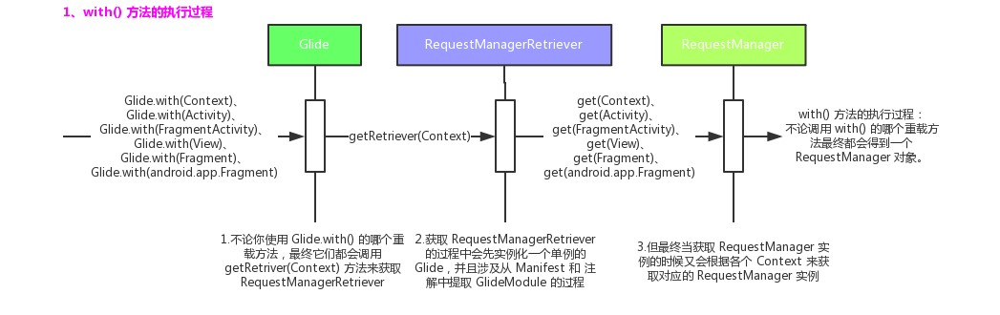
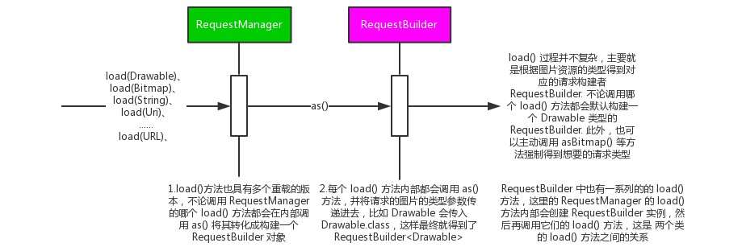
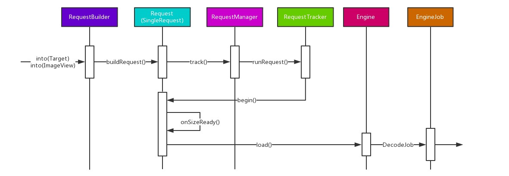
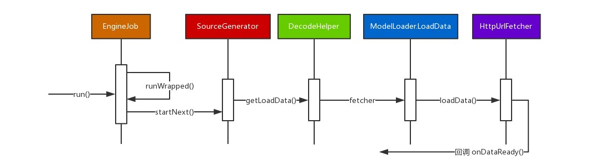
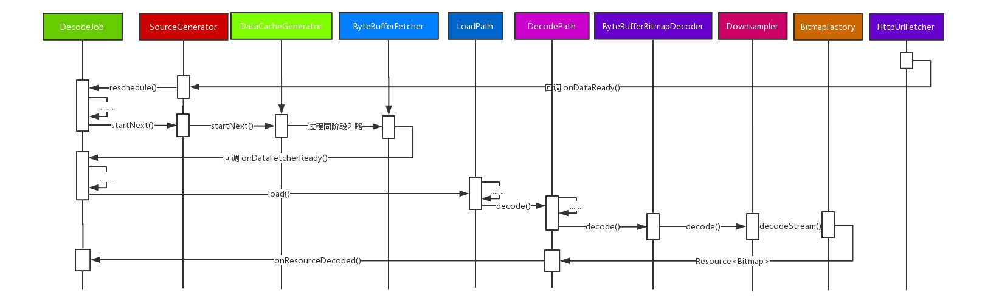
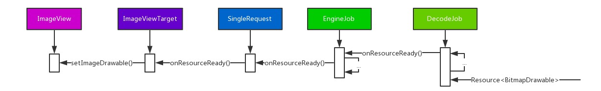

# Glide 系列-2：主流程源码分析（4.8.0）

Glide 是 Android 端比较常用的图片加载框架，这里我们就不再介绍它的基础的使用方式。你可以通过查看其官方文档学习其基础使用。这里，我们给出一个 Glide 的最基本的使用示例，并以此来研究这个整个过程发生了什么：

```java
Glide.with(fragment).load(myUrl).into(imageView);
```

上面的代码虽然简单，但是整个执行过程涉及许多类，其流程也比较复杂。为了更清楚地说明这整个过程，我们将 Glide 的图片加载按照调用的时间关系分成了下面几个部分：

1. `with()` 方法的执行过程
2. `load()` 方法的执行过程
3. `into()` 方法的执行过程
    1. 阶段1：开启 `DecodeJob` 的过程
    2. 阶段2：打开网络流的过程
    3. 阶段3：将输入流转换为 `Drawable` 的过程
    4. 阶段4：将 `Drawable` 展示到 `ImageView` 的过程

即按照上面的示例代码，先分成 `with()`、`load()` 和 `into()` 三个过程，而 `into()` 过程又被细化成四个阶段。

下面我们就按照上面划分的过程来分别介绍一下各个过程中都做了哪些操作。

## 1、with() 方法的执行过程

### 1.1 实例化单例的 Glide 的过程

当调用了 Glide 的 `with()` 方法的时候会得到一个 `RequestManager` 实例。`with()` 有多个重载方法，我们可以使用 `Activity` 或者 `Fragment` 等来获取 `Glide` 实例。它们最终都会调用下面这个方法来完成最终的操作：

```java
public static RequestManager with(Context context) {
    return getRetriever(context).get(context);
}
```

在 `getRetriever()` 方法内部我们会先使用 `Glide` 的 `get()` 方法获取一个单例的 Glide 实例，然后从该 Glide 实例中得到一个 `RequestManagerRetriever`:

```java
private static RequestManagerRetriever getRetriever(Context context) {
    return Glide.get(context).getRequestManagerRetriever();
}
```

这里调用了 Glide 的 `get()` 方法，它最终会调用 `initializeGlide()` 方法实例化一个**单例**的 `Glide` 实例。在之前的文中我们已经介绍了这个方法。它主要用来从注解和 Manifest 中获取 GlideModule，并根据各 GlideModule 中的方法对 Glide 进行自定义：

[《Glide 系列-1：预热、Glide 的常用配置方式及其原理》](Glide系列：Glide的配置和使用方式.md)

下面的方法中需要传入一个 `GlideBuilder` 实例。很明显这是一种构建者模式的应用，我们可以使用它的方法来实现对 Glide 的个性化配置：

```java
private static void initializeGlide(Context context, GlideBuilder builder) {

    // ... 各种操作，略

    // 赋值给静态的单例实例
    Glide.glide = glide;
}
```

最终 Glide 实例由 `GlideBuilder` 的 `build()` 方法构建完毕。它会直接调用 Glide 的构造方法来完成 Glide 的创建。在该构造方法中会将各种类型的图片资源及其对应的加载类的映射关系注册到 Glide 中，你可以阅读源码了解这部分内容。

### 1.2 Glide 的生命周期管理

在 `with()` 方法的执行过程还有一个重要的地方是 Glide 的生命周期管理。因为当我们正在进行图片加载的时候，Fragment 或者 Activity 的生命周期可能已经结束了，所以，我们需要对 Glide 的生命周期进行管理。

Glide 对这部分内容的处理也非常巧妙，它使用没有 UI 的 Fragment 来管理 Glide 的生命周期。这也是一种非常常用的生命周期管理方式，比如 `RxPermission` 等框架都使用了这种方式。你可以通过下面的示例来了解它的作用原理：

[示例代码：使用 Fragment 管理 onActivityResult()](https://github.com/Shouheng88/Android-references/tree/master/advanced/src/main/java/me/shouheng/advanced/callback)

在 `with()` 方法中，当我们调用了 `RequestManagerRetriever` 的 `get()` 方法之后，会根据 Context 的类型调用 `get()` 的各个重载方法。

```java
  public RequestManager get(@NonNull Context context) {
    if (context == null) {
      throw new IllegalArgumentException("You cannot start a load on a null Context");
    } else if (Util.isOnMainThread() && !(context instanceof Application)) {
      if (context instanceof FragmentActivity) {
        return get((FragmentActivity) context);
      } else if (context instanceof Activity) {
        return get((Activity) context);
      } else if (context instanceof ContextWrapper) {
        return get(((ContextWrapper) context).getBaseContext());
      }
    }

    return getApplicationManager(context);
  }
```

我们以 Activity 为例。如下面的方法所示，当当前位于后台线程的时候，会使用 Application 的 Context 获取 `RequestManager`，否则会使用无 UI 的 Fragment 进行管理：

```java
  public RequestManager get(@NonNull Activity activity) {
    if (Util.isOnBackgroundThread()) {
      return get(activity.getApplicationContext());
    } else {
      assertNotDestroyed(activity);
      android.app.FragmentManager fm = activity.getFragmentManager();
      return fragmentGet(activity, fm, /*parentHint=*/ null, isActivityVisible(activity));
    }
  }
```

然后就调用到了 `fragmentGet()` 方法。这里我们从 `RequestManagerFragment` 中通过 `getGlideLifecycle()` 获取到了 `Lifecycle` 对象。`Lifecycle` 对象提供了一系列的、针对 Fragment 生命周期的方法。它们将会在 Fragment 的各个生命周期方法中被回调。

```java
  private RequestManager fragmentGet(Context context, FragmentManager fm, 
    Fragment parentHint, boolean isParentVisible) {
    RequestManagerFragment current = getRequestManagerFragment(fm, parentHint, isParentVisible);
    RequestManager requestManager = current.getRequestManager();
    if (requestManager == null) {
      Glide glide = Glide.get(context);
      requestManager =
          factory.build(
              glide, current.getGlideLifecycle(), current.getRequestManagerTreeNode(), context);
      current.setRequestManager(requestManager);
    }
    return requestManager;
  }
```

然后，我们将该 `Lifecycle` 传入到 `RequestManager` 中，以 `RequestManager` 中的两个方法为例，`RequestManager` 会对 `Lifecycle` 进行监听，从而达到了对 Fragment 的生命周期进行监听的目的：

```java
  public void onStart() {
    resumeRequests();
    targetTracker.onStart();
  }

  public void onStop() {
    pauseRequests();
    targetTracker.onStop();
  }
```

### 1.3 小结

经过上述分析，我们可以使用下面的流程图总结 Glide 的 `with()` 方法的执行过程：



## 2、load() 方法的执行过程

### 2.1 load() 的过程

当我们拿到了 `RequestManager` 之后就可以使用它来调用 `load()` 方法了。在我们的示例中传入的是一个 url 对象。`load()` 方法也是重载的，我们可以传入包括 Bitmap, Drawable, Uri 和 String 等在内的多种资源类型。示例中会调用下面的这个方法得到一个 `RequestBuilder` 对象，显然这是一种构建者模式的应用。我们可以使用 `RequestBuilder` 的其他方法来继续构建图片加载请求，你可以通过查看它的源码了解 Glide 都为我们提供了哪些构建方法：

```java
  public RequestBuilder<TranscodeType> load(@Nullable String string) {
    return loadGeneric(string);
  }
```

在 `RequestBuilder` 的构造方法中存在一个 `apply()` 方法值得我们一提，其定义如下。从下面的方法定义中可以看出，我们可以通过为 `RequestBuilder` 指定 `RequestOptions` 来配置当前图片加载请求。比如，指定磁盘缓存的策略，指定占位图，指定图片加载出错时显示的图片等等。那么我们怎么得到 `RequestOptions` 呢？在 Glide 4.8.0 中的类 `RequestOptions` 为我们提供了一系列的静态方法，我们可以这些方法来得到 `RequestOptions` 的实例：

```java
  public RequestBuilder<TranscodeType> apply(RequestOptions requestOptions) {
    Preconditions.checkNotNull(requestOptions);
    this.requestOptions = getMutableOptions().apply(requestOptions);
    return this;
  }
```

回过头来，我们可以继续跟踪 `load()` 方法。其实，不论我们使用了 `load()` 的哪个重载方法，最终都会调用到下面的方法。它的逻辑也比较简单，就是将我们的图片资源信息赋值给 `RequestBuilder` 的局部变量就完事了。至于图片如何被加载和显示，则在 `into()` 方法中进行处理。

```java
  public RequestBuilder<TranscodeType> load(@Nullable String string) {
    return loadGeneric(string);
  }

  private RequestBuilder<TranscodeType> loadGeneric(@Nullable Object model) {
    this.model = model;
    isModelSet = true;
    return this;
  }
```

### 2.2 小结

所以，我们可以总结 Glide 的 `load()` 方法的执行过程如下。也就是使用 `RequestManger` 得到一个 `RequestBuilder` 的过程：



## 3、into() 方法的执行过程

考虑到 `into()` 方法流程比较长、涉及的类比较多，我们按照图片加载的过程将其分成四个阶段来进行介绍。

第一个阶段是开启 `DecodeJob` 的过程。`DecodeJob` 负责从缓存或者从原始的数据源中加载图片资源，对图片进行变换和转码，是 Glide 图片加载过程的核心。`DecodeJob` 继承了 `Runnable`，实际进行图片加载的时候会将其放置到线程池当中执行。这个阶段我们重点介绍的是从 `RequestBuilder` 构建一个 `DecodeJob` 并开启 `DecodeJob` 任务的过程。即构建一个 `DecodeJob` 并将其丢到线程池里的过程。

第二个阶段是打开网络流的过程。这个阶段会根据我们的图片资源来从数据源中加载图片数据。以我们的示例为例，在默认情况下会从网络当中加载图片，并得到一个 `InputStream`. 

第三个阶段是将输入流转换为 `Drawable` 的过程。得到了 `InputStream` 之后还要调用 `BitmapFactory` 的 `decodeStream()` 方法来从 `InputStream` 中得到一个 `Drawable`. 

第四个阶段是将 `Drawable` 显示到 `ImageView` 上面的过程。

### 3.1 阶段1：开启 DecodeJob 的过程

#### 3.1.1 流程分析

我们继续沿着 `into()` 方法进行分析。

`into()` 方法也定义在 `RequestBuilder` 中，并且也是重载的。不论我们调用哪个重载方法都会将要用来显示图片的对象封装成一个 `Target` 类型。`Target` 主要用来对用来显示图片的对象的生命周期进行管理。当我们要将图片加载到 ImageView 的时候，最终会调用下面的 `buildTarget()` 方法来讲我们的 ImageView 封装成一个 `ViewTarget`，然后调用 `into()` 的重载方法进行后续处理：

```java
  public <Z> ViewTarget<ImageView, Z> buildTarget(ImageView view, Class<Z> clazz) {
    if (Bitmap.class.equals(clazz)) {
      return (ViewTarget<ImageView, Z>) new BitmapImageViewTarget(view);
    } else if (Drawable.class.isAssignableFrom(clazz)) {
      return (ViewTarget<ImageView, Z>) new DrawableImageViewTarget(view);
    } else {
      throw new IllegalArgumentException(
          "Unhandled class: " + clazz + ", try .as*(Class).transcode(ResourceTranscoder)");
    }
  }

  private <Y extends Target<TranscodeType>> Y into(Y target,
      RequestListener<TranscodeType> targetListener,
      RequestOptions options) {

    options = options.autoClone();
    Request request = buildRequest(target, targetListener, options); // 1

    Request previous = target.getRequest();
    if (request.isEquivalentTo(previous)
        && !isSkipMemoryCacheWithCompletePreviousRequest(options, previous)) {
      request.recycle();
      if (!Preconditions.checkNotNull(previous).isRunning()) {
        previous.begin();
      }
      return target;
    }

    requestManager.clear(target);
    target.setRequest(request);
    requestManager.track(target, request); // 2

    return target;
  }
```

在上面的 `into()` 方法的 `1` 处最终会调用到下面的方法来构建一个请求对象。（这里我们忽略掉具体的参数，只给看构建请求的逻辑）。简而言之，该方法会根据我们是否调用过 `RequestBuilder` 的 `error()` 方法设置过图片加载出错时候显示的图片来决定返回 `mainRequest` 还是 `errorRequestCoordinator`。因为我们没有设置该参数，所以会直接返回 `mainRequest`。
	
```java
  private Request buildRequestRecursive(/*各种参数*/) {

    ErrorRequestCoordinator errorRequestCoordinator = null;
    if (errorBuilder != null) {
      errorRequestCoordinator = new ErrorRequestCoordinator(parentCoordinator);
      parentCoordinator = errorRequestCoordinator;
    }

    Request mainRequest = buildThumbnailRequestRecursive(/*各种参数*/); // 1

    if (errorRequestCoordinator == null) {
      return mainRequest;
    }

    // ... 略

    Request errorRequest = errorBuilder.buildRequestRecursive(/*各种参数*/);
    errorRequestCoordinator.setRequests(mainRequest, errorRequest);
    return errorRequestCoordinator;
  }
```

上面是根据是否设置加载失败时显示的图片来决定返回的请求对象的。如果你使用过 Glide 的话，那么一定记得除了设置加载失败时的图片，我们还会先加载一张小图，即 `Thumbnail`。所以，在上面方法的 `1` 处会根据设置调用过 `RequestBuilder` 的 `thumbnail()` 方法来决定返回 `Thumbnail` 的请求还是真实图片的请求。同样因为我们没有设置过该方法，所以最终会调用下面的方法来构建最终的图片加载请求。

```java
  private Request obtainRequest(/*各种参数*/) {
    return SingleRequest.obtain(/*各种参数*/);
  }
```

在 `SingleRequest` 的 `obtain()` 方法中会先尝试从请求的池中取出一个请求，当请求不存在的时候就会实例化一个 `SingleRequest`，然后调用它的 `init()` 方法完成请求的初始化工作。这里的请求池使用了 Android 的 support v4 包中的 `Pool` 相关的 API. 它被设计用来构建基于数组的请求池，具体如何使用可以参考相关的文档和源码。

```java
  public static <R> SingleRequest<R> obtain(/*各种参数*/) {
    SingleRequest<R> request = (SingleRequest<R>) POOL.acquire();
    if (request == null) {
      request = new SingleRequest<>();
    }
    request.init(/*各种参数*/);
    return request;
  }
```

得到了请求之后会用 `RequestManager` 的 `track()` 方法：

```java
  void track(@NonNull Target<?> target, @NonNull Request request) {
    targetTracker.track(target);
    requestTracker.runRequest(request);
  }
```

该方法的主要作用有两个：

1. 调用 `TargetTracker` 的 `track()` 方法对对当前 `Target` 的生命周期进行管理；
2. 调用 `RequestTracker` 的 `runRequest()` 方法对当前请求进行管理，当 Glide 未处于暂停状态的时候，会直接使用 `Request` 的 `begin()` 方法开启请求。

下面是 `SingeleRequest` 的 `begin()` 方法。它会根据当前加载的状态来判断应该调用哪个方法。因为我们之前图片加载的过程可能因为一些意想不到的原因被终止，所以当重启的时候就需要根据之前的状态进行恢复。对于我们第一次加载的情况，则会直接进入到下方 1 处的 `onSizeReady()` 方法中：

```java
  public void begin() {
    if (model == null) {
      if (Util.isValidDimensions(overrideWidth, overrideHeight)) {
        width = overrideWidth;
        height = overrideHeight;
      }
      int logLevel = getFallbackDrawable() == null ? Log.WARN : Log.DEBUG;
      onLoadFailed(new GlideException("Received null model"), logLevel);
      return;
    }

    if (status == Status.RUNNING) {
      throw new IllegalArgumentException("Cannot restart a running request");
    }

    // 如果我们在完成之后重新启动（通常通过诸如 notifyDataSetChanged() 之类的方法，
    // 在相同的目标或视图中启动相同的请求），我们可以使用我们上次检索的资源和大小
    // 并跳过获取新的大小。所以，如果你因为 View 大小发生了变化而想要重新加载图片
    // 就需要在开始新加载之前清除视图 (View) 或目标 (Target)。
    if (status == Status.COMPLETE) {
      onResourceReady(resource, DataSource.MEMORY_CACHE);
      return;
    }

    status = Status.WAITING_FOR_SIZE;
    if (Util.isValidDimensions(overrideWidth, overrideHeight)) {
      onSizeReady(overrideWidth, overrideHeight); // 1
    } else {
      target.getSize(this);
    }

    if ((status == Status.RUNNING || status == Status.WAITING_FOR_SIZE)
        && canNotifyStatusChanged()) {
      target.onLoadStarted(getPlaceholderDrawable()); // 2
    }
  }
```

下面是 `onSizeReady()` 方法，我们可以看出它会先判断当前是否处于 `Status.WAITING_FOR_SIZE` 状态，并随后将状态更改为 `Status.RUNNING` 并调用 `engine` 的 `load()` 方法。显然，更改完状态之后继续回到上面的方法，在 2 处即调用了 `Target` 的 `onLoadStarted()` 方法。这样 `Target` 的第一个生命周期就被触发了。

```java
  public void onSizeReady(int width, int height) {
    if (status != Status.WAITING_FOR_SIZE) {
      return;
    }
    status = Status.RUNNING;

    float sizeMultiplier = requestOptions.getSizeMultiplier();
    this.width = maybeApplySizeMultiplier(width, sizeMultiplier);
    this.height = maybeApplySizeMultiplier(height, sizeMultiplier);

    loadStatus = engine.load(/*各种参数*/);

    if (status != Status.RUNNING) {
      loadStatus = null;
    }
  }
```

然后，让我们将重点放到 `Engine` 的 `load()` 方法。该方法虽然不长，但是却包含了许多重要的内容。我们在下篇文章中将要研究的 Glide 的缓存就是在这里实现的。该方法大致的逻辑上，先尝试从内存缓存当中查找指定的资源，当内存中不存在的时候就准备使用 `DecodeJob` 来加载图片。

```java
  public <R> LoadStatus load(/*各种参数*/) {
    EngineKey key = keyFactory.buildKey(model, signature, width, height, transformations,
        resourceClass, transcodeClass, options);

    EngineResource<?> active = loadFromActiveResources(key, isMemoryCacheable);
    if (active != null) {
      cb.onResourceReady(active, DataSource.MEMORY_CACHE);
      return null;
    }

    EngineResource<?> cached = loadFromCache(key, isMemoryCacheable);
    if (cached != null) {
      cb.onResourceReady(cached, DataSource.MEMORY_CACHE);
      return null;
    }

    EngineJob<?> current = jobs.get(key, onlyRetrieveFromCache);
    if (current != null) {
      current.addCallback(cb);
      return new LoadStatus(cb, current);
    }

    EngineJob<R> engineJob = engineJobFactory.build(
            key,
            isMemoryCacheable,
            useUnlimitedSourceExecutorPool,
            useAnimationPool,
            onlyRetrieveFromCache);

    DecodeJob<R> decodeJob = decodeJobFactory.build(/*各种参数*/);

    jobs.put(key, engineJob);

    engineJob.addCallback(cb);
    engineJob.start(decodeJob);

    return new LoadStatus(cb, engineJob);
  }
```

上面方法中涉及两个类，一个是 `DecodeJob`、一个是 `EngineJob`。它们之间的关系是，`EngineJob` 内部维护了线程池，用来管理资源加载，已经当资源加载完毕的时候通知回调。 `DecodeJob` 继承了 `Runnable`，是线程池当中的一个任务。就像上面那样，我们通过调用 `engineJob.start(decodeJob)` 来开始资源加载。

#### 3.1.2 小结



根据上文中的分析，我们不难得出上面的流程图。不考虑缓存的问题，这个部分的逻辑还是比较清晰的，即：当调用了 `into()` 之后，首先构建一个请求对象 `SingleRequest`，然后调用 `RequestManager` 的 `track()` 方法对 `Request` 和 `Target` 进行管理；随后，使用 `Request` 的 `begin()` 方法来启动请求；该方法中会使用 `Engine` 的 `load()` 方法决定是从缓存当中获取资源还是从数据源中加载数据；如果是从数据源中加载数据的话，就构建一个 `DecodeJob` 交给 `EngineJob` 来执行即可。

### 3.2 阶段2：打开网络流的过程

#### 3.2.1 打开网络流的过程

在上面的分析中，将 `DecodeJob` 交给 `EngineJob` 就完事了。因为 `DecodeJob` 是一个任务，会在线程池当中进行执行。所以，如果我们继续追踪的话，就应该从 `DecodeJob` 的 `run()` 方法开始：

所以，如果想要找到加载资源和解码的逻辑，就应该查看 DecodeJob 的 `run()` 方法。下面就是这个方法的定义：

```java
  public void run() {
    DataFetcher<?> localFetcher = currentFetcher;
    try {
      if (isCancelled) {
        notifyFailed();
        return;
      }
      runWrapped();
    } catch (Throwable t) {
      if (stage != Stage.ENCODE) {
        throwables.add(t);
        notifyFailed();
      }
      if (!isCancelled) {
        throw t;
      }
    } finally {
      if (localFetcher != null) {
        localFetcher.cleanup();
      }
      GlideTrace.endSection();
    }
  }
```

`DecodeJob` 的执行过程使用了状态模式，它会根据当前的状态决定将要执行的方法。在上面的方法中，当当前任务没有被取消的话，会进入到 `runWrapped()` 方法。该方法中会使用 `runReason` 作为当前的状态决定要执行的逻辑：

```java
  private void runWrapped() {
    switch (runReason) {
      case INITIALIZE:
        stage = getNextStage(Stage.INITIALIZE);
        currentGenerator = getNextGenerator();
        runGenerators();
        break;
      case SWITCH_TO_SOURCE_SERVICE:
        runGenerators();
        break;
      case DECODE_DATA:
        decodeFromRetrievedData();
        break;
      default:
        throw new IllegalStateException("Unrecognized run reason: " + runReason);
    }
  }
```

这里的 `runReason` 是一个枚举类型，它包含的枚举值即为上面的三种类型。当我们在一个过程执行完毕之后会回调 `DecodeJob` 中的方法修改 `runReason`，然后根据新的状态值执行新的逻辑。

除了 `runReason`，`DecodeJob` 中还有一个变量 `stage` 也是用来决定 `DecodeJob` 状态的变量。同样，它也是一个枚举，用来表示将要加载数据的数据源以及数据的加载状态。它主要在加载数据的时候在 `runGenerators()`、`runWrapped()` 和 `getNextStage()` 三个方法中被修改。通常它的逻辑是，先从（大小、尺寸等）转换之后的缓存中拿数据，如果没有的话再从没有转换过的缓存中拿数据，最后还是拿不到的话就从原始的数据源中加载数据。

以上就是 `DecodeJob` 中的状态模式运行的原理。

对于一个新的任务，会在 `DecodeJob` 的 `init()` 方法中将 `runReason` 置为 `INITIALIZE`，所以，我们首先会进入到上述 `switch` 中的 `INITIALIZE` 中执行。然后，因为我们没有设置过磁盘缓存的策略，因此会使用默认的 `AUTOMATIC` 缓存方式。于是，我们将会按照上面所说的依次从各个缓存中拿数据。由于我们是第一次加载，并且暂时我们不考虑缓存的问题，所以，最终数据的加载会交给 `SourceGenerator` 进行。

不知道你是否还记得上一篇文章中我们在讲解在 Glide 中使用 OkHttp 时提到的相关的类。它们真正作用的地方就在下面的这个方法中。这是 `SourceGenerator` 的 `startNext()` 方法，它会：

1. 先使用 `DecodeHelper` 的 `getLoadData()` 方法从注册的映射表中找出当前的图片类型对应的 `ModelLoader`；
2. 然后使用它的 `DataFetcher` 的 `loadData()` 方法从原始的数据源中加载数据。

```java
  public boolean startNext() {
    if (dataToCache != null) {
      Object data = dataToCache;
      dataToCache = null;
      cacheData(data);
    }

    if (sourceCacheGenerator != null && sourceCacheGenerator.startNext()) {
      return true;
    }
    sourceCacheGenerator = null;

    loadData = null;
    boolean started = false;
    while (!started && hasNextModelLoader()) {
      loadData = helper.getLoadData().get(loadDataListIndex++);
      if (loadData != null
          && (helper.getDiskCacheStrategy().isDataCacheable(loadData.fetcher.getDataSource())
          || helper.hasLoadPath(loadData.fetcher.getDataClass()))) {
        started = true;
        loadData.fetcher.loadData(helper.getPriority(), this);
      }
    }
    return started;
  }
```

由于我们的图片时网络中的资源，在默认情况下会使用 Glide 内部的 `HttpUrlFetcher` 从网络中加载数据。其 `loadData()` 方法定义如下：

```java
  public void loadData(Priority priority, DataCallback<? super InputStream> callback) {
    try {
      InputStream result = loadDataWithRedirects(glideUrl.toURL(), 0, null, glideUrl.getHeaders());
      callback.onDataReady(result);
    } catch (IOException e) {
      callback.onLoadFailed(e);
    } finally {
    }
  }
```

很明显，这里从网络中打开输入流之后得到了一个 `InputStream` 之后就使用回调将其返回了。至于 `loadDataWithRedirects()` 方法的实现，就是使用 `HttpURLConnection` 打开网络流的过程，这里我们不进行详细的说明了。

#### 3.2.2 小结



这样，`into()` 方法的第二个阶段，即从网络中获取一个输入流的过程就分析完毕了。整个过程并不算复杂，主要是在 `DecodeJob` 中的状态模式可能一开始看不太懂，还有就是其中涉及到的一些类不清楚其作用。如果你存在这两个疑惑的话，那么建议你：1).耐心思考下状态模式的转换过程；2).翻下上一篇文章了解自定义 Glide 图片加载方式的几个类的设计目的；3).最重要的，多看源码。

### 3.3 阶段3：将输入流转换为 Drawable 的过程

#### 3.3.1 转换 Drawable 的过程

在上面的小节中我们已经打开了网络流，按照 Android 自身提供的 `BitmapFactory`，我们可以很容易地从输入流中得到 Drawable 不是？那么为什么这个转换的过程还要单独分为一个阶段呢？

实际上，这里的转换过程并不比上面打开输入流的过程简单多少。这是因为它涉及转码和将图片转换成适合控件大小的过程。好了，下面就让我们来具体看一下这个过程都发生了什么吧！

首先，从上面的 `loadData()`，我们可以看出当得到了输入流之后会回调 `onDataReady()` 方法。这个方法会一直从 `HttpUrlFetcher` 中一直回调到 `SourceGenerator` 中。这里它会使用默认的磁盘缓存策略判断数据是否可以缓存，并决定对数据进行缓存还是继续回调。

```java
  public void onDataReady(Object data) {
    DiskCacheStrategy diskCacheStrategy = helper.getDiskCacheStrategy();
    if (data != null && diskCacheStrategy.isDataCacheable(loadData.fetcher.getDataSource())) {
      dataToCache = data;
      cb.reschedule(); // 1
    } else {
      cb.onDataFetcherReady(loadData.sourceKey, data, loadData.fetcher,
          loadData.fetcher.getDataSource(), originalKey);
    }
  }
```

因为我们的数据是使用 `HttpUrlFetcher` 加载的，所以将会进入到 1 处继续进行处理。此时，`DecodeJob` 将会根据当前的状态从 `run()` 方法开始执行一遍，并再次调用 `DataCacheGenerator` 的 `startNext()` 方法。但是，此次与上一次不同的地方在于，这次已经存在可以用于缓存的数据了。所以，下面的方法将会被触发：

```java
  private void cacheData(Object dataToCache) {
    try {
      Encoder<Object> encoder = helper.getSourceEncoder(dataToCache);
      DataCacheWriter<Object> writer =
          new DataCacheWriter<>(encoder, dataToCache, helper.getOptions());
      originalKey = new DataCacheKey(loadData.sourceKey, helper.getSignature());
      helper.getDiskCache().put(originalKey, writer);
    } finally {
      loadData.fetcher.cleanup();
    }

    sourceCacheGenerator =
        new DataCacheGenerator(Collections.singletonList(loadData.sourceKey), helper, this);
  }
```

这里的主要逻辑是构建一个用于将数据缓存到磁盘上面的 `DataCacheGenerator`。`DataCacheGenerator` 的流程基本与 `SourceGenerator` 一致，也就是根据资源文件的类型找到 `ModelLoader`，然后使用 `DataFetcher` 加载缓存的资源。与之前不同的是，这次是用 `DataFecher` 来加载 `File` 类型的资源。也就是说，当我们从网络中拿到了数据之后 Glide 会先将其缓存到磁盘上面，然后再从磁盘上面读取图片并将其显示到控件上面。所以，当从网络打开了输入流之后 `SourceGenerator` 的任务基本结束了，而后的显示的任务都由 `DataCacheGenerator` 来完成。

与 `HttpUrlFetcher` 一样，File 类型的资源将由 `ByteBufferFetcher` 来加载，当它加载完毕之后也也会回调 `onDataReady()` 方法。此时，将会调用 `DataCacheGenerator` 的 `onDataReady()`：

```java
  public void onDataReady(Object data) {
    cb.onDataFetcherReady(sourceKey, data, loadData.fetcher, DataSource.DATA_DISK_CACHE, sourceKey);
  }
```

该方法会继续回调到 `DecodeJob` 的 `onDataFetcherReady()` 方法，后续的逻辑比较清晰，只是在不断继续调用方法，我们依次给出这些方法：

```java
  // DecodeJob#onDataFetcherReady()
  public void onDataFetcherReady(Key sourceKey, Object data, DataFetcher<?> fetcher,
      DataSource dataSource, Key attemptedKey) {
    // ... 赋值，略
    if (Thread.currentThread() != currentThread) {
      runReason = RunReason.DECODE_DATA;
      callback.reschedule(this);
    } else {
      try {
        // decode 数据以得到期待的资源类型
        decodeFromRetrievedData();
      } finally {
        GlideTrace.endSection();
      }
    }
  }

  // DecodeJob#decodeFromRetrievedData()
  private void decodeFromRetrievedData() {
    Resource<R> resource = null;
    try {
      resource = decodeFromData(currentFetcher, currentData, currentDataSource);
    } catch (GlideException e) {
      // ... 异常处理
    }
    // ... 释放资源和错误重试等
  }

  // DecodeJob#decodeFromData()
  private <Data> Resource<R> decodeFromData(DataFetcher<?> fetcher, Data data,
      DataSource dataSource) throws GlideException {
    try {
      // ... 略
      Resource<R> result = decodeFromFetcher(data, dataSource);
      return result;
    } finally {
      fetcher.cleanup();
    }
  }

  // DecodeJob#decodeFromFetcher()
  private <Data> Resource<R> decodeFromFetcher(Data data, DataSource dataSource)
      throws GlideException {
    LoadPath<Data, ?, R> path = decodeHelper.getLoadPath((Class<Data>) data.getClass());
    return runLoadPath(data, dataSource, path);
  }

  // DecodeJob#runLoadPath()
  private <Data, ResourceType> Resource<R> runLoadPath(Data data, DataSource dataSource,
      LoadPath<Data, ResourceType, R> path) throws GlideException {
    // ... 获取参数信息
    try {
      // 使用 LoadPath 继续处理
      return path.load(
          rewinder, options, width, height, new DecodeCallback<ResourceType>(dataSource));
    } finally {
      rewinder.cleanup();
    }
  }

  // LoadPath#load()
  public Resource<Transcode> load(DataRewinder<Data> rewinder, @NonNull Options options, int width,
      int height, DecodePath.DecodeCallback<ResourceType> decodeCallback) throws GlideException {
    try {
      // 继续加载
      return loadWithExceptionList(rewinder, options, width, height, decodeCallback, throwables);
    } finally {
      listPool.release(throwables);
    }
  }

  // LoadPath#loadWithExceptionList()
  private Resource<Transcode> loadWithExceptionList(/*各种参数*/) throws GlideException {
    Resource<Transcode> result = null;
    for (int i = 0, size = decodePaths.size(); i < size; i++) {
      DecodePath<Data, ResourceType, Transcode> path = decodePaths.get(i);
      try {
        // 使用 DecodePath 继续处理
        result = path.decode(rewinder, width, height, options, decodeCallback);
      } catch (GlideException e) {
        exceptions.add(e);
      }
      if (result != null) {
        break;
      }
    }
    return result;
  }
```

经过了上面的一系列猛如虎的操作之后，我们进入了 `loadWithExceptionList()` 方法，这里会对 `DecodePath` 进行过滤，以得到我们期望的图片的类型。这个方法中调用了 `DecodePath` 的 `decode()` 方法。这个方法比较重要，它像一个岔路口：1 处的代码是将数据转换成我们期望的图片的过程；2 处的代码是当得到了期望的图片之后对处理继续处理并显示的过程。

```java
  // DecodePath#decode()
  public Resource<Transcode> decode(DataRewinder<DataType> rewinder, int width, int height,
      Options options, DecodeCallback<ResourceType> callback) throws GlideException {
    Resource<ResourceType> decoded = decodeResource(rewinder, width, height, options); // 1
    Resource<ResourceType> transformed = callback.onResourceDecoded(decoded); // 2
    return transcoder.transcode(transformed, options);
  }
```

然后，让我们继续沿着 `decodeResource()` 走。它会调用下面的这个循环对当前的数据类型和期望的、最终的图片类型匹配从而决定用来继续处理的 `ResourceDecoder`。

```java
  private Resource<ResourceType> decodeResourceWithList(/*各种参数*/) throws GlideException {
    Resource<ResourceType> result = null;
    for (int i = 0, size = decoders.size(); i < size; i++) {
      ResourceDecoder<DataType, ResourceType> decoder = decoders.get(i);
      try {
        DataType data = rewinder.rewindAndGet();
        if (decoder.handles(data, options)) {
          data = rewinder.rewindAndGet();
          result = decoder.decode(data, width, height, options);
        }
      } catch (IOException | RuntimeException | OutOfMemoryError e) {
        exceptions.add(e);
      }

      if (result != null) {
        break;
      }
    }
    return result;
  }
```

`ResourceDecoder` 具有多个实现类，比如 `BitmapDrawableDecoder`、`ByteBufferBitmapDecoder`等。从名字也可以看出来是用来将一个类型转换成另一个类型的。

在我们的程序中会使用 `ByteBufferBitmapDecoder` 来将 `ByteBuffer` 专成 `Bitmap`。它最终会在 `Downsampler` 的 `decodeStream()` 方法中调用 `BitmapFactory` 的 `decodeStream()` 方法来从输入流中得到 Bitmap。（我们的 `ByteBuffer` 在  `ByteBufferBitmapDecoder` 中先被转换成了输入流。）

```java
  private static Bitmap decodeStream(InputStream is, BitmapFactory.Options options,
      DecodeCallbacks callbacks, BitmapPool bitmapPool) throws IOException {
    // ... 略
    TransformationUtils.getBitmapDrawableLock().lock();
    try {
      result = BitmapFactory.decodeStream(is, null, options);
    } catch (IllegalArgumentException e) {
      // ... 错误处理，略
    } finally {
      TransformationUtils.getBitmapDrawableLock().unlock();
    }

    if (options.inJustDecodeBounds) {
      is.reset();
    }
    return result;
  }
```

这样剩下的就只有不断继续向上回调或者返回，最终回到了我们上面所说的岔路口。这样从输入流中加载图片的逻辑就结束了:)

#### 3.3.2 小结



怎么样，是不是觉得这个过程比打开输入流的过程复杂多了？毕竟这个部分涉及到了从缓存当中取数据以及向缓存写数据的过程，算的上是核心部分了。整体而言，这部分的设计还是非常巧的，即使用了状态模式，根据当前的状态来决定下一个 `Generator`。从网络中拿到输入流之后又使用 `DataCacheGenerator` 从缓存当中读取数据，这个过程连我第一次读源码的时候都没发现，以至于后来调试验证了推理之后才确信这部分是这样设计的……

### 3.4 阶段4：将 Drawable 展示到 ImageView 的过程

根据上面的分析，我们已经从网络中得到了图片数据，并且已经将其放置到了缓存中，又从缓存当中取出数据进行准备进行显示。上面的过程比较复杂，下面将要出场的这个阶段也并不轻松……

#### 3.4.1 最终展示图片的过程

在上面分析中，我们已经进入到了之前所谓的岔路口，这里我们再给出这个方法的定义如下。上面的分析到了代码 1 处，现在我们继续从代码 2 处进行分析。

```java
  // DecodePath#decode()
  public Resource<Transcode> decode(DataRewinder<DataType> rewinder, int width, int height,
      Options options, DecodeCallback<ResourceType> callback) throws GlideException {
    Resource<ResourceType> decoded = decodeResource(rewinder, width, height, options); // 1
    Resource<ResourceType> transformed = callback.onResourceDecoded(decoded); // 2
    return transcoder.transcode(transformed, options); // 3
  }
```

这里会调用 `callback` 的方法进行回调，它最终会回调到 `DecodeJob` 的 `onResourceDecoded()` 方法。其主要的逻辑是根据我们设置的参数进行变化，也就是说，如果我们使用了 `centerCrop` 等参数，那么这里将会对其进行处理。这里的 `Transformation` 是一个接口，它的一系列的实现都是对应于 `scaleType` 等参数的。

```java
  <Z> Resource<Z> onResourceDecoded(DataSource dataSource, Resource<Z> decoded) {
    Class<Z> resourceSubClass = (Class<Z>) decoded.get().getClass();
    Transformation<Z> appliedTransformation = null;
    Resource<Z> transformed = decoded;
    // 对得到的图片资源进行变换
    if (dataSource != DataSource.RESOURCE_DISK_CACHE) {
      appliedTransformation = decodeHelper.getTransformation(resourceSubClass);
      transformed = appliedTransformation.transform(glideContext, decoded, width, height);
    }
    if (!decoded.equals(transformed)) {
      decoded.recycle();
    }

    // ... 缓存相关的逻辑，略
    return result;
  }
```

在上面的方法中对图形进行变换之后还会根据图片的缓存策略决定对图片进行缓存。然后这个方法就直接返回了我们变换之后的图象。这样我们就又回到了之前的岔路口。程序继续执行就到了岔路口方法的第 3 行。这里还会使用 `BitmapDrawableTranscoder` 的 `transcode()` 方法返回 `Resouces<BitmapDrawable>`。只是这里会使用 `BitmapDrawableTranscoder` 包装一层，即做了延迟初始化处理。

这样，当第 3 行方法也执行完毕，我们的岔路口方法就分析完了。然后就是不断向上 `return` 进行返回。所以，我们又回到了 `DecodeJob` 的 `decodeFromRetrievedData()` 方法如下。这里会进入到下面方法的 1 处来完成最终的图片显示操作。

```java
  private void decodeFromRetrievedData() {
    Resource<R> resource = null;
    try {
      resource = decodeFromData(currentFetcher, currentData, currentDataSource);
    } catch (GlideException e) {
      throwables.add(e);
    }
    if (resource != null) {
      notifyEncodeAndRelease(resource, currentDataSource); // 1
    } else {
      runGenerators();
    }
  }
```

接着程序会达到 `DecodeJob` 的 `onResourceReady()` 方法如下。因为达到下面的方法的过程的逻辑比较简单，我们就不贴出这部分的代码了。

```java
  public void onResourceReady(Resource<R> resource, DataSource dataSource) {
    this.resource = resource;
    this.dataSource = dataSource;
    MAIN_THREAD_HANDLER.obtainMessage(MSG_COMPLETE, this).sendToTarget();
  }
```

这里会获取到一个消息并将其发送到 `Handler` 中进行处理。当 `Handler` 收到消息之后会调用 `EncodeJob` 的 `handleResultOnMainThread()` 方法继续处理：

```java
  void handleResultOnMainThread() {
    // ... 略
    engineResource = engineResourceFactory.build(resource, isCacheable);
    hasResource = true;

    engineResource.acquire();
    listener.onEngineJobComplete(this, key, engineResource);

    for (int i = 0, size = cbs.size(); i < size; i++) {
      ResourceCallback cb = cbs.get(i);
      if (!isInIgnoredCallbacks(cb)) {
        engineResource.acquire();
        cb.onResourceReady(engineResource, dataSource); // 1
      }
    }
    engineResource.release();

    release(false /*isRemovedFromQueue*/);
  }
```

经过一系列的判断之后程序进入到代码 1 处，然后继续进行回调。这里的 `cb` 就是 `SingeleRequest`。

程序到了 `SingleRequest` 的方法中之后在下面的代码 1 处回调 `Target` 的方法。而这里的 `Target` 就是我们之前所说的 `ImageViewTarget`.

```java
  private void onResourceReady(Resource<R> resource, R result, DataSource dataSource) {
    boolean isFirstResource = isFirstReadyResource();
    status = Status.COMPLETE;
    this.resource = resource;

    isCallingCallbacks = true;
    try {
      // ... 略

      if (!anyListenerHandledUpdatingTarget) {
        Transition<? super R> animation =
            animationFactory.build(dataSource, isFirstResource);
        target.onResourceReady(result, animation); // 1
      }
    } finally {
      isCallingCallbacks = false;
    }

    notifyLoadSuccess();
  }
```

当程序到了 `ImageViewTarget` 之后会使用 `setResource()` 方法最终调用 `ImageView` 的方法将 `Drawable` 显示到控件上面。

```java
  protected void setResource(@Nullable Drawable resource) {
    view.setImageDrawable(resource);
  }
```

这样，我们的 Glide 的加载过程就结束了。

#### 3.4.2 小结



上面是我们将之前得到的 `Drawable`  显示到控件上面的过程。这个方法包含了一定的逻辑，涉及的代码比较多，但是整体的逻辑比较简单，所以这部分的篇幅并不长。

### 4、总结

以上的内容便是我们的 Glide 加载图片的整个流程。从文章的篇幅和涉及的代码也可以看出，整个完整的过程是比较复杂的。从整体来看，Glide 之前启动和最终显示图片的过程比较简单、逻辑也比较清晰。最复杂的地方也是核心的地方在于 `DecodeJob` 的状态切换。

上面的文章中，我们重点梳理图片加载的整个流程，对于图片缓存和缓存的图片的加载的过程我没有做过多的介绍。我们会在下一篇文章中专门来介绍这部分内容。

以上。
