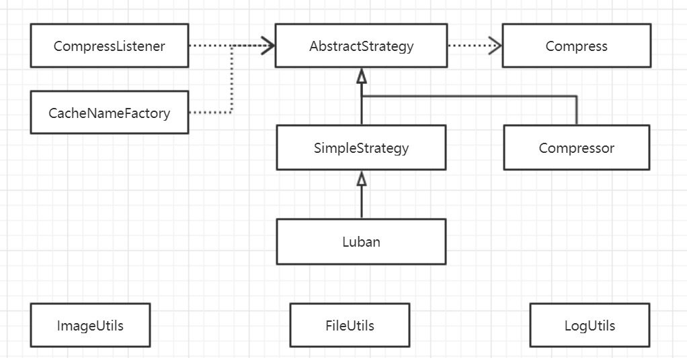

# 开源一个 Android 图片压缩框架

在我们的业务场景中，需要使用客户端采集图片，上传服务器，然后对图片信息进行识别。为了提升程序的性能，我们需要保证图片上传服务器的速度的同时，保证用于识别图片的质量。整个优化包括两个方面的内容：

1. 相机拍照的优化：包括相机参数的选择、预览、启动速度和照片质量等；
2. 图片压缩的优化：基于拍摄的图片和从相册中选择的图片进行压缩，控制图片大小和尺寸。

在本文中，我们主要介绍图片压缩优化，后续我们会介绍如何对 Android 的相机进行封装和优化。本项目主要基于 Android 自带的图片压缩 API 进行封装，结合了 Luban 和 Compressor 的优点，同时提供了用户自定义压缩策略的接口。该项目的主要目的在于，统一图片压缩框库的实现，集成常用的两种图片压缩算法，让你以更低的成本集成图片压缩功能到自己的项目中。

## 1、图片压缩的基础知识

对于一般业务场景，当我们展示图片的时候，Glide 会帮我们处理加载的图片的尺寸问题。但在把采集来的图片上传到服务器之前，为了节省流量，我们需要对图片进行压缩。

在 Android 平台上，默认提供的压缩有三种方式：质量压缩和两种尺寸压缩，邻近采样以及双线性采样。下面我们简单介绍下者三种压缩方式都是如何使用的：

### 1.1 质量压缩

所谓的质量压缩就是下面的这行代码，它是 Bitmap 的方法。当我们得到了 Bitmap 的时候，即可使用这个方法来实现质量压缩。它一般位于我们所有压缩方法的最后一步。

```java
// android.graphics。Bitmap
compress(CompressFormat format, int quality, OutputStream stream)
```

该方法接受三个参数，其含义分别如下：

1. format：枚举，有三个选项 `JPEG`, `PNG` 和 `WEBP`，表示图片的格式；
2. quality：图片的质量，取值在 `[0,100]` 之间，表示图片质量，越大，图片的质量越高；
3. stream：一个输出流，通常是我们压缩结果输出的文件的流

### 1.2 邻近采样

邻近采样基于临近点插值算法，用像素代替周围的像素。邻近采样的核心代码只有下面三行，

```java
BitmapFactory.Options options = new BitmapFactory.Options();
options.inSampleSize = 1;
Bitmap bitmap = BitmapFactory.decodeResource(getResources(), R.drawable.blue_red, options);
```

邻近采样核心的地方在于 `inSampleSize` 的计算。它通常是我们使用的压缩算法的第一步。我们可以通过设置 inSampleSize 来得到原始图片采样之后的结果，而不是将原始的图片全部加载到内存中，以防止 OOM。标准使用姿势如下：

```java
    // 获取原始图片的尺寸
    BitmapFactory.Options options = new BitmapFactory.Options();
    options.inJustDecodeBounds = true;
    options.inSampleSize = 1;
    BitmapFactory.decodeStream(srcImg.open(), null, options);
    this.srcWidth = options.outWidth;
    this.srcHeight = options.outHeight;

    // 进行图片加载，此时会将图片加载到内存中
    options.inJustDecodeBounds = false;
    options.inSampleSize = calInSampleSize();
    Bitmap bitmap = BitmapFactory.decodeStream(srcImg.open(), null, options);
```

这里主要分成两个步骤，它们各自的含义是：

1. 先通过设置 Options 的 `inJustDecodeBounds` 为 true，来加载图片，以得到图片的尺寸信息。此时图片不会被加载到内存中，所以不会造成 OOM，同时我们可以通过 Options 得到原图的尺寸信息。
2. 根据上一步中得到的图片的尺寸信息，计算一个 inSampleSize，然后将 inJustDecodeBounds 设置为 false，以加载采样之后的图片到内存中。

关于 inSampleSize 需要简单说明一下：inSampleSize 代表压缩后的图像一个像素点代表了原来的几个像素点，例如 inSampleSize 为 4，则压缩后的图像的宽高是原来的 1/4，像素点数是原来的 1/16，inSampleSize 一般会选择 2 的指数，如果不是 2 的指数，内部计算的时候也会向 2 的指数靠近。所以，实际使用过程中，我们会通过明确指定 inSampleSize 为 2 的指数，来避免内部计算导致的不确定性。

### 1.3 双线性采样

邻近采样可以对图片的尺寸进行有效的控制，但是它存在几个问题。比如，当我需要把图片的宽度压缩到 1200 左右的时候，如果原始的图片的宽度压是 3200，那么我只能通过设置 inSampleSize 将采样率设置为 2 来将其压缩到 1600. 此时图片的尺寸比我们的要求要大。就是说，邻近采样无法对图片的尺寸进行更加精准的控制。如果需要对图片尺寸进行更加精准的控制，那么就需要使用双线性压缩了。

双线性采样采用双线性插值算法，相比邻近采样简单粗暴的选择一个像素点代替其他像素点，双线性采样参考源像素相应位置周围 2x2 个点的值，根据相对位置取对应的权重，经过计算得到目标图像。

它在 Android 中的使用也比较简单，

```java
Bitmap bitmap = BitmapFactory.decodeResource(getResources(), R.drawable.blue_red);
Matrix matrix = new Matrix();
matrix.setScale(0.5f, 0.5f);
Bitmap sclaedBitmap = Bitmap.createBitmap(bitmap, 0, 0, bitmap.getWidth()/2, bitmap.getHeight()/2, matrix, true);
```

也就是对得到的 Bitmap 应用 `createBitmap()` 进行处理，并传入 Matrix 指定图片尺寸放缩的比例。该方法返回的 Bitmap 就是双线性压缩之后的结果。

### 1.4 图片压缩算法总结

在实际使用过程中，我们通常会结合三种压缩方式使用，一般使用的步骤如下，

1. 使用邻近采样对原始的图片进行采样，将图片控制到比目标尺寸稍大的大小，防止 OOM；
2. 使用双线性采样对图片的尺寸进行压缩，控制图片的尺寸为目标的大小；
3. 对上述两个步骤之后得到的图片 Bitmap 进行质量压缩，并将其输出到磁盘上。

当然，本质上 Android 图片的编码是由 [Skia](https://skia.org/index_zh) 库来完成的，所以，除了使用 Android 自带的库进行压缩，我们还可以调用外部的库进行压缩。为了追求更高的压缩效率，通常我们会在 Native 层对图片进行处理，这将涉及 JNI 的知识。笔者曾在之前的文章 [《在 Android 中使用 JNI 的总结》](https://juejin.im/post/5c79f5d0518825347a56275f) 中介绍过 Android 平台上 JNI 的调用的常规思路，感兴趣的同学可以参考下。

## 2、Github 上的开源的图片压缩库

现在 Github 上的图片压缩框架主要有 Luban 和 Compressor 两个。Star 的数量也比较高，一个 9K，另一个 4K. 但是，这两个图片压缩的库有各自的优点和缺点。下面我们通过一个表格总结一下：

|框架|优点|缺点|
|:-:|:-|:-|
|Luban|据说是根据微信图片压缩逆推的算法|1.只适用于一般的图片展示的场景，无法对图片的尺寸进行精准压缩；2.内部封装 AsyncTaks 来进行异步的图片压缩，对于 RxJava 支持不好。|
|Compressor|1.可以对图片的尺寸进行压缩；2.支持 RxJava。|1.尺寸压缩的场景有限，如果有特别的需求，则需要手动修改源代码；2.图片压缩采样的时候计算有问题，导致采样后的图片尺寸总是小于我们指定的尺寸|

上面的图表已经总结得很详细了。所以，根据上面的两个库各自的优缺点，我们打算开发一个新的图片压缩框架。它满足下面的功能：

1. 支持 RxJava：我们可以像使用 Compressor 的时候那样，指定图片压缩的线程和结果监听的线程；
2. 支持 Luban 压缩算法：Luban 压缩算法核心的部分只在于 inSampleSize 的计算，因此，我们可以很容易得将其集成到我们的新的库中。之所以加入 Luban，是为了让我们的库可以适用于一般图片展示的场景。用户无需指定图片的尺寸，用起来省心省力。
3. 支持 Compressor 压缩算法同时指定更多的参数：Compressor 压缩算法就是我们上述提到的三种压缩算法的总和。不过，当要压缩的宽高比与原始图片的宽高比不一致的时候，它只提供了一种情景。下文中介绍我们框架的时候会说明进行更详细的说明。当然，你可以在调用框架的方法之前主动去计算出一个宽高比，但是你需要把图片压缩的第一个阶段主动走一遍，费心费力。
4. 提供用户自定义压缩算法的接口：我们希望设计的库可以允许用户自定义压缩策略。在想要替换图片压缩算法的时候，通过链式调用的一个方法直接更换策略即可。即，我们希望能够让用户以最低的成本替换项目中的图片压缩算法。

## 3、项目整体架构

以下是我们的图片压缩框架的整体架构，这里我们只列举除了其中核心的部分代码。这里的 Compress 是我们的链式调用的起点，我们可以用它来指定图片压缩的基本参数。然后，当我们使用它的 `strategy()` 方法之后，方法将进入到图片压缩策略中，此时，我们继续链式调用压缩策略的自定义方法，个性化地设置各压缩策略自己的参数：



这里的所有的压缩策略都继承自抽线的基类 AbstractStrategy，它提供了两个默认的实现 Luban 和 Compressor. 接口  CompressListener 和 CacheNameFactory 分别用来监听图片压缩进度和自定义压缩的图片的名称。下面的三个是图片相关的工具类，用户可以调用它们来实现自己压缩策略。

## 4、使用

首先，在项目的 Gradle 中加入我的 Maven 仓库的地址：

    maven { url "https://dl.bintray.com/easymark/Android" }

然后，在你的项目的依赖中，添加该库的依赖：

    implementation 'me.shouheng.compressor:compressor:0.0.1'

然后，就可以在项目中使用了。你可以参考 Sample 项目的使用方式。不过，下面我们还是对它的一些 API 做简单的说明。

### 4.1 Luban 的使用

下面是 Luban 压缩策略的使用示例，它与 Luban 库的使用类似。只是在 Luban 的库的基础上，我们增加了一个 copy 的选项，用来表示当图片因为小于指定的大小而没有被压缩之后，是否将原始的图片拷贝到指定的目录。因为，比如当你使用回调获取图片压缩结果的时候，如果按照 Luban 库的逻辑，你得到的是原始的图片，所以，此时你需要额外进行判断。因此，我们增加了这个布尔类型的参数，你可以通过它指定将原始文件进行拷贝，这样你就不需要在回调中对是否是原始图片进行判断了。

```kotlin
    // 在 Compress 的 with() 方法中指定 Context 和 要压缩文件 File
    val luban = Compress.with(this, file)
        // 这里添加一个回调，如果你不使用 RxJava，那么可以用它来处理压缩的结果
        .setCompressListener(object : CompressListener{
            override fun onStart() {
                LogUtils.d(Thread.currentThread().toString())
                Toast.makeText(this@MainActivity, "Compress Start", Toast.LENGTH_SHORT).show()
            }

            override fun onSuccess(result: File?) {
                LogUtils.d(Thread.currentThread().toString())
                displayResult(result?.absolutePath)
                Toast.makeText(this@MainActivity, "Compress Success : $result", Toast.LENGTH_SHORT).show()
            }

            override fun onError(throwable: Throwable?) {
                LogUtils.d(Thread.currentThread().toString())
                Toast.makeText(this@MainActivity, "Compress Error ：$throwable", Toast.LENGTH_SHORT).show()
            }
        })
        // 压缩图片的名称工厂方法，用来指定压缩结果的文件名
        .setCacheNameFactory { System.currentTimeMillis().toString() }
        // 图片的质量
        .setQuality(80)
        // 上面基本的配置完了，下面指定图片的压缩策略为 Luban
        .strategy(Strategies.luban())
        // 指定如果图片小于等于 100K 就不压缩了，这里的参数 copy 表示，如果不压缩的话要不要拷贝文件
        .setIgnoreSize(100, copy)

        // 按上面那样得到了 Luban 实例之后有下面两种方式启动图片压缩
        // 启动方式 1：使用 RxJava 进行处理
        val d = luban.asFlowable()
            .subscribeOn(Schedulers.io())
            .observeOn(AndroidSchedulers.mainThread())
            .subscribe { displayResult(it.absolutePath) }
    
        // 启动方式 2：直接启动，此时使用内部封装的 AsyncTask 进行压缩，压缩结果只能在上面的回调中进行处理了
        luban.launch()
```

### 4.2 Compressor 的使用

下面是 Compressor 压缩策略的基本的使用，在调用 `strategy()` 方法指定压缩策略之前，你的任务与 Luban 一致。所以，如果你需要更换图片压缩算法的时候，直接使用 `strategy()` 方法更换策略即可，前面部分的逻辑无需改动，因此，可以降低你更换压缩策略的成本。

```kotlin
    val compressor = Compress.with(this, file)
        .setQuality(60)
        .setTargetDir("")
        .setCompressListener(object : CompressListener {
            override fun onStart() {
                LogUtils.d(Thread.currentThread().toString())
                Toast.makeText(this@MainActivity, "Compress Start", Toast.LENGTH_SHORT).show()
            }

            override fun onSuccess(result: File?) {
                LogUtils.d(Thread.currentThread().toString())
                displayResult(result?.absolutePath)
                Toast.makeText(this@MainActivity, "Compress Success : $result", Toast.LENGTH_SHORT).show()
            }

            override fun onError(throwable: Throwable?) {
                LogUtils.d(Thread.currentThread().toString())
                Toast.makeText(this@MainActivity, "Compress Error ：$throwable", Toast.LENGTH_SHORT).show()
            }
        })
        .strategy(Strategies.compressor())
        .setMaxHeight(100f)
        .setMaxWidth(100f)
        .setScaleMode(Configuration.SCALE_SMALLER)
        .launch()
```

这里的 `setMaxHeight(100f)` 和 `setMaxWidth(100f)` 用来表示图片压缩的目标大小。具体的大小是如何计算的呢？在 Compressor 库中你是无法确定的，但是在我们的库中，你可以通过 `setScaleMode()` 方法来指定。这个方法接收一个整数类型的枚举，它的取值范围有 4 个，即 `SCALE_LARGER`, `SCALE_SMALLER`, `SCALE_WIDTH` 和 `SCALE_HEIGHT`，它们具体的含义我们会进行详细说明。这里我们默认的压缩方式是 SCALE_LARGER，也就是 Compressor 库的压缩方式。那么这四个参数分别是什么含义呢？

这里我们以一个例子来说明，假设有一个图片的宽度是 1000，高度是 500，简写作 (W:1000, H:500)，通过 `setMaxHeight()` 和 `setMaxWidth()` 指定的参数均为 100，那么，就称目标图片的尺寸，宽度是 100，高度是 100，简写作 (W:100, H:100)。那么按照上面的四种压缩方式，最终的结果将是：

- **SCALE_LARGER**：对高度和长度中较大的一个进行压缩，另一个自适应，因此压缩结果是 (W:100, H:50). 也就是说，因为原始图片宽高比 2:1，我们需要保持这个宽高比之后再压缩。而目标宽高比是 1:1. 而原图的宽度比较大，所以，我们选择将宽度作为压缩的基准，宽度缩小 10 倍，高度也缩小 10 倍。这是 Compressor 库的默认压缩策略，显然它只是优先使得到的图片更小。这在一般情景中没有问题，但是当你想把短边控制在 100 就无计可施了（需要计算之后再传参），此时可以使用 SCALE_SMALLER。
- **SCALE_SMALLER**：对高度和长度中较大的一个进行压缩，另一个自适应，因此压缩结果是 (W:200, H:100). 也就是，高度缩小 5 倍之后，达到目标 100，然后宽度缩小 5 倍，达到 200. 
- **SCALE_WIDTH**：对宽度进行压缩，高度自适应。因此得到的结果与 SCALE_LARGER 一致。
- **SCALE_HEIGHT**：对高度进行压缩，宽度自适应，因此得到的结果与 SCALE_HEIGHT 一致。

### 4.3 自定义策略

自定义一个图片压缩策略也是很简单的，你可以通过继承 SimpleStrategy 或者直接继承 AbstractStrategy 来实现：

```kotlin
class MySimpleStrategy: SimpleStrategy() {

    override fun calInSampleSize(): Int {
        return 2
    }

    fun myLogic(): MySimpleStrategy {
        return this
    }

}
```

注意下，如果想要实现链式的调用，自定义压缩策略的方法需要返回自身。

## 5、最后

因为我们的项目中，需要把图片的短边控制到 1200，长变只适应，只通过改变 Luban 来改变采样率只能把边长控制到一个范围中，无法精准压缩。所以，我们想到了 Compressor，并提出了 SCALE_SMALLER 的压缩模式. 但是 Luban 也不是用不到，一般用来展示的图片的压缩，它用起来更加方便。因此，我们在库中综合了两个框架，其实代码量并不大。当然，为了让我们的库功能更加丰富，因此我们提出了自定义压缩策略的接口，也是用来降低压缩策略的更换成本吧。

最后项目开源在 Github，地址是：https://github.com/Shouheng88/Compressor. 欢迎 Star 和 Fork，为该项目贡献代码或者提出 issue :)

后续，笔者会对 Android 端的相机优化和 JNI 操作 OpenCV 进行图片处理进行讲解，感兴趣的关注作者呦 :)
