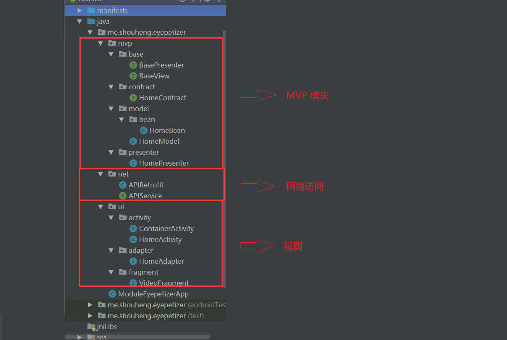

# Android 应用架构设计探索：MVC、MVP、MVVM和组件化

MVC、MVP和MVVM是常见的三种架构设计模式，当前MVP和MVVM的使用相对比较广泛，当然MVC也并没有过时之说。而所谓的组件化就是指将应用根据业务需求划分成各个模块来进行开发，每个模块又可以编译成独立的APP进行开发。理论上讲，组件化和前面三种架构设计不是一个层次的。它们之间的关系是，组件化的各个组件可以使用前面三种架构设计。我们只有了解了这些架构设计的特点之后，才能在进行开发的时候选择适合自己项目的架构模式，这也是本文的目的。

## 1、MVC

MVC (Model-View-Controller, 模型-视图-控制器)，标准的MVC是这个样子的：

- 模型层 (Model)：业务逻辑对应的数据模型，无View无关，而与业务相关；
- 视图层 (View)：一般使用XML或者Java对界面进行描述；
- 控制层 (Controllor)：在Android中通常指Activity和Fragment，或者由其控制的业务类。

Activity并非标准的Controller，它一方面用来控制了布局，另一方面还要在Activity中写业务代码，造成了Activity既像View又像Controller。

在Android开发中，就是指直接使用Activity并在其中写业务逻辑的开发方式。显然，一方面Activity本身就是一个视图，另一方面又要负责处理业务逻辑，因此逻辑会比较混乱。

这种开发方式不太适合Android开发。

## 2、MVP

### 2.1 概念梳理

MVP (Model-View-Presenter) 是MVC的演化版本，几个主要部分如下：

- 模型层 (Model)：主要提供数据存取功能。
- 视图层 (View)：处理用户事件和视图。在Android中，可能是指Activity、Fragment或者View。
- 展示层 (Presenter)：负责通过Model存取书数据，连接View和Model，从Model中取出数据交给View。

所以，对于MVP的架构设计，我们有以下几点需要说明：

1. 这里的Model是用来存取数据的，也就是用来从指定的数据源中获取数据，不要将其理解成MVC中的Model。在MVC中Model是数据模型，在MVP中，我们用Bean来表示数据模型。
2. Model和View不会直接发生关系，它们需要通过Presenter来进行交互。在实际的开发中，我们可以用接口来定义一些规范，然后让我们的View和Model实现它们，并借助Presenter进行交互即可。

为了说明MVP设计模式，我们给出一个示例程序。你可以在[Github](https://github.com/Shouheng88/Android-references)中获取到它的源代码。

### 2.2 示例程序

在该示例中，我们使用了：

1. 开眼视频的API作为数据源；
2. Retrofit进行数据访问；
3. 使用ARouter进行路由；
4. 使用MVP设计模式作为程序架构。

下面是该模块的基本的包结构：



这里核心的代码是MVP部分。

这里我们首先定义了MVP模式中的最顶层的View和Presenter，在这里分别是`BaseView`和`BasePresenter`，它们在该项目中是两个空的接口，在一些项目中，我们可以根据自己的需求在这两个接口中添加自己需要的方法。

然后，我们定义了`HomeContract`。它是一个抽象的接口，相当于一层协议，用来规定指定的功能的View和Presenter分别应该具有哪些方法。通常，对于不同的功能，我们需要分别实现一个MVP，每个MVP都会又一个对应的Contract。笔者认为它的好处在于，将指定的View和Presenter的接口定义在一个接口中，更加集中。它们各自需要实现的方法也一目了然地展现在了我们面前。

这里根据我们的业务场景，该接口的定义如下：

    public interface HomeContract {

        interface IView extends BaseView {
            void setFirstPage(List<HomeBean.IssueList.ItemList> itemLists);
            void setNextPage(List<HomeBean.IssueList.ItemList> itemLists);
            void onError(String msg);
        }

        interface IPresenter extends BasePresenter {
            void requestFirstPage();
            void requestNextPage();
        }
    }

`HomeContract`用来规定View和Presenter应该具有的操作，在这里它用来指定主页的View和Presenter的方法。从上面我们也可以看出，这里的`IView`和`IPresenter`分别实现了`BaseView`和`BasePresenter`。

上面，我们定义了V和P的规范，MVP中还有一项Model，它用来从网络中获取数据。这里我们省去网络相关的具体的代码，你只需要知道`APIRetrofit.getEyepetizerService()`是用来获取Retrofit对应的Service，而`getMoreHomeData()`和`getFirstHomeData()`是用来从指定的接口中获取数据就行。下面是`HomeModel`的定义：

```
public class HomeModel {

    public Observable<HomeBean> getFirstHomeData() {
        return APIRetrofit.getEyepetizerService().getFirstHomeData(System.currentTimeMillis());
    }

    public Observable<HomeBean> getMoreHomeData(String url) {
        return APIRetrofit.getEyepetizerService().getMoreHomeData(url);
    }
}

```

OK，上面我们已经完成了Model的定义和View及Presenter的规范的定义。下面，我们就需要具体去实现View和Presenter。

首先是Presenter，下面是我们的`HomePresenter`的定义。在下面的代码中，为了更加清晰地展示其中的逻辑，我删减了一部分无关代码：

```
public class HomePresenter implements HomeContract.IPresenter {

    private HomeContract.IView view;

    private HomeModel homeModel;

    private String nextPageUrl;

    // 传入View并实例化Model
    public HomePresenter(HomeContract.IView view) {
        this.view = view;
        homeModel = new HomeModel();
    }

    // 使用Model请求数据，并在得到请求结果的时候调用View的方法进行回调
    @Override
    public void requestFirstPage() {
        Disposable disposable = homeModel.getFirstHomeData()
                // ....
                .subscribe(itemLists -> { view.setFirstPage(itemLists); },
                        throwable -> { view.onError(throwable.toString()); });
    }

    // 使用Model请求数据，并在得到请求结果的时候调用View的方法进行回调
    @Override
    public void requestNextPage() {
        Disposable disposable = homeModel.getMoreHomeData(nextPageUrl)
                // ....
                .subscribe(itemLists -> { view.setFirstPage(itemLists); },
                        throwable -> { view.onError(throwable.toString()); });
    }
}

```

从上面我们可以看出，在Presenter需要将View和Model建立联系。我们需要在初始化的时候传入View，并实例化一个Model。Presenter通过Model获取数据，并在拿到数据的时候，通过View的方法通知给View层。

然后，就是我们的View层的代码，同样，我对代码做了删减：

```
@Route(path = BaseConstants.EYEPETIZER_MENU)
public class HomeActivity extends CommonActivity<ActivityEyepetizerMenuBinding> implements HomeContract.IView {

    // 实例化Presenter
    private HomeContract.IPresenter presenter;
    {
        presenter = new HomePresenter(this);
    }

    @Override
    protected int getLayoutResId() {
        return R.layout.activity_eyepetizer_menu;
    }

    @Override
    protected void doCreateView(Bundle savedInstanceState) {
        // ...
        // 使用Presenter请求数据
        presenter.requestFirstPage();
        loading = true;
    }

    private void configList() {
        // ...
        getBinding().rv.addOnScrollListener(new RecyclerView.OnScrollListener() {
            @Override
            public void onScrolled(RecyclerView recyclerView, int dx, int dy) {
                    // 请求下一页的数据
                    presenter.requestNextPage();
                }
            }
        });
    }

    // 当请求到结果的时候在页面上做处理，展示到页面上
    @Override
    public void setFirstPage(List<HomeBean.IssueList.ItemList> itemLists) {
        loading = false;
        homeAdapter.addData(itemLists);
    }

    // 当请求到结果的时候在页面上做处理，展示到页面上
    @Override
    public void setNextPage(List<HomeBean.IssueList.ItemList> itemLists) {
        loading = false;
        homeAdapter.addData(itemLists);
    }

    @Override
    public void onError(String msg) {
        ToastUtils.makeToast(msg);
    }

    // ...
}
```

从上面的代码中我们可以看出实际在View中也要维护一个Presenter的实例。
当需要请求数据的时候会使用该实例的方法来请求数据，所以，在开发的时候，我们需要根据请求数据的情况，在Presenter中定义接口方法。

实际上，MVP的原理就是View通过Presenter获取数据，获取到数据之后再回调View的方法来展示数据。

### 2.3 MVC 和 MVP 的区别

1. MVC 中是允许 Model 和 View 进行交互的，而MVP中，Model 与 View 之间的交互由Presenter完成；
2. MVP 模式就是将 P 定义成一个接口，然后在每个触发的事件中调用接口的方法来处理，也就是将逻辑放进了 P 中，需要执行某些操作的时候调用 P 的方法就行了。

### 2.4 MVP的优缺点

优点：

1. 降低耦合度，实现了 Model 和 View 真正的完全分离，可以修改 View 而不影响 Modle；
2. 模块职责划分明显，层次清晰；
3. 隐藏数据；
4. Presenter 可以复用，一个 Presenter 可以用于多个 View，而不需要更改 Presenter 的逻辑；
5. 利于测试驱动开发，以前的Android开发是难以进行单元测试的；
6. View 可以进行组件化，在MVP当中，View 不依赖 Model。

缺点：

1. Presenter 中除了应用逻辑以外，还有大量的 View->Model，Model->View 的手动同步逻辑，造成 Presenter 比较笨重，维护起来会比较困难；
2. 由于对视图的渲染放在了 Presenter 中，所以视图和 Presenter 的交互会过于频繁；
3. 如果 Presenter 过多地渲染了视图，往往会使得它与特定的视图的联系过于紧密，一旦视图需要变更，那么Presenter也需要变更了。

## 3、MVVM (分手大师)

### 3.1 基础概念

MVVM 是 Model-View-ViewModel 的简写。它本质上就是 MVC 的改进版。MVVM 就是将其中的 View 的状态和行为抽象化，让我们将视图 UI 和业务逻辑分开。

- 模型层 (Model)：负责从各种数据源中获取数据；
- 视图层 (View)：在 Android 中对应于 Activity 和 Fragment，用于展示给用户和处理用户交互，会驱动 ViewModel 从 Model 中获取数据；
- ViewModel 层：用于将 Model 和 View 进行关联，我们可以在 View 中通过 ViewModel 从 Model 中获取数据；当获取到了数据之后，会通过自动绑定，比如 DataBinding，来将结果自动刷新到界面上。

使用 Google 官方的 Android Architecture Components ，我们可以很容易地将 MVVM 应用到我们的应用中。下面，我们就使用它来展示一下 MVVM 的实际的应用。你可以在[Github](https://github.com/Shouheng88/Android-references)中获取到它的源代码。

### 3.2 示例程序

在该项目中，我们使用了：

1. 果壳网的 API 作为数据源；
2. 使用 Retrofit 进行网络数据访问；
3. 使用 ViewMdeol 作为整体的架构设计。

该项目的包结构如下图所示：


这里的`model.data`下面的类是对应于网络的数据实体的，由JSON自动生成，这里我们不进行详细描述。这里的`model.repository`下面的两个类是用来从网络中获取数据信息的，我们也忽略它的定义。

上面就是我们的 Model 的定义，并没有太多的内容，基本与 MVP 一致。

下面的是 ViewModel 的代码，我们选择了其中的一个方法来进行说明。当我们定义 ViewModel 的时候，需要继承 ViewModel 类。

```
public class GuokrViewModel extends ViewModel {

    public LiveData<Resource<GuokrNews>> getGuokrNews(int offset, int limit) {
        MutableLiveData<Resource<GuokrNews>> result = new MutableLiveData<>();
        GuokrRetrofit.getGuokrService().getNews(offset, limit)
                .subscribeOn(Schedulers.io())
                .observeOn(AndroidSchedulers.mainThread())
                .subscribe(new Observer<GuokrNews>() {
                    @Override
                    public void onError(Throwable e) {
                        result.setValue(Resource.error(e.getMessage(), null));
                    }

                    @Override
                    public void onComplete() { }

                    @Override
                    public void onSubscribe(Disposable d) { }

                    @Override
                    public void onNext(GuokrNews guokrNews) {
                        result.setValue(Resource.success(guokrNews));
                    }
                });
        return result;
    }
}
```

这里的 ViewModel 来自 `android.arch.lifecycle.ViewModel`，所以，为了使用它，我们还需要加入下面的依赖：

    api "android.arch.lifecycle:runtime:$archVersion"
    api "android.arch.lifecycle:extensions:$archVersion"
    annotationProcessor "android.arch.lifecycle:compiler:$archVersion"

在 ViewModel 的定义中，我们直接使用 Retrofit 来从网络中获取数据。然后当获取到数据的时候，我们使用 LiveData 的方法把数据封装成一个对象返回给 View 层。在 View 层，我们只需要调用该方法，并对返回的 LiveData 进行"监听"即可。这里，我们将错误信息和返回的数据信息进行了封装，并且封装了一个代表当前状态的枚举信息，你可以参考源代码来详细了解下这些内容。

上面我们定义完了 Model 和 ViewModel，下面我们看下 View 层的定义，以及在 View 层中该如何使用 ViewModel。

```
@Route(path = BaseConstants.GUOKR_NEWS_LIST)
public class NewsListFragment extends CommonFragment<FragmentNewsListBinding> {

    private GuokrViewModel guokrViewModel;

    private int offset = 0;

    private final int limit = 20;

    private GuokrNewsAdapter adapter;

    @Override
    protected int getLayoutResId() {
        return R.layout.fragment_news_list;
    }

    @Override
    protected void doCreateView(Bundle savedInstanceState) {
        // ...

        guokrViewModel = ViewModelProviders.of(this).get(GuokrViewModel.class);

        fetchNews();
    }

    private void fetchNews() {
        guokrViewModel.getGuokrNews(offset, limit).observe(this, guokrNewsResource -> {
            if (guokrNewsResource == null) {
                return;
            }
            switch (guokrNewsResource.status) {
                case FAILED:
                    ToastUtils.makeToast(guokrNewsResource.message);
                    break;
                case SUCCESS:
                    adapter.addData(guokrNewsResource.data.getResult());
                    adapter.notifyDataSetChanged();
                    break;
            }
        });
    }
}
```

以上就是我们的 View 层的定义，这里我们先使用了 

这里的`view.fragment`包下面的类对应于实际的页面，这里我们 `ViewModelProviders` 的方法来获取我们需要使用的 ViewModel，然后，我们直接使用该 ViewModel 的方法获取数据，并对返回的结果进行“监听”即可。

以上就是 MVVM 的基本使用，当然，这里我们并没有使用 DataBinding 直接与返回的列表信息进行绑定，它被更多的用在了整个 Fragment 的布局中。

### 3.3 MVVM 的优点和缺点

MVVM模式和MVC模式一样，主要目的是分离视图（View）和模型（Model），有几大优点：

1. **低耦合**：视图（View）可以独立于Model变化和修改，一个 ViewModel 可以绑定到不同的 View 上，当 View 变化的时候 Model 可以不变，当 Model 变化的时候 View 也可以不变。
2. **可重用性**：你可以把一些视图逻辑放在一个 ViewModel 里面，让很多 view 重用这段视图逻辑。
3. **独立开发**：开发人员可以专注于业务逻辑和数据的开发（ViewModel），设计人员可以专注于页面设计。
4. **可测试**：界面素来是比较难于测试的，而现在测试可以针对 ViewModel 来写。

## 4、组件化

### 4.1 基础概念

所谓的**组件化**，通俗理解就是将一个工程分成各个模块，各个模块之间相互解耦，可以独立开发并编译成一个独立的 APP 进行调试，然后又可以将各个模块组合起来整体构成一个完整的 APP。它的好处是当工程比较大的时候，便于各个开发者之间分工协作、同步开发；被分割出来的模块又可以在项目之间共享，从而达到复用的目的。组件化有诸多好处，尤其适用于比较大型的项目。

简单了解了组件化之后，让我们来看一下如何实现组件化开发。你可能之前听说过组件化开发，或者被其高大上的称谓吓到了，但它实际应用起来并不复杂，至少借助了现成的框架之后并不复杂。这里我们先梳理一下，在应用组件化的时候需要解决哪些问题：

1. 如何分成各个模块？我们可以根据业务来进行拆分，对于比较大的功能模块可以作为应用的一个模块来使用，但是也应该注意，划分出来的模块不要过多，否则可能会降低编译的速度并且增加维护的难度。
2. 各个模块之间如何进行数据共享和数据通信？我们可以把需要共享的数据划分成一个单独的模块来放置公共数据。各个模块之间的数据通信，我们可以使用阿里的 ARouter 进行页面的跳转，使用封装之后的 RxJava 作为 EventBus 进行全局的数据通信。
3. 如何将各个模块打包成一个独立的 APP 进行调试？首先这个要建立在2的基础上，然后，我们可以在各个模块的 gradle 文件里面配置需要加载的 AndroidManifest.xml 文件，并可以为每个应用配置一个独立的 Application 和启动类。
4. 如何防止资源名冲突问题？遵守命名规约就能规避资源名冲突问题。
5. 如何解决 library 重复依赖以及 sdk 和依赖的第三方版本号控制问题？可以将各个模块公用的依赖的版本配置到 settings.gradle 里面，并且可以建立一个公共的模块来配置所需要的各种依赖。

Talk is cheap，下面让我们动手实践来应用组件化进行开发。你可以在[Github](https://github.com/Shouheng88/Android-references)中获取到它的源代码。

### 4.2 组件化实践

#### 包结构

首先，我们先来看整个应用的包的结构。如下图所示，该模块的划分是根据各个模块的功能来决定的。图的右侧白色的部分是各个模块的文件路径，我推荐使用这种方式，而不是将各个模块放置在 app 下面，因为这样看起来更加的清晰。为了达到这个目的，你只需要按照下面的方式在 settings.gralde 里面配置一下各个模块的路径即可。注意在实际应用的时候模块的路径的关系，不要搞错了。


然后，我们介绍一下这里的 commons 模块。它用来存放公共的资源和一些依赖，这里我们将两者放在了一个模块中以减少模块的数量。下面是它的 gradle 的部分配置。这里我们使用了 api 来引入各个依赖，以便在其他的模块中也能使用这些依赖。

```
dependencies {
    api fileTree(include: ['*.jar'], dir: 'libs')
    // ...
    // router
    api 'com.alibaba:arouter-api:1.3.1'
    annotationProcessor 'com.alibaba:arouter-compiler:1.1.4'
    // walle
    api 'com.meituan.android.walle:library:1.1.6'
    // umeng
    api 'com.umeng.sdk:common:1.5.3'
    api 'com.umeng.sdk:analytics:7.5.3'
    api files('libs/pldroid-player-1.5.0.jar')
}
```

#### 路由

接着，我们来看一下路由框架的配置。这里，我们使用阿里的 ARouter 来进行页面之间的跳转，你可以在[Github](https://github.com/alibaba/ARouter)上面了解该框架的配置和使用方式。这里我们只讲解一下在组件化开发的时候需要注意的地方。注意到 ARouter 是通过注解来进行页面配置的，并且它的注解是在编译的时候进行处理的。所以，我们需要引入`arouter-compiler`来使用它的编译时处理功能。需要注意的地方是，我们只要在公共的模块中加入`arouter-api`就可以使用ARouter的API了，但是需要在每个模块中引入`arouter-compiler`才能使用编译时注解。也就是说，我们需要在每个模块中都加入`arouter-compiler`依赖。

#### 模块独立

为了能够将各个模块编译成一个独立的 APP，我们需要在 Gradle 里面做一些配置。

首先，我们需要在`gradle.properties`定义一些布尔类型的变量用来判断各个模块是作为一个 library 还是 application 进行编译。这里我的配置如下面的代码所示。也就是，我为每个模块都定义了这么一个布尔类型的变量，当然，你也可以只定义一个变量，然后在各个模块中使用同一个变量来进行判断。

```
isGuokrModuleApp=false
isLiveModuleApp=false
isLayoutModuleApp=false
isLibraryModuleApp=false
isEyepetizerModuleApp=false
```

然后，我们来看一下各个模块中的 gradle 该如何配置，这里我们以开眼视频的功能模块作为例子来进行讲解。首先，一个模块作为 library 还是 application 是根据引用的 plugin 来决定的，所以，我们要根据之前定义的布尔变量来决定使用的 plugin：

```
if (isEyepetizerModuleApp.toBoolean()) {
    apply plugin: 'com.android.application'
} else {
    apply plugin: 'com.android.library'
}
```

假如我们要将某个模块作为一个独立的 APP，那么启动类你肯定需要配置。这就意味着你需要两个 AndroidManifest.xml 文件，一个用于 library 状态，一个用于 application 状态。所以，我们可以在 main 目录下面再定义一个 AndroidManifest.xml，然后，我们在该配置文件中不只指定启动类，还使用我们定义的 Application。指定 Application 有时候是必须的，比如你需要在各个模块里面初始化 ARouter 等等。这部分代码就不给出了，可以参考源码，这里我们给出一下在 Gradle 里面指定 AndroidManifest.xml 的方式。

如下所示，我们可以根据之前定义的布尔值来决定使用哪一个配置文件：

    sourceSets {
        main {
            jniLibs.srcDirs = ['libs']
            if (isEyepetizerModuleApp.toBoolean()) {
                manifest.srcFile "src/main/debug/AndroidManifest.xml"
            } else {
                manifest.srcFile "src/main/AndroidManifest.xml"
            }
        }
    }

此外，还需要注意的是，如果我们希望在每个模块中都能应用 DataBinding 和 Java 8 的一些特性，那么你需要在每个模块里面都加入下面的配置：

    // use data binding
    dataBinding {
        enabled = true
    }
    // use java 8 language
    compileOptions {
        sourceCompatibility JavaVersion.VERSION_1_8
        targetCompatibility JavaVersion.VERSION_1_8
    }

对于编译时注解之类的配置，我们也需要在每个模块里面都进行声明。

完成了以上的配置，我们只要根据需要编译的类型，修改之前定义的布尔值，来决定是将该模块编译成 APP 还是作为类库来使用即可。

以上就是组件化在 Android 开发当中的应用。

## 总结

MVC、MVP和MVVM各有各自的特点，可以根据应用开发的需要选择适合自己的架构模式。组件化的目的就在于保持各个模块之间的独立从而便于分工协作。它们之间的关系就是，你可以在组件化的各个模块中应用前面三种架构模式的一种或者几种。

