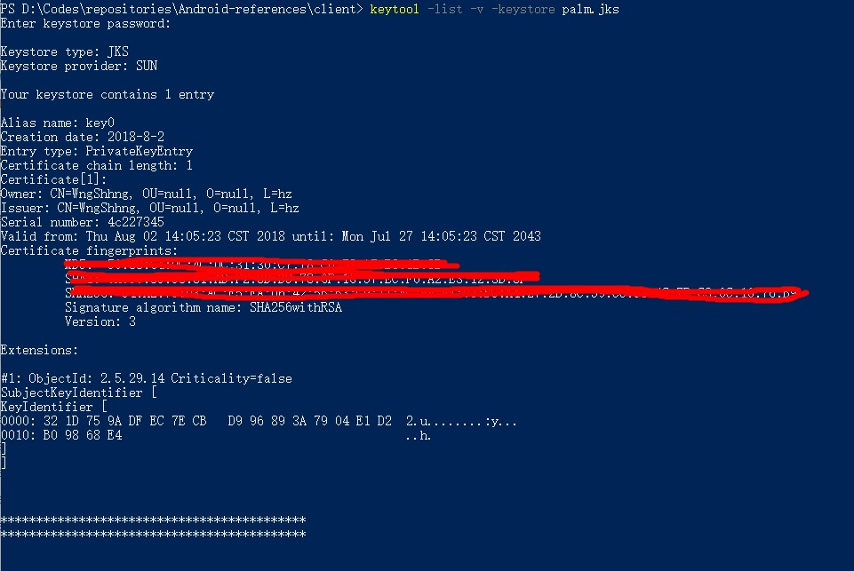
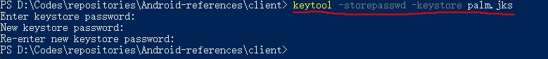
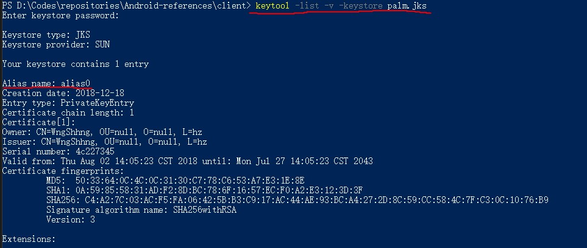
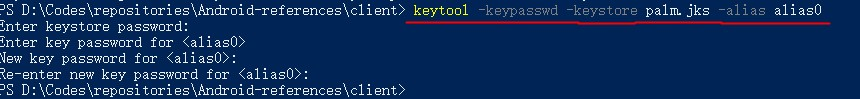

# Keytool 常用的指令合集

### 获取 APK 的签名信息

方式 1：在命令行中输入下面的命令，即可获取 SHA1 签名信息：

    keytool -printcert -file C:\META-INF\CERT.RSA
    
这里的 `C:\META-INF\CERT.RSA` 是从 APK 包中解压出来的 `RSA` 文件的路径。

方式 2：或者使用下面的命令也可以达到相同的目的，并且不用对 APK 进行解压：

    keytool -printcert -jarfile example-release-v2.apk

### 显示签名文件的信息

在命令行输入下面的指令来显示签名文件的信息，这里的 `palm.jks` 是签名文件：

    keytool -list -v -keystore palm.jks

指令执行的结果是：

### 修改签名文件的密码

在命令行输入下面的指令来修改签名文件的密码，这里的 `palm.jks` 是签名文件：

    keytool -storepasswd -keystore palm.jks

指令的执行结构如下，我们输入旧密码，然后两次输入并确认新密码之后，密码即修改成功：

### 修改签名文件的别名

在命令行输入下面的指令来修改签名文件的别名，这里的 `palm.jks` 是签名文件，`key0` 是之前的别名，`alias0` 是要修改成的别名：

    keytool -changealias -keystore palm.jks -alias key0 -destalias alias0

指令执行的结果如下，输入签名文件的密码之后，我们就成功地修改了别名：

然后，我们使用下面的指令再来查看一下修改之后的签名文件的信息，以确认别名修改成功。如下图所示，别名已经被我们成功地修改成了 `alias0`：

### 修改签名文件的别名的密码

在命令行输入下面的指令来修改签名文件的别名的密码，这里的 `palm.jks` 是签名文件，`alias0` 是签名文件的别名：

    keytool -keypasswd -keystore palm.jks -alias alias0

指令执行的结果如下所示，当我们输入完了签名文件的密码和原来的别名密码之后，输入两遍新的别名的密码即可：

