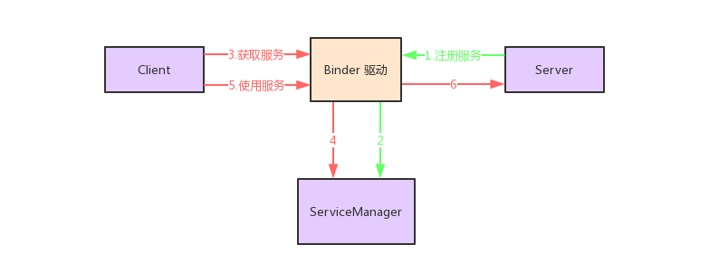
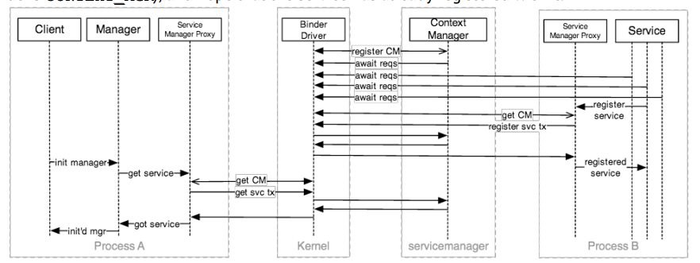

# Android 中的 Binder 通信机制

Binder 是 Android 系统中非常重要的组成部分。Android 系统中的许多功能建立在 Binder 机制之上。在这篇文章中，我们会对 Android 中的 Binder 在系统架构中的作用进行分析，然后，我们会从底层的实现角度简要说明为什么 Android 要开发出一套独立的跨进程通信机制，最后，我们会给出一个 AIDL 的使用示例来说明如何使用 Binder 来进行通信。

## 1、什么是 Binder？ 为什么说它对 Android 系统至关重要？

“什么是 Binder？ 为什么说它对 Android 系统至关重要？” 在回答这个问题之前，我们先来说下其他的东西。

不知道你有没有思考过这么一个问题：为什么当我们在 Android 中启动一个页面的时候需要调用 `startActivity()` 方法，然后还要传入一个 Intent？ 如果我们不使用这种传递值的方式，直接写成静态的变量有没有问题？这也是之前有人问过我的一个问题。

对上面的两个问题，我们先回答第二个。使用静态的变量传递值在大部分情况下是可以的，当然要注意在使用完了值之后要及时释放资源，不然会占用太多内存，甚至 OOM. 但是，在特殊的情况下它是无法适用的，即跨进程的情况下。这是因为，静态的变量的作用范围只是其所在的进程，在其他进程访问的时候属于跨进程访问，当然访问不到了。对于第一个问题，Android 中的一个 Activity 的启动过程远比我们想象的复杂，其中就涉及跨进程的通信过程。当我们调用 `startActivity()` 方法之后，我们的所有的 “意图” 会经过层层过滤，一直到一个称之为 AMS 的地方被处理。处理完之后，再跨进程调用你启动页面时的进程进行后续处理，即回调 `onCreate()` 等声明周期方法。

*一个 Activity 的启动过程涉及 Android 中两种重要的通信机制，Binder 和 Handler，我们会在以后的文章中对此进行分析。*

下面我们通过一个简单的图来说明一下 Activity 的启动过程：


当我们调用 `startActivity()` 方法的时候，会将 ApplicationThread 传递给 AMS. 这里的 ApplicationThread 实现了 `IApplicationThread.Stub`. （**请注意下实现的这个类的定义形式：一个接口内部的 Stub 类**。这对我们很重要，因为它是 AIDL 的定义非常常见的形式。在 Android 的系统源码中大规模地使用了这种方式来进行跨进程通信。）它被用来进行跨进程调用，你可以将其理解成一个远程对象的映射，通过调用它就可以调用它所在进程中的方法和变量。

这里的 ApplicationThread 会作为一个变量传递给 AMS，AMS 在对 “意图” 解析完毕之后会通过 ApplicationThread 调用应用进程的方法，发送消息给 H。这里的 H 是一个 Handler，它被用来向主线程的消息队列发送消息，从而在主线程中根据消息的类型回调 Activity 的各个生命周期方法。你可以参考下面这篇文章来了解 Android 中的 Handler 机制。

[Android 消息机制：Handler、MessageQueue 和 Looper](https://juejin.im/post/5bdec872e51d4551ee2761cb)

对于 AMS，它是一个系统服务。我们会在调用 `startActivity()` 方法中，从 ServiceManager 中获取到 AMS. 而且 AMS 实现了 `IActivityManager.Stub`。（注意下这里的实现类的形式和上面相似，所以它也是一个跨进程的过程）。所以，当我们调用 AMS 的方法的时候其实就是在当前进程中调用 AMS 所在进程的方法。

看了上面的过程，也许有的同学会觉得。上面的过程对 Android 系统至关重要，但是我们并没有用到 Binder 啊。实际上，我们只是没有直接使用 Binder：


上面是我们在开发过程中实际使用 Binder 的过程。我们大多数情况下都在与各个 Manager 进行交互，而实际上这些 Manager 内部是使用 Binder 来进行跨进程通信的。如上所示，当我们调用 Manager 的时候，Manager 会通过代理类来从 Binder 驱动中得到另一个进程的 Stub 对象，然后我们使用该 Stub 对象，远程调用另一个进程的方法。只是这个过程被封装了，我们没有感知到而已，而这个跨进程通信 (IPC) 的机制就是 Binder 机制。

## 2、为什么是 Binder 而不是其他通信机制？

Android 是基于 Linux 的，Linux 本身已经具有了许多的 IPC 机制，比如：管道（Pipe）、信号（Signal）和跟踪（Trace）、插口（Socket）、消息队列（Message）、共享内存（Share Memory）和信号量（Semaphore）。那么，为什么 Android 要特立独行地搞出一套 IPC 机制呢？这当然是有原因的：

1. 效率：Socket 作为一款通用接口，其传输效率低，开销大，主要用在跨网络的进程间通信和本机上进程间的低速通信。消息队列和管道采用存储-转发方式，即数据先从发送方缓存区拷贝到内核开辟的缓存区中，然后再从内核缓存区拷贝到接收方缓存区，至少有两次拷贝过程。共享内存虽然无需拷贝，但控制复杂，难以使用。Binder 只需要一次数据拷贝，性能上仅次于共享内存。

2. 稳定性：Binder 基于 C/S 架构，客户端（Client）有什么需求就丢给服务端（Server）去完成，架构清晰、职责明确又相互独立，自然稳定性更好。共享内存虽然无需拷贝，但是控制负责，难以使用。从稳定性的角度讲，Binder 机制是优于内存共享的。

3. 安全性：Binder 通过在内核层为客户端添加身份标志 `UID/PID`，来作为身份校验的标志，保障了通信的安全性。传统 IPC 访问接入点是开放的，无法建立私有通道。比如，命名管道的名称，SystemV 的键值，Socket 的 ip 地址或文件名都是开放的，只要知道这些接入点的程序都可以和对端建立连接，不管怎样都无法阻止恶意程序通过猜测接收方地址获得连接。

除了上面的原因之外，Binder 还拥有许多其他的特性，比如：1).采用引用计数，当某个 Binder 不再被任何客户端引用的时候，会通知它的持有者可以将其释放，这适用于 Android 这种常常因为资源不足而回收资源的应用场景。2).它内部维护了一个线程池；3).可以像触发本地方法一样触发远程的方法。4).支持同步和异步 (oneway) 的触发模型；5).可以使用 AIDL 模板进行描述和开发。

## 3、Binder 模型，Binder 中的 4 个主要角色

在 Binder 模型中共有 4 个主要角色，它们分别是：Client、Server、Binder 驱动和 ServiceManager。Binder 的整体结构是基于 C/S 结构的，以我们启动 Activity 的过程为例，每个应用都会与 AMS 进行交互，当它们拿到了 AMS 的 Binder 之后就像是拿到了网络接口一样可以进行访问。如果我们将 Binder 和网络的访问过程进行类比，那么 Server 就是服务器，Client 是客户终端，ServiceManager 是域名服务器（DNS），驱动是路由器。其中 Server、Client 和 ServiceManager 运行于用户空间，驱动运行于内核空间。

当我们的系统启动的时候，会在启动 SystemServer 进程的时候启动各个服务，也包括上面的 AMS. 它们会被放进一个哈希表中，并且哈希表的键是字符串。这样我们就可以通过服务的字符串名称来找到对应的服务。这些服务就是一个个的 Binder 实体，对于 AMS 而言，也就是 `IActivityManager.Stub` 实例。这些服务被启动的之后就像网络中的服务器一样一直等待用户的访问。

对于这里的 ServiceManager，它也是一种服务，但是它比较特殊，它会在所有其他的服务之前被注册，并且只被注册一次。它的作用是用来根据字符串的名称从哈希表中查找服务，以及在系统启动的时候向哈希表中注册服务。



所以，我们可以使用上面的这张图来描述整个 Binder 模型：首先，在系统会将应用程序所需的各种服务通过 Binder 驱动注册到系统中（ServiceManager 先被注册，之后其他服务再通过 ServiceManager 进行注册），然后当某个客户端进行需要使用某个服务的时候，也需要与 Binder 驱动进行交互，Binder 会通过客户端需要的服务的名称到 ServiceManager 中查找指定的服务，并将其返回给客户端程序进行使用。

## 3、Binder 的原理

### 3.1 内存映射

上面我们总结了 `Binder` 的模型。根据以上内容，`Binder` 之所以高效，是因为它可以像在当前进程中触发方法一样触发其他进程的方法。那么，它是如何做到这一点的呢？

Binder 整个实现过程是非常复杂的，在老罗的《Android 系统源码情景分析》一书中四分之一的篇幅都在讲 Binder 的实现原理。所以，在这里我们不算详细地讲解它的具体的实现原理，我们只对其中部分内容做简单的分析，并且不希望涉及大量的代码。

- [TODO]()

当使用 `Binder` 进行通信的时候。`Binder` 驱动会先通过在 `mmap()` 在内核空间创建数据接收的缓存空间。接着在内核空间开辟一块内核缓存区，**建立内核缓存区和内核中数据接收缓存区之间的映射关系，以及内核中数据接收缓存区和接收进程用户空间地址的映射关系**（存在两个映射关系）。然后，发送方进程通过系统调用 `copy_from_user()` 将数据复制到内核中的内核缓存区，由于内核缓存区和接收进程的用户空间存在内存映射，因此也就相当于把数据发送到了接收进程的用户空间，这样便完成了一次进程间的通信。相对于传统的 `IPC`，`Binder` 只需要一次复制就完成了进程间的通信。这也是 `Binder` 相比于其他的 `IPC` 机制高效的原因。


当 `Client` 将数据和要执行的方法的编号 (`code`) 传递给 `Server` 之后，`Server` 会根据编号触发服务中的方法。当方法执行完毕之后，再通过将数据写入自身的用户空间。因为 `Server` 的用户空间和内核中的数据缓冲区存在映射关系，所以也就相当于把结果写进了内核缓存区中。然后，内核再通过调用系统的 `copy_to_user()` 方法将数据写入到 `Client` 的用户空间。这样 `Client` 就完成了对服务的一次调用。

上文中提到的编号需要注意一下，因为 `Client` 进程需要跨进程调用 `Server` 的进程，所以具体要调用哪个方法必须通过编号来告诉 `Server`。

## 4、Binder 的使用

### 4.1 代理模式

`Binder` 本质上只是一种底层通信方式，和具体服务没有关系。为了提供具体服务，`Server` 必须提供一套接口函数以便 `Client` 通过远程访问使用各种服务。这时通常采用**代理设计模式**：将接口函数定义在一个抽象类中，`Server` 和 `Client` 都会以该抽象类为基类实现所有接口函数，所不同的是 `Server` 端是真正的功能实现，而 `Client` 端是对这些函数远程调用请求的包装。为了简化这种设计模式，Android 中提供了 AIDL 供我们使用。下文中我们会介绍 AIDL 相关的内容以及它的一些基本的使用方式。

### 4.2 AIDL

`AIDL (Android Interface Definition Language，Android 接口定义语言)` 是一种文件格式，用来简化 `Binder`  的使用。当使用 `Binder` 的时候，只需要创建一个后缀名为 `.aidl` 的文件，然后像定义接口一样定义方法。定义完毕之后，使用工具 `aidl.exe` 即可生成 `Binder` 所需要的各种文件。当然，我们的 AS 已经为我们集成了 `aidl.exe`，所以，只需要在定义了 `AIDL` 文件之后，**编译**即可生成使用 `Binder` 时所需的文件。当然，不使用 AIDL，直接编写 `Binder` 所需的 `java` 文件也是可以的。

`AIDL` 是一种接口定义语言，它与 Java 中定义接口的方式有所区别。下面我们通过一个例子来说明 AIDL 的使用方式。

这里我们模拟一个笔记管理的类，通过在 `Activity` 中与一个远程的 `Service` 进行交互来实现 `IPC` 的效果。这里，我们先要定义数据实体 `Note`，它只包含两个字段，并且实现了 `Parcelable`。这里 `Note` 所在的目录是 `me.shouheng.advanced.aidl`，然后，我们需要在 `src/main` 建立一个同样的包路径，然后定义所需的 AIDL 文件：

    // INoteManager.aidl
    package me.shouheng.advanced.aidl;
    import me.shouheng.advanced.aidl.Note;
    interface INoteManager {
        Note getNote(long id);
        void addNote(long id, String name);
    }

    // Note.aidl
    package me.shouheng.advanced.aidl;
    parcelable Note;

注意，在 `INoteManager` 文件中，我们定义了远程服务所需的各种方法。这里只定义了两个方法，一个用来获取指定 `id` 的笔记，一个用来向远程服务中添加一条笔记记录。

这样定义完了之后，我们可以对项目进行编译，这样就可以 `build` 目录下面得到为我们生成好的 `INoteManager` 类文件。以后，我们就可以使用这个文件中生成类和方法来进行远程通信。但在使用该接口之前，我们还是先来看一下其中都生成了些什么东西：

```
package me.shouheng.advanced.aidl;
public interface INoteManager extends android.os.IInterface {

    public static abstract class Stub extends android.os.Binder implements me.shouheng.advanced.aidl.INoteManager {

        private static final java.lang.String DESCRIPTOR = "me.shouheng.advanced.aidl.INoteManager";

        public Stub() {
            this.attachInterface(this, DESCRIPTOR);
        }

        public static me.shouheng.advanced.aidl.INoteManager asInterface(android.os.IBinder obj) {
            if ((obj==null)) {
                return null;
            }
            android.os.IInterface iin = obj.queryLocalInterface(DESCRIPTOR);
            if (((iin!=null)&&(iin instanceof me.shouheng.advanced.aidl.INoteManager))) {
                return ((me.shouheng.advanced.aidl.INoteManager)iin);
            }
            return new me.shouheng.advanced.aidl.INoteManager.Stub.Proxy(obj);
        }

        @Override
        public android.os.IBinder asBinder() {
            return this;
        }

        @Override
        public boolean onTransact(int code, android.os.Parcel data, android.os.Parcel reply, int flags) throws android.os.RemoteException {
            switch (code) {
                case INTERFACE_TRANSACTION: {
                    reply.writeString(DESCRIPTOR);
                    return true;
                }
                case TRANSACTION_getNote: {
                    data.enforceInterface(DESCRIPTOR);
                    long _arg0;
                    _arg0 = data.readLong();
                    me.shouheng.advanced.aidl.Note _result = this.getNote(_arg0);
                    reply.writeNoException();
                    if ((_result!=null)) {
                        reply.writeInt(1);
                        _result.writeToParcel(reply, android.os.Parcelable.PARCELABLE_WRITE_RETURN_VALUE);
                    } else {
                        reply.writeInt(0);
                    }
                    return true;
                }
                case TRANSACTION_addNote: {
                    data.enforceInterface(DESCRIPTOR);
                    long _arg0;
                    _arg0 = data.readLong();
                    java.lang.String _arg1;
                    _arg1 = data.readString();
                    this.addNote(_arg0, _arg1);
                    reply.writeNoException();
                    return true;
                }
            }
            return super.onTransact(code, data, reply, flags);
        }

        private static class Proxy implements me.shouheng.advanced.aidl.INoteManager {

            private android.os.IBinder mRemote;

            Proxy(android.os.IBinder remote) {
                mRemote = remote;
            }

            @Override
            public android.os.IBinder asBinder() {
                return mRemote;
            }

            public java.lang.String getInterfaceDescriptor() {
                return DESCRIPTOR;
            }

            @Override
            public me.shouheng.advanced.aidl.Note getNote(long id) throws android.os.RemoteException {
                android.os.Parcel _data = android.os.Parcel.obtain();
                android.os.Parcel _reply = android.os.Parcel.obtain();
                me.shouheng.advanced.aidl.Note _result;
                try {
                    _data.writeInterfaceToken(DESCRIPTOR);
                    _data.writeLong(id);
                    mRemote.transact(Stub.TRANSACTION_getNote, _data, _reply, 0);
                    _reply.readException();
                    if ((0!=_reply.readInt())) {
                        _result = me.shouheng.advanced.aidl.Note.CREATOR.createFromParcel(_reply);
                    } else {
                        _result = null;
                    }
                } finally {
                    _reply.recycle();
                    _data.recycle();
                }
                return _result;
            }

            @Override
            public void addNote(long id, java.lang.String name) throws android.os.RemoteException {
                android.os.Parcel _data = android.os.Parcel.obtain();
                android.os.Parcel _reply = android.os.Parcel.obtain();
                try {
                    _data.writeInterfaceToken(DESCRIPTOR);
                    _data.writeLong(id);
                    _data.writeString(name);
                    mRemote.transact(Stub.TRANSACTION_addNote, _data, _reply, 0);
                    _reply.readException();
                } finally {
                    _reply.recycle();
                    _data.recycle();
                }
            }
        }

        static final int TRANSACTION_getNote = (android.os.IBinder.FIRST_CALL_TRANSACTION + 0);

        static final int TRANSACTION_addNote = (android.os.IBinder.FIRST_CALL_TRANSACTION + 1);
    }

    public me.shouheng.advanced.aidl.Note getNote(long id) throws android.os.RemoteException;

    public void addNote(long id, java.lang.String name) throws android.os.RemoteException;
}
```

如果只是看这上面的生成的代码，也许你仍然无法了解这些生成的类究竟有什么作用。下面就让我们通过使用上面生成的类来说明 AIDL 的具体工作流程。

首先，我们要定义远程的服务，并在该服务中实现业务逻辑：

```
public class NoteService extends Service {

    private CopyOnWriteArrayList<Note> notes = new CopyOnWriteArrayList<>();

    private Binder binder = new INoteManager.Stub() {
        @Override
        public Note getNote(long id) {
            return Observable.fromIterable(notes).filter(note -> note.id == id).singleOrError().blockingGet();
        }

        @Override
        public void addNote(long id, String name) {
            notes.add(new Note(id, name));
        }
    };

    @Override
    public void onCreate() {
        super.onCreate();
        notes.add(new Note(100, "Note 100"));
        notes.add(new Note(101, "Note 101"));
    }

    @Nullable
    @Override
    public IBinder onBind(Intent intent) {
        return binder;
    }
}
```

这里在 `onCreate()` 方法中创建了两条记录，并且创建了 `INoteManager.Stub` 的实例，并在 `onBind()` 方法中将其返回。然后，我们在一个 `Activity` 中启动该远程服务，并尝试从该服务中获取指定 `id` 的笔记记录。从期望的结果来看，它的功能有些类似于 `ContentProvider`，即用来向调用者提供数据。

下面是该 `Activity` 的实现。这里我们在 `onCreate()` 方法中启动上述服务。并将实例化的 `ServiceConnection` 作为参数启动该服务。在 `ServiceConnection` 的方法中，我们调用 `INoteManager.Stub` 的 `asInterface(IBinder)` 方法来讲 `service` 转换成 `INoteManager`，然后从其中获取指定 `id` 的笔记记录即可。

```
    private ServiceConnection connection = new ServiceConnection() {
        @Override
        public void onServiceConnected(ComponentName name, IBinder service) {
            INoteManager noteManager = INoteManager.Stub.asInterface(service);
            try {
                Note note = noteManager.getNote(100);
                LogUtils.d(note);
            } catch (RemoteException e) {
                e.printStackTrace();
            }
        }

        @Override
        public void onServiceDisconnected(ComponentName name) { }
    };

    @Override
    protected void doCreateView(Bundle savedInstanceState) {
        Intent intent = new Intent(this, NoteService.class);
        bindService(intent, connection, Context.BIND_AUTO_CREATE);
    }

    @Override
    protected void onDestroy() {
        super.onDestroy();
        unbindService(connection);
    }
}
```

根据 `INoteManager.Stub` 的 `asInterface()` 方法的定义，该方法中会将传入的 `service` 包装成一个 `INoteManager.Stub.Proxy` 返回，所以，我们在 `onServiceConnected()` 方法中实际调用的是该代理类的 `getNote()` 方法。而该代理类的 `getNote()` 方法中又调用了传入的 `mRemote.transact()` 方法。而这里的 `service` 正是我们在 `NoteService` 中创建的 `binder`。也就是说，当我们在 `onServiceConnected()` 中调用 `getNote()` 方法的时候，实际上调用了 `INoteManager.Stub` 的 `transact()` 方法。

所以，从上面我们看出：

1. 这里就像是在当前进程中调用了另一个进程的方法一样。这个调用的过程是通过 `Binder` 来实现的。
2. 当调用 `INoteManager.Stub` 的 `transact()` 方法的时候，通过传入了一个整型的 `code` 来作为要触发的方法的标识，这就是我们上面提到的方法的编号。

于是，我们可以通过下面的这张图来总结在上面使用 AIDL 的过程中各部分扮演的角色：


也就是客户端通过 `Proxy` 访问 `Binder` 驱动，然后 `Binder` 驱动调用 `Stub`，而 `Stub` 中调用我们的业务逻辑。这里的 `Proxy` 和 `Stub` 用来统一接口函数，`Proxy` 用来告诉我们远程服务中有哪些可用的方法，而具体的业务逻辑则由 `Stub` 来实现。`Binder` 的进程通信就发生在 `Proxy` 和 `Stub` 之间。

### 4.3 Binder 的执行过程

上面是标准的 AIDL 的使用方式，实际在我们开发的时候好像并没有用到许多 AIDL。这是因为很多 API 隐藏了 AIDL 的实现细节，而只提供了一个 Manager。就像下图所示，你只需要与 Manager 进行交互就可以了：


再加上 `ServiceManager`，一次完整的 IPC 过程中，各个模块的逻辑如下所示：



如果用一个更加详尽的方式展示这个过程，那么它将是下面这样：


最后，以获取定位服务的过程作为一个例子，那么在获取服务的过程中各个进程的状态如下所示。因为，这幅图中不仅包含了 `Binder` 相关的知识，同时涉及了许多 Android 系统层面的东西，对于自我提升会有许多帮助，因此将其 post 在这里。如果弄懂了上面的过程，看懂下面的整个过程也不会有太大的难度。


## 参考资料


**源代码**：[Android-references](https://github.com/Shouheng88/Android-references/tree/master/advanced)