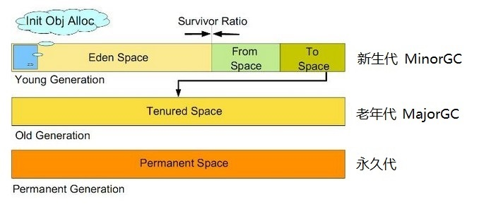

# Android 高级面试-4：虚拟机相关

*内存管理属于基础知识组织下语言即可，内存模型放在 Java 并发相关；虚拟机执行系统是重点，包括，类加载机制（类的加载、校验阶段，与热补丁原理相关）*

学习这一块的内容可以参考:

- [《JVM 系列-1：虚拟机内存管理》](https://blog.csdn.net/github_35186068/article/details/83754068)
- [《全面理解Java内存模型 JMM 及volatile关键字》](https://blog.csdn.net/javazejian/article/details/72772461)

## 1、内存管理

- GC 回收策略
- Java 中内存区域与垃圾回收机制
- 垃圾回收机制与调用 `System.gc()` 区别

1. **标记-清除算法**：这种算法直接在内存中把需要回收的对象“抠”出来。效率不高，清除之后会产生内容碎片，造成内存不连续，当分配较大内存对象时可能会因内存不足而触发垃圾收集动作。
2. **标记-整理算法**：类似于标记-清除算法，只是回收了之后，它要对内存空间进行整理，以使得剩余的对象占用连续的存储空间。
3. **复制算法**：将内存分成两块，一次只在一块内存中进行分配，垃圾回收一次之后，就将该内存中的未被回收的对象移动到另一块内存中，然后将该内存一次清理掉。
4. **分代收集算法**：根据对象存活周期的不同将内存划分成几块，然后根据其特点采用不同的回收算法。

`System.gc()` 函数的作用只是提醒虚拟机：程序员希望进行一次垃圾回收。但是它不能保证垃圾回收一定会进行，而且具体什么时候进行是取决于具体的虚拟机的，不同的虚拟机有不同的对策。

- Java 中对象的生命周期

> A

- JVM 内存区域，开线程影响哪块内存

*内存区域大致的分布图，与线程对应之后的分布图*

图中`由浅蓝色标识的部分是所有线程共享的数据区；淡紫色标识的部分是每个线程私有的数据区域`。

1. **程序计数器**：`线程私有`，用来指示当前线程所执行的字节码的行号，就是用来标记线程现在执行的代码的位置；对 Java 方法，它存储的是字节码指令的地址；对于 Native 方法，该计数器的值为空。
2. **栈**：`线程私有`，与线程同时创建，总数与线程关联，代表Java方法执行的内存模型。每个方法执行时都会创建一个栈桢来存储方法的的变量表、操作数栈、动态链接方法、返回值、返回地址等信息。一个方法的执行和退出就是用一个栈帧的入栈和出栈表示的。通常我们不允许你使用递归就是因为，方法就是一个栈，太多的方法只执行而没有退出就会导致栈溢出，不过可以通过尾递归优化。栈又分为虚拟机栈和本地方法栈，一个对应 Java 方法，一个对应 Native 方法。
3. **堆**：用来给对象分配内存的，`几乎所有的对象实例（包括数组）都在上面分配`。它是垃圾收集器的主要管理区域，因此也叫 GC 堆。它实际上是一块内存区域，由于一些收集算法的原因，又将其细化分为新生代和老年代等。如果在堆中没有内存完成实例分配，并且堆也无法再扩展时，将会抛出 OutOfMemoryError 异常。
4. **方法区**：方法区由多线程共享，用来存储类信息、常量、静态变量、即使编译后的代码等数据。`运行时常量池`是方法区的一部分，它用于存放编译器生成的各种字面量和符号引用，比如字符串常量等。根据 Java 虚拟机规范的规定，当方法区无法满足内存分配需求时，将抛出 OutOfMemoryError 异常。

- 软引用、弱引用区别
- Java 中的四种引用
- 强引用置为 null，会不会被回收？

四种引用类型：强引用、软引用、弱引用和虚引用。    

1. 当使用 `new` 关键字创建一个对象的时候，这个对象就是**强引用**的，它绝对不会被回收，即使内存耗尽。你可以通过将其置为 `null` 来弱化对其的引用，但什么时候被回收还要取决于 GC 算法。    
2. 软引用和弱引用相似，你可以分别通过 `SoftReference<T>` 和 `WeakReference<T>` 来使用它们，它们的区别在于后者更弱一些。**当 JVM 进行垃圾回收时，无论内存是否充足，都会回收被弱引用关联的对象；而软引用关联着的对象，只有在内存不足的时候 JVM 才会回收该对象**。软引用可以用来做缓存，因为当 JVM 内存不足的时候才会被回收；而弱引用适合 Android 上面引用 Activity 等的时候使用，因为 Activity 被销毁不一定是因为内存不足，可能是正常的生命周期结束。如果此时使用软引用，而 JVM 内存仍然足够，则仍然会持有 Activity 的引用而造成内存泄漏。
3. **虚引用**在任何时候都可能被垃圾回收器回收。

当一个对象不再被引用的时候，该对象也不一定被回收，理论上它还有一次救赎的机会，即通过覆写 `finilize()` 方法把对自己的引用从弱变强，即把自己赋值给全局的对象等。因为当对象不可达的时候，只有当 `finilize()` 没被覆写，或者 `finilize()` 已经被调用过，则该对象会被回收。否则，它会被放在一个队列中，并在稍后由一个低优先级的 Finilizer 线程执行它。

- 垃圾收集机制 对象创建，新生代与老年代

实际虚拟机的内存区域就是一整块内存，不区分新生代与老年代。新生代与老年代是垃圾收集器为了使用不同收集策略而定义的名称。

内存分配的策略是：1). 对象优先在Eden分配；2). 大对象直接进入老年代；3). 长期存活对象将进入老年代。

我们之前有一次线上的问题就是代码中查询了太多的数据，导致大对象直接进入了老年代，查询频繁，导致虚拟机 GC 频繁，进入假死状态（停顿）。

**新生代**：主要是用来存放新生的对象。一般占据堆的 1/3 空间。由于频繁创建对象，所以新生代会频繁触发 MinorGC 进行垃圾回收。

新生代又分为 Eden 区、ServivorFrom、ServivorTo 三个区。

**Eden 区**：Java 新对象的出生地（如果新创建的对象占用内存很大，则直接分配到老年代）。当Eden 区内存不够的时候就会触发 MinorGC，对新生代区进行一次垃圾回收。    
**ServivorTo**：保留了一次 MinorGC 过程中的幸存者。    
**ServivorFrom**：上一次 GC 的幸存者，作为这一次 GC 的被扫描者。

**MinorGC** 的过程：MinorGC 采用复制算法。首先，把 Eden 和 ServivorFrom 区域中存活的对象复制到 ServicorTo 区域（如果有对象的年龄以及达到了老年的标准，则赋值到老年代区），同时把这些对象的年龄+1（如果 ServicorTo 不够位置了就放到老年区）；然后，清空 Eden 和 ServicorFrom 中的对象；最后，ServicorTo 和 ServicorFrom 互换，原 ServicorTo 成为下一次 GC 时的 ServicorFrom 区。

**老年代**：主要存放应用程序中生命周期长的内存对象。老年代的对象比较稳定，所以 MajorGC 不会频繁执行。MajorGC 前一般都先进行了一次 MinorGC，使得有新生代的对象进入老年代，导致空间不够用时才触发。当无法找到足够大的连续空间分配给新创建的较大对象时也会提前触发一次 MajorGC 进行垃圾回收腾出空间。

当老年代也满了装不下的时候，就会抛出 **OOM** 异常。

至于老年代究竟使用哪种垃圾收集算法实际上是由垃圾收集器来决定的。老年代、新生代以及新生代的各个内存区域之间的比例并不是固定的，我们可以使用参数来配置。

## 2、虚拟机执行系统

- 谈谈类加载器 classloader
- 类加载机制，双亲委派模型
- 动态加载
- 对动态加载（OSGI）的了解？

> 先去研究热修复方面的内容！！！

## 3、内存模型

*梳理下内存模型，组织一下语言*

- JVM 内存模型，内存区域
- JVM 内存模型

Java 内存模型，即 Java Memory Model，简称 `JMM`，它是一种抽象的概念，或者是一种协议，用来解决在并发编程过程中内存访问的问题，同时又可以兼容不同的硬件和操作系统。

在 Java 内存模型中，所有的变量都存储在主内存。每个 Java 线程都存在着自己的工作内存，工作内存中保存了该线程用得到的变量的副本，线程对变量的读写都在工作内存中完成，无法直接操作主内存，也无法直接访问其他线程的工作内存。当一个线程之间的变量的值的传递必须经过主内存。

当两个线程 A 和线程 B 之间要完成通信的话，要经历如下两步：首先，线程 A 从主内存中将共享变量读入线程 A 的工作内存后并进行操作，之后将数据重新写回到主内存中；然后，线程 B 从主存中读取最新的共享变量。

此外，内存模型还规定了

1. 主内存和工作内存交互的 8 种操作及其规则；
2. 提供了 voliate 关键字用来，保证变量的可见性，和屏蔽指令重排序;
3. 对 long 及 double 的特殊规定：读写操作分成两个 32 位操作；
4. 先行发生原则 (happens-before) 和 as-if-serial 语义（不管怎么重排序，程序的执行结果不能被改变）。

## 4、Android 虚拟机

- ART 和 Dalvik (DVM) 的区别

ART 4.4 时发布，5.0 之后默认使用 ART. 

1. ART 在应用安装时会进行预编译 (ahead of time compilation, AOT)，将字节码编译成机器码并存储在本地，这样每次运行程序时就无需编译了，提升了效率。缺点是：1).安装耗时更长了；2).占用更多存储空间。7.0 之后，ART 引入 JIT，安装时不会将字节码全部编译成机器码，而是运行时将热点代码编译成机器码。
2. DVM 是为 32 位 CPU 设计的，ART 支持 64 位且兼容 32 位 CPU. 
3. ART 对垃圾收集机制进行了改进，将 GC 暂停由 2 次改成了 1 次等。
4. ART 的运行时堆空间划分与 DVM 不同

- DVM 与 JVM 的区别

1. 基于的架构不同：DVM 基于`寄存器`，相比于 JVM（基于栈），执行速度更快（因为无需到栈中读取数据）。
2. 执行的字节码不同：DVM 在执行的是 dex 文件，经过 class 经 dx 转换之后的。dex 会对 class 进行优化，整个 class，取出冗余信息，加快加载方式。
3. DVM 允许在有限的空间内同时运行多个进程
4. DVM 由 Zygote 创建和初始化
Zygote 是一个 DVM 进程，当需要创建一个应用程序时，Zygote 通过 fork 自身来创建新的 DVM 实例。
5. DVM 有共享机制，不同应用在运行时可以共享相同的类。
6. DVM 早期没有使用 JIT 编译器，JIT 就是即时编译器，早期的 DVM 需要经过解释器将 dex 码编译成机器码，效率不高。2.2 之后使用了 JIT，会对热点代码进行编译，生成本地机器码，下次执行到相同的逻辑时，可以直接执行本地机器码，无需每次编译。

- DVM 与 ART 的诞生

init 进程启动 Zygote 时会调用 `app_main.cpp`，它会调用 AndroidRuntime 的 `start()` 函数，在其中通过 `startVM()` 方法启动虚拟机。在启动虚拟机之前会通过读取系统的属性，判断使用 DVM 还是 ART 虚拟机实例。

