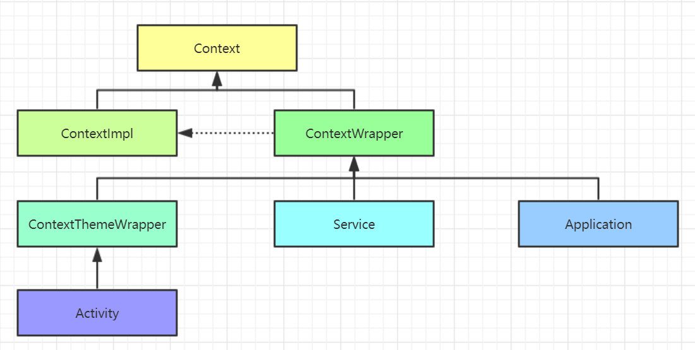
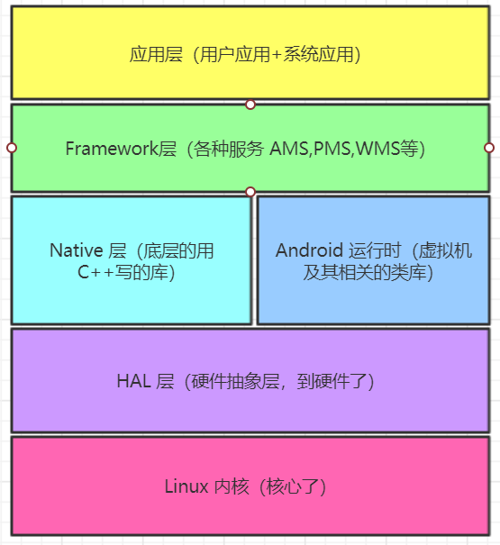

# Android 高级面试-5：四大组件、系统源码等

## 1、四大组件

### 1.1 Activity

**问题：在两个 Activity 之间传递对象还需要注意什么呢？**

对象的大小。Intent 中的 Bundle 是使用 Binder 机制进行数据传送的。能使用的 Binder 的缓冲区是有大小限制的（有些手机是 2 M），而一个进程默认有 16 个 Binder 线程，所以一个线程能占用的缓冲区就更小了（有人以前做过测试，大约一个线程可以占用 128 KB）。所以当你看到 TransactionTooLargeException 异常时，你应该知道怎么解决了。使用 EventBus 等传递大数据。

**问题：onSaveInstanceState() 和 onRestoreInstanceState()**

当 Activity 被销毁的时候回调用 `onSaveInstanceState()` 方法来存储当前的状态。这样当 Activity 被重建的时候，可以在 `onCreate()` 和 `onRestoreInstanceState()` 中恢复状态。对于 targetAPI 为 28 及以后的应用，该方法会在 `onStop()` 方法之后调用；对于之前的设备，这方法会在 `onStop()` 之前调用，但是无法确定是在 `onPause()` 之前还是之后调用。

`onRestoreInstanceState()` 用来恢复之前存储的状态，它会在 `onStart()` 和 `onPostCreate()` 之间被调用。此外，也可以直接在 `onCreate()` 方法中进行恢复，但是基于这个方法调用的时机，如果有特别需求，可以在这个方法中进行处理。

**问题：SingleTask 启动模式**    
**问题：Activity 启动模式**

1. `standard`：默认，每次启动的时候会创建一个新的实例，并且被创建的实例所在的栈与启动它的 Activity 是同一个栈。比如，A 启动了 B，那么 B 将会与 A 处在同一个栈。假如，我们使用 Application 的 Context 启动一个 Activity 的时候会抛出异常，这是因为新启动的 Activity 不知道自己将会处于哪个栈。可以在启动 Activity 的时候使用 `FLAG_ACTIVITY_NEW_TASK`。这样新启动的 Acitivyt 将会创建一个新的栈。
2. `singleTop`：栈顶复用，如果将要启动的 Activity 已经位于栈顶，那么将会复用栈顶的 Activity，并且会调用它的 `onNewIntent()`。常见的应用场景是从通知打开 Activity 时。
3. `singleTask`：单例，如果启动它的任务栈中存在该 Activity，那么将会复用该 Activity，并且会将栈内的、它之上的所有的 Activity 清理出去，以使得该 Activity 位于栈顶。常见的应用场景是启动页面、购物界面、确认订单界面和付款界面等。
4. `singleInstance`：这种启动模式会在启动的时候为其指定一个单独的栈来执行。如果用同样的intent 再次启动这个 Activity，那么这个 Activity 会被调到前台，并且会调用其 `onNewIntent()` 方法。

**问题：下拉状态栏是不是影响 Activity 的生命周期，如果在 onStop() 的时候做了网络请求，onResume() 的时候怎么恢复**     
**问题：前台切换到后台，然后再回到前台，Activity 生命周期回调方法。弹出 Dialog，生命值周期回调方法**     
**问题：Activity 生命周期**     
**问题：Activity 上有 Dialog 的时候按 Home 键时的生命周期**      
**问题：横竖屏切换的时候，Activity 各种情况下的生命周期**

Android 下拉通知栏不会影响 Activity 的生命周期方法。

弹出 Dialog，生命周期：其实是否弹出 Dialog，并不影响 Activity 的生命周期，所以这时和正常启动时 Activity 的生命回调方法一致: `onCreate() -> onStart() -> onResume()`。


这里我们总结一下在实际的使用过程中可能会遇到的一些 Acitivity 的生命周期过程：

1. `当用户打开新的 Activity 或者切换回桌面`：会经过的生命周期为 `onPause()->onStop()`。因为此时 Activity 已经变成不可见了，当然，如果新打开的 Activity 用了透明主题，那么 onStop() 不会被调用，因此原来的 Activity 只是不能交互，但是仍然可见。
2. `从新的 Activity 回到之前的 Activity 或者从桌面回到之前的 Activity`：会经过的生命周期为 `onRestart()->onStart()-onResume()`。此时是从 onStop() 经 onRestart() 回到 onResume() 状态。
3. 如果在上述 1 的情况下，进入后台的 Activity 因为内存不足被销毁了，那么当再次回到该 Activity 的时候，生命周期方法将会从 onCreate() 开始执行到 onResume()。
4. `当用户按下 Back 键时`：如果当前 Activity 被销毁，那么经过的生命周期将会是 `onPause()->onStop()->onDestroy()`。

具体地，当存在两个 Activity，分别是 A 和 B 的时候，在各种情况下，它们的生命周期将会经过：

1. `Back 键 Home 键`
    1. 当用户点击 A 中按钮来到 B 时，假设 B 全部遮挡住了 A，将依次执行：`A.onPause()->B.onCreate()->B.onStart()->B.onResume->A.onStop()`。
    2. 接1，此时如果点击 Back 键，将依次执行：`B.onPause()->A.onRestart()->A.onStart()->A.onResume()->B.onStop()->B.onDestroy()`。
    3. 接2，此时如果按下 Back 键，系统返回到桌面，并依次执行：`A.onPause()->A.onStop()->A.onDestroy()`。
    4. 接2，此时如果按下 Home 键（非长按），系统返回到桌面，并依次执行`A.onPause()->A.onStop()`。由此可见，Back 键和 Home 键主要区别在于是否会执行 onDestroy()。
    5. 接2，此时如果长按 Home 键，不同手机可能弹出不同内容，Activity 生命周期未发生变化。

2. `横竖屏切换时 Activity 的生命周期`
    1. 不设置 Activity 的 `android:configChanges` 时，切屏会重新调用各个生命周期，切横屏时会执行一次，切竖屏时会执行两次。
    2. 设置 Activity 的 `android:configChanges=“orientation”` 时，切屏还是会重新调用各个生命周期，切横、竖屏时只会执行一次。
    3. 设置 Activity 的 `android:configChanges=“orientation|keyboardHidden”` 时，切屏不会重新调用各个生命周期，只会执行 onConfiguration() 方法。

**问题：Activity 之间的通信方式**

1. Intent + `onActivityResult()` + `setResult()`
2. 静态变量（跨进程不行）
3. 全局通信，广播或者 EventBus

**问题：AlertDialog, PopupWindow, Activity 区别**

AlertDialog 是 Dialog 的子类，所以它包含了 Dialog 类的很多属性和方法。是弹出对话框的主要方式，对话框分成支持包的和非支持包的，UI 效果上略有区别。

`AlertDialog 与 PopupWindow 之间最本质的差异在于`：

1. `AlertDialog 是非阻塞式对话框；而 PopupWindow 是阻塞式对话框`。AlertDialog 弹出时，后台还可以做事情；PopupWindow 弹出时，程序会等待，在 PopupWindow 退出前，程序一直等待，只有当我们调用了 `dismiss()` 方法的后，PopupWindow 退出，程序才会向下执行。我们在写程序的过程中可以根据自己的需要选择使用 Popupwindow 或者是 Dialog. 
2. `两者最根本的区别在于有没有新建一个 window`，PopupWindow 没有新建，而是通过 WMS 将 View 加到 DecorView；Dialog 是新建了一个 window (PhoneWindow)，相当于走了一遍 Activity 中创建 window 的流程。

`Activity 与 Dialog` 类似，都会使用 PhoneWindow 来作为 View 的容器。Activity 也可以通过设置主题为 Dialog 的来将其作为对话框来使用。Dialog 也可以通过设置 Theme 来表现得像一个 Activity 一样作为整个页面。但 Activity 具有生命周期，并且它的生命周期归 AMS 管，而 Dialog 不具有生命周期，它归 WMS 管。

**问题：Activity 与 Service 通信的方式**

前提是是否跨进程，如果不跨进程的话，EventBus 和 静态变量都能传递信息，否则需要 IPC 才行：

1. `Binder 用于跨进程的通信方式`，AIDL 可以用来进行与远程通信，绑定服务的时候可以拿到远程的 Binder，然后调用它的方法就可以从远程拿数据。那么如果希望对远程的服务进行监听呢？可以使用 AIDL 中的 `oneway` 来定义回调的接口，然后在方法中传入回调即可。也可以使用 Messenger，向远程发送信息的时候，附带本地的 Messenger，然后远程获取本地的 Messenger 然后向其发送信息即可，详见 IPC 相关一文：[《Android 高级面试-2：IPC 相关》](https://juejin.im/post/5c6a9b6a6fb9a049f362a71f)
2. 广播：使用广播实现跨进程通信
3. 启动服务的时候传入值，使用 `startService()` 的方式

*关于 Activity 相关的内容可以参考笔者的文章：[《Android 基础回顾：Activity 基础》](https://blog.csdn.net/github_35186068/article/details/86380438)*

### 1.2 Service

**问题：怎么启动 Service**    
**问题：Service 的开启方式**    
**问题：Service 生命周期**


1. Service 有绑定模式和非绑定模式，以及这两种模式的混合使用方式。不同的使用方法生命周期方法也不同。 
    1. **非绑定模式**：当第一次调用 `startService()` 的时候执行的方法依次为 `onCreate()->onStartCommand()`；当 Service 关闭的时候调用 `onDestory()`。
    2. **绑定模式**：第一次 `bindService()` 的时候，执行的方法为 `onCreate()->onBind()`；解除绑定的时候会执行 `onUnbind()->onDestory()`。

2. 我们在开发的过程中还必须注意 Service 实例只会有一个，也就是说如果当前要启动的 Service 已经存在了那么就不会再次创建该 Service 当然也不会调用 onCreate() 方法。所以，
    1. 当第一次执行 `startService(intent)` 的时候，会调用该 Service 中的 `onCreate()` 和`onStartCommand()` 方法。
    2. 当第二次执行 `startService(intent)` 的时候，只会调用该 Service 中的 `onStartCommand()` 方法。（因此已经创建了服务，所以不需要再次调用 `onCreate()` 方法了）。

3. `bindService()` 方法的第三个参数是一个标志位，这里传入 `BIND_AUTO_CREATE` 表示在Activity 和 Service 建立关联后自动创建 Service，这会使得 MyService 中的 `onCreate()` 方法得到执行，但 `onStartCommand()` 方法不会执行。所以，在上面的程序中当调用了`bindService()` 方法的时候，会执行的方法有，Service 的 `onCreate()` 方法，以及 ServiceConnection 的 `onServiceConnected()` 方法。

4. 在 3 中，如果想要停止 Service，需要调用 `unbindService()` 才行。 

5. 如果我们既调用了 `startService()`，又调用 `bindService()` 会怎么样呢？这时不管你是单独调用 `stopService()` 还是 `unbindService()`，Service 都不会被销毁，必须要将两个方法都调用 Service 才会被销毁。也就是说，`stopService()` 只会让 Service 停止，`unbindService()` 只会让 Service 和 Activity 解除关联，一个 Service 必须要在既没有和任何 Activity 关联又处理停止状态的时候才会被销毁。

**问题：进程保活**     

1. Service 设置成 `START_STICKY` 那么 Service 被 kill 之后会被重启；
2. 通过 `startForeground()` 将进程设置为前台进程，做前台服务，优先级和前台进程一样，除非系统资源紧缺，否则不会 kill 进程；
3. 双进程守护，其中一个被清理之后，没有被清理的进程可以重启被 kill 的进程；
4. 在 native 层使用守护进程，native 层的进程会被认为和 Android 进程是两个不同的进程，父进程被杀死，子进程依然可以存活；
5. 联系厂商，加入白名单；
6. 启用一个像素的 Activity. 

**问题：App 中唤醒其他进程的实现方式**

### 1.3 Broadcast

**问题：BroadcastReceiver，LocalBroadcastReceiver 区别**    
**问题：广播的使用场景**     
**问题：广播的使用方式，场景**     
**问题：广播的分类？**     
**问题：广播（动态注册和静态注册区别，有序广播和标准广播）**

1. 按照注册方式：`静态注册和动态注册`两种：

    1. 静态广播直接在 manifest 中注册。限制：
        1. 在 Android 8.0 的平台上，应用不能对大部分的广播进行静态注册，也就是说，不能在 AndroidManifest 文件对`有些`广播进行静态注册；
        2. 当程序运行在后台的时候，静态广播中不能启动服务。
    2. 动态广播与静态广播相似，但是不需要在 Manifest 中进行注册。`注意当页面被销毁的时候需要取消注册广播！`

2. 按照作用范围：`本地广播和普通广播`两种，

    1. 普通广播是全局的，所有应用程序都可以接收到，容易会引起安全问题。
    2. 本地广播只能够在应用内传递，广播接收器也只能接收应用内发出的广播。本地广播的核心类是 LocalBroadcastManager，使用它的静态方法 `getInstance()` 获取一个单例之后就可以使用该单例的 `registerReceiver()`、`unregisterReceiver()` 和 `sendBroadcast()` 等方法来进行操作了。

3. 按照是否有序：`有序广播和无序广播`两种，无序广播各接收器接收的顺序无法确定，并且在广播发出之后接收器只能接收，不能拦截和进行其他处理，两者的区别主要体现在发送时调用的方法上。优先级高的会先接收到，优先级相等的话则顺序不确定。并且前面的广播可以在方法中向 Intent 写入数据，后面的广播可以接收到写入的值。

### 1.4 ContentProvider

**问题：Android 系统为什么会设计 ContentProvider，进程共享和线程安全问题**

ContentProvider 在 Android 中的作用是对外共享数据，提供了数据访问接口，用于在不同应用程序之间共享数据，同时还能保证被访问数据的安全性。它通常用来提供一些公共的数据，比如用来查询文件信息，制作音乐播放器的时候用来读取系统中的音乐文件的信息。

与 SQLiteDatabase 不同，ContentProvider 中的 CRUD 不接收表名参数，而是 Uri 参数。内容 URI 是内容提供器中数据的唯一标识符，包括权限和路径。

并发访问时，不论是不同的进程还是同一进程的不同线程，当使用 AMS 获取 Provider 的时候返回的都是同一实例。我们使用 Provider 来从远程访问数据，当 `query()` 方法运行在不同的线程，实际上是运行在 Provider 方的进程的 Binder 线程池中。通过 Binder 的线程池来实现多进程和多线程访问的安全性。

### 1.5 Fragment

**问题：Fragment 各种情况下的生命周期**    
**问题：Activity 与 Fragment 之间生命周期比较**


**问题：Fragment 之间传递数据的方式？**

1. 同一 Activity 的 Fragment 之间可以使用 ViewModel 来交换数据；
2. 使用 EventBus，广播，静态的；
3. 通过 Activity 获取到另一个 Fragment，强转之后使用它对外提供的 public 方法进行通信；
4. 通过 Activity 获取到另一个 Fragment，该 Fragment 实现某个接口，然后转成接口之后进行通信（也适用于 Activity 与 Fragment 之间），强转之后使用它对外提供的 public 方法进行通信；

**问题：如何实现 Fragment 的滑动**

### 1.6 Context

**问题：Application 和 Activity 的 Context 对象的区别**

Context 的继承关系如下所示，所以，`Android 中的 Context 数量 = Activity 的数量 + Service 的数量 + 1 (Application)`



Context 的用途比较广，比如用来获取图片、字符串，显式对话框等，`大部分情况下，使用哪个 Context 都可以，少数情况下只能使用特定的 Context`. 比如启动 Activity 的时候，要求传入 Activity 的 Context，因为 AMS 需要直到启动指定 Activity 的 Activity 的栈。一般情况下，能使用 Application 的 Context 尽量使用它的，因为它的生命周期更长。

Context 之间使用的是`装饰者设计模式`，其中 Context 是一个抽象的类。ContextWrapper 内部实际使用 ContextImpl 实现的，因此所有的逻辑基本是在 ContextImpl 中实现的。然后对于 ContextThemeWrapper，它在 ContextWrapper 的基础之上又进行了一层装饰，就是与主题相关的东西。

新版的 Activity 启动中将 Activity 的各个回调执行的逻辑放在了各个 ClientTransactionItem 中，比如 LaunchActivityItem 表示用来启动 Activity。 最终执行逻辑的时候是调用它们的 execute() 方法并使用传入的 ClientTransactionHandler 真正执行任务。而这里的 ClientTransactionHandler 实际上就是 ActivityThread，所以它将调用到 Activity 的 `handleLaunchActivity()` 启动 Activity. 然后程序进入到 `performLaunchActivity()` 中。这个方法中会创建上面的 Application 和 Activity 对应的 Context：

```java
    private Activity performLaunchActivity(ActivityClientRecord r, Intent customIntent) {
        // ...

        // 创建 Activity 的 Context
        ContextImpl appContext = createBaseContextForActivity(r);
        Activity activity = null;
        try {
            java.lang.ClassLoader cl = appContext.getClassLoader();
            // 创建新的 Activity
            activity = mInstrumentation.newActivity(
                    cl, component.getClassName(), r.intent);
            // ...
        } catch (Exception e) {
            // ... handle exception
        }

        try {
            // 创建应用的 Application
            Application app = r.packageInfo.makeApplication(false, mInstrumentation);

            if (activity != null) {
                CharSequence title = r.activityInfo.loadLabel(appContext.getPackageManager());
                // Activity 的配置
                Configuration config = new Configuration(mCompatConfiguration);
                if (r.overrideConfig != null) {
                    config.updateFrom(r.overrideConfig);
                }
                // 创建窗口
                Window window = null;
                if (r.mPendingRemoveWindow != null && r.mPreserveWindow) {
                    window = r.mPendingRemoveWindow;
                    r.mPendingRemoveWindow = null;
                    r.mPendingRemoveWindowManager = null;
                }
                // 关联 Activity 和 Context
                appContext.setOuterContext(activity);
                activity.attach(appContext, this, getInstrumentation(), r.token,
                        r.ident, app, r.intent, r.activityInfo, title, r.parent,
                        r.embeddedID, r.lastNonConfigurationInstances, config,
                        r.referrer, r.voiceInteractor, window, r.configCallback);

                // ...
                // 设置 Activity 的主题
                int theme = r.activityInfo.getThemeResource();
                if (theme != 0) {
                    activity.setTheme(theme);
                }

                // 回调 Activity 的生命周期方法
                activity.mCalled = false;
                if (r.isPersistable()) {
                    mInstrumentation.callActivityOnCreate(activity, r.state, r.persistentState);
                } else {
                    mInstrumentation.callActivityOnCreate(activity, r.state);
                }
                r.activity = activity;
            }
            r.setState(ON_CREATE);
            mActivities.put(r.token, r);
        } catch (SuperNotCalledException e) {
            throw e;
        } catch (Exception e) {
            // ... handle exception
        }

        return activity;
    }

    public Application makeApplication(boolean forceDefaultAppClass, Instrumentation instrumentation) {
        // ...

        try {
            // 创建 Application 的 Context
            ContextImpl appContext = ContextImpl.createAppContext(mActivityThread, this);
            app = mActivityThread.mInstrumentation.newApplication(
                    cl, appClass, appContext);
            // 关联 Application 和 Context
            appContext.setOuterContext(app);
        } catch (Exception e) {
            // ... handle exception
        }
        // ...
        return app;
    }
```

### 1.7 其他

**问题：AndroidManifest 的作用与理解**

声明了四大组件、应用版本、权限等的配置信息，会在解析 APK 的时候由 PMS 进行解析，然后解析的结果会被缓存到 PMS 中。

## 2、Android API

### 2.1 AsyncTask

**问题：AsyncTask 机制，如何取消 AsyncTask**     
**问题：多线程（关于 AsyncTask 缺陷引发的思考）**    
**问题：Asynctask 有什么优缺点**    
**问题：AsyncTask 机制、原理及不足？**

AsyncTask 是 Android 提供的用来执行异步操作的 API，我们可以通过它来执行异步操作，并在得到结果之后将结果放在主线程当中进行后续处理。

AsyncTask 的缺点是在使用多个异步操作和并需要进行 Ui 变更时，就变得复杂起来（会导致多个 AsyncTask 进行嵌套）。如果有多个地方需要用到 AsyncTask，可能需要定义多个 AsyncTask 的实现。

如果 AsyncTask 以一个`非静态的内部类`的形式声明在 Activity 中，那么它会持有 Activity 的匿名引用，如果销毁 Activity 时 AsyncTask 还在执行异步任务的话，Activity 就不能销毁，会造成内存泄漏。解决方式是，要么将 AsyncTask 定义成静态内部类，要么在 Activity 销毁的时候调用 `cancel()` 方法取消 AsyncTask.在屏幕旋转或 Activity 意外结束时，Activity 被创建，而 AsyncTask 会拥有之前 Activity 的引用，会导致结果丢失。

AsyncTask 在 1.6 之前是串行的，1.6 之后是并行的，3.0 之后又改成了串行的。不过我们可以通过调用 `executeOnExecutor()` 方法并传入一个线程池，来让 AsyncTask 在某个线程池中并行执行任务。

AsyncTask 的源码就是将一个任务封装成 Runnable 之后放进线程池当中执行，执行完毕之后调用主线程的 Handler 发送消息到主线程当中进行处理。任务在默认线程池当中执行的时候，会被加入到一个双端队列中执行，执行完一个之后再执行下一个，以此来实现任务的串行执行。

**问题：介绍下 SurfaceView**

`SurfaceView` 以及 TextureView 均继承于 `android.view.View`，它们都在`独立的线程`中绘制和渲染，常被用在对绘制的速率要求比较高的应用场景中，用来解决普通 View 因为绘制的时间延迟而带来的`掉帧`的问题，比如用作相机预览、视频播放的媒介等。

SurfaceView 提供了`嵌入在视图层次结构内`的专用绘图图层 (Surface)。图层 (Surface) 处于 `Z 轴`，位于持有 SurfaceView 的窗口之后。SurfaceView 在窗口上开了一个透明的 “洞” 以展示图面。Surface 的排版显示受到视图层级关系的影响，它的兄弟视图结点会在顶端显示。注意，如果 Surface 上面有透明控件，那么每次 Surface 变化都会引起框架重新计算它和顶层控件的透明效果，这会影响性能。SurfaceView 使用`双缓冲`，SurfaceView 自带一个 Surface，这个 Surface 在 WMS 中有自己对应的 WindowState，在 `SurfaceFlinger` 中也会有自己的 Layer。这样的好处是对这个 Surface 的渲染可以放到单独线程去做。因为这个 `Surface 不在 View hierachy` 中，它的显示也不受 View 的属性控制，所以不能进行平移，缩放等变换，也不能放在其它 ViewGroup 中，一些 View 中的特性也无法使用。

TextureView 在 Andriod 4.0 之后的 API 中才能使用，并且必须在`硬件加速`的窗口中。和 SurfaceView 不同，它不会在 WMS 中单独创建窗口，而是作为 `View hierachy` 中的一个普通 View，因此可以和其它`普通 View 一样进行移动，旋转，缩放，动画等`变化。它占用内存比 SurfaceView 高，在 5.0 以前在主线程渲染，5.0 以后有单独的渲染线程。

### 2.2 View 体系

#### 2.2.1 事件分发机制

**问题：Android 事件分发机制**    
**问题：事件传递机制的介绍**     
**问题：View 事件传递**     
**问题：触摸事件的分发？**
**问题：点击事件被拦截，但是想传到下面的 View，如何操作？**    

1. 触摸事件首先被 Activity 接收，然后它调用自己的 `dispatchTouchEvent(MotionEvent)` 传递给 PhoneWindow；
2. PhoneWindow 将事件传递给 DecorView；
3. DecorView 将事件交给 ViewGroup，接下来事件的传递在 ViewGroup 和 View 之间进行，即按照 View 树进行传递。
4. 事件分发机制本质上是一个`深度优先`的遍历算法。

事件分发机制的核心代码：

```java
    // ViewGroup:
    boolean dispatchTouchEvent(MotionEvent e) {
        boolean result;
        if (onInterceptTouchEvent(e)) { // 父控件可以覆写并返回 true 以拦截
            result = super.dispatchTouchEvent(e); // 调用 View 中该方法的实现
        } else {
            for (child in children) {
                result = child.dispatchTouchEvent(e); // 这里的 child 分成 View 和 ViewGroup 两者情形
                if (result) break; // 被子控件消费，停止分发
            }
        }
        return result;
    }
    // View:
    public boolean dispatchTouchEvent(MotionEvent event) {
        if (mOnTouchListener.onTouch(this, event)) {
            return true;
        } else {
            return onTouchEvent(event); // 判断事件类型，是长按还是单击并进行回调
        }
    }
```

对于 `dispatchTouchEvent()` 方法，在 View 的默认实现中，会先交给触摸事件进行处理，若它返回了 true 就消费了，否则根据触摸的类型，决定是交给 `OnClickListener` 还是 `OnLongClickListener` 继续处理。

**问题：封装 View 的时候怎么知道 View 的大小**     
**问题：计算一个 view 的嵌套层级**

按照广度优先算法进行遍历。

**问题：postinvalidate() 和 invalidate() 的区别**
**问题：invalidate() 和 requestLayout() 的实现原理**

Android 中实现 view 的更新有两组方法，一组是 invalidate，另一组是 postInvalidate，其中前者是在UI线程自身中使用，而后者在非 UI 线程中使用。

调用 `invalidate()` 的时候会调用内部的 `invalidateInternal()` 并将要重绘的区域信息传递进去：

```java
    // View:
    void invalidateInternal(int l, int t, int r, int b, boolean invalidateCache,
            boolean fullInvalidate) {
        // ...
        if (skipInvalidate()) {
            return;
        }
        if ((mPrivateFlags & (PFLAG_DRAWN | PFLAG_HAS_BOUNDS)) ==....) {
            ...
            if (invalidateCache) {
                mPrivateFlags |= PFLAG_INVALIDATED; // 增加 PFLAG_INVALIDATED 标志
                mPrivateFlags &= ~PFLAG_DRAWING_CACHE_VALID; // 删除 PFLAG_DRAWING_CACHE_VALID 标志
            }
            final AttachInfo ai = mAttachInfo;
            final ViewParent p = mParent;
            if (p != null && ai != null && l < r && t < b) {
                final Rect damage = ai.mTmpInvalRect;
                damage.set(l, t, r, b);
                // 告诉父 View 绘制的区域，向上传递请求
                p.invalidateChild(this, damage);
            }
            ...
        }
    }
```

这里的 p 就是指它的父控件，即 ViewGroup：

```java
// ViewGroup:
public final void invalidateChild(View child, final Rect dirty) {
    ViewParent parent = this;
    final AttachInfo attachInfo = mAttachInfo;
    // AttachInfo 不能是空
    if (attachInfo != null) {
        // 如果子 View 正在动画
        final boolean drawAnimation = (child.mPrivateFlags &  PFLAG_DRAW_ANIMATION) == PFLAG_DRAW_ANIMATION;
        // View 是否存在矩阵变换
        Matrix childMatrix = child.getMatrix();
        //完全不透明，没有动画
        final boolean isOpaque = child.isOpaque() && !drawAnimation &&
                child.getAnimation() == null && childMatrix.isIdentity();
        //子 View 设置标志 dirty
        int opaqueFlag = isOpaque ? PFLAG_DIRTY_OPAQUE : PFLAG_DIRTY;
        // LayerType 不是 LAYER_TYPE_NONE
        if (child.mLayerType != LAYER_TYPE_NONE) {
            mPrivateFlags |= PFLAG_INVALIDATED;
            mPrivateFlags &= ~PFLAG_DRAWING_CACHE_VALID;
        }

        final int[] location = attachInfo.mInvalidateChildLocation;
        location[CHILD_LEFT_INDEX] = child.mLeft;
        location[CHILD_TOP_INDEX] = child.mTop;
        // ...
        do {
            View view = null;
            if (parent instanceof View) {
                view = (View) parent;
            }
            // ...
            if (view != null) {
                if ((view.mViewFlags & FADING_EDGE_MASK) != 0 &&
                        view.getSolidColor() == 0) {
                    opaqueFlag = PFLAG_DIRTY;
                }
                // ...
            }
            // 继续向上进行传递
            parent = parent.invalidateChildInParent(location, dirty);
            if (view != null) {
                // 矩阵变换相关
                // ...
                Matrix m = view.getMatrix();
                if (!m.isIdentity()) {
                    RectF boundingRect = attachInfo.mTmpTransformRect;
                    // ...
                    dirty.set(...);
                }
            }
        } while (parent != null);
    }
}

// ViewGroup:
public ViewParent invalidateChildInParent(final int[] location,  final Rect dirty) {
    if ((mPrivateFlags & PFLAG_DRAWN) == ....) {
        if ((mGroupFlags & (FLAG_OPTIMIZE_INVALIDATE | ...) {
            // 变换成相对父视图的坐标系的值。
            dirty.offset(location[CHILD_LEFT_INDEX] - mScrollX,
                            location[CHILD_TOP_INDEX] - mScrollY);
            if ((mGroupFlags & FLAG_CLIP_CHILDREN) == 0) {
                 // 与父 View 坐标系联合，dirty 可能变为父亲视图的区域。
                 dirty.union(0, 0, mRight - mLeft, mBottom - mTop);
            }
            // 获取父 View 相对它的父节点的左侧和上侧距离
            final int left = mLeft;
            final int top = mTop;

            if ((mGroupFlags & FLAG_CLIP_CHILDREN) == FLAG_CLIP_CHILDREN) {
                // 有此标志，dirty 区域已经是相对父视图的坐标系的值了，
                // 与父视图相交，区域有交集。在没有 Scroll 的情况下。
                // 其实就是视图自己的区域(相对父视图坐标系)
                if (!dirty.intersect(0, 0, mRight - left, mBottom - top)) {
                    dirty.setEmpty();
                }
            }
            mPrivateFlags &= ~PFLAG_DRAWING_CACHE_VALID;
            // location 设置相对父视图的位置。
            location[CHILD_LEFT_INDEX] = left;
            location[CHILD_TOP_INDEX] = top;
            ...
            // 返回它的父视图。
            return mParent;
        } else {
            .....
            location[CHILD_LEFT_INDEX] = mLeft;
            location[CHILD_TOP_INDEX] = mTop;
            if ((mGroupFlags & FLAG_CLIP_CHILDREN) == FLAG_CLIP_CHILDREN) {
                dirty.set(0, 0, mRight - mLeft, mBottom - mTop);
            } else {
                dirty.union(0, 0, mRight - mLeft, mBottom - mTop);
            }
            ....
            return mParent;
        }
    }
    return null;
}
```

这里的 parent 就是指 ViewParent，ViewGroup 以及 ViewRootImpl 都是它的子类。因此，按照上述传递的逻辑，事件最终将进入到 ViewRootImpl 中:

```java
// ViewRootImpl:
public ViewParent invalidateChildInParent(int[] location, Rect dirty) {
   // 保证是创建视图树结构的线程
   checkThread();
   if (dirty == null) {
       invalidate();
       return null;
   } else if (dirty.isEmpty() && !mIsAnimating) {
       //如果 dirty 内容为空，什么都不做，返回。
       return null;
   }

   if (mCurScrollY != 0 || mTranslator != null) {
       mTempRect.set(dirty);
       dirty = mTempRect;
       if (mCurScrollY != 0) {
           dirty.offset(0, -mCurScrollY);
       }
       if (mTranslator != null) {
           mTranslator.translateRectInAppWindowToScreen(dirty);
       }
       if (mAttachInfo.mScalingRequired) {
           dirty.inset(-1, -1);
       }
   }

   invalidateRectOnScreen(dirty);
   return null;
}

private void invalidateRectOnScreen(Rect dirty) {
    final Rect localDirty = mDirty;
    // ...
    localDirty.union(dirty.left, dirty.top, dirty.right, dirty.bottom);
    final float appScale = mAttachInfo.mApplicationScale;
    final boolean intersected = localDirty.intersect(0, 0,
                (int) (mWidth * appScale + 0.5f), (int) (mHeight * appScale + 0.5f));
    if (!intersected) {
        localDirty.setEmpty();
    }
    if (!mWillDrawSoon && (intersected || mIsAnimating)) {
        // 遍历 View 树了
        scheduleTraversals();
    }
}
```

**问题：三种测量方式之间的区别**

1. `UNSPECIFIED`：默认值，父控件没有给子 View 任何限制，子 View 可以设置为任意大小，没有任何限制。这种情况比较少见，不太会用到。
2. `EXACTLY`：表示父控件已经确切的指定了子 View 的大小。父视图希望子视图的大小应该是由 specSize 的值来决定的，系统默认会按照这个规则来设置子视图的大小，简单的说当设置 width 或 height 为 match_parent 时，模式为 EXACTLY，因为子 view 会占据剩余容器的空间，所以它大小是确定的。
3. `AT_MOST`：表示子 View 具体大小没有尺寸限制，但是存在上限，最多只能是 specSize 中指定的大小。（当设置为 width 或 height 为 wrap_content 时，模式为 AT_MOST, 表示子 view 的大小最多是多少，这样子 view 会根据这个上限来设置自己的尺寸）。

**问题：为什么不能在子线程中访问 UI？**    
**问题：线程是检查是在哪里进行的？**

Android 中的控件不是线程安全的，之所以这样设计是为了：

1. 设计成同步的可以简化使用的复杂度；
2. 可以提升控件的性能（异步加锁在非多线程环境是额外的开销）。

线程检查是在 ViewRootImpl 当中进行的，当我们调用比如 `invalidate()` 和 `requestLayout()` 的时候，请求会沿着 View 树向上传递到 ViewRootImpl 中。然后在该类的方法中会调用 `checkThread()` 方法进行线程检查：

```java
public final class ViewRootImpl implements ViewParent {
    public ViewRootImpl(Context context, Display display) {
        // ...
        mThread = Thread.currentThread();
        // ...
    }

    // 调用这个方法进行线程安全校验
    void checkThread() {
        if (mThread != Thread.currentThread()) {
            throw new CalledFromWrongThreadException(
                    "Only the original thread that created a view hierarchy can touch its views.");
        }
    }
}
```

可以看出，这里判断的线程并不一定是主线程，只是绝大部分情况下，我们在主线程中创建 View.

**问题：View.post() 和 Handler.post() 之间的区别**

我们可以在 Activity 的 `onCreate()` 方法中使用 View 的 `post()` 方法获取控件大小，而无需进行延时。原因是：

```java
public class View {
    public boolean post(Runnable action) {
        // 关联的信息，此时并没有添加到 Window 里，所以这里 attachInfo 是 null
        final AttachInfo attachInfo = mAttachInfo;
        if (attachInfo != null) {
            return attachInfo.mHandler.post(action);
        }
        // 将消息缓存起来
        getRunQueue().post(action);
        return true;
    }
    // 单例的 HandlerActionQueue
    private HandlerActionQueue getRunQueue() {
        if (mRunQueue == null) {
            mRunQueue = new HandlerActionQueue();
        }
        return mRunQueue;
    }
}

public class HandlerActionQueue {
    private HandlerAction[] mActions;
    private int mCount;

    public void post(Runnable action) {
        postDelayed(action, 0);
    }

    public void postDelayed(Runnable action, long delayMillis) {
        final HandlerAction handlerAction = new HandlerAction(action, delayMillis);

        synchronized (this) {
            if (mActions == null) {
                // 单例的数组
                mActions = new HandlerAction[4];
            }
            // 将其添加到数组里面
            mActions = GrowingArrayUtils.append(mActions, mCount, handlerAction);
            mCount++;
        }
    }

    // 消息被执行的时机，我们需要知道这个方法什么时候被调用
    public void executeActions(Handler handler) {
        synchronized (this) {
            final HandlerAction[] actions = mActions;
            for (int i = 0, count = mCount; i < count; i++) {
                final HandlerAction handlerAction = actions[i];
                // 这里进行了消息处理
                handler.postDelayed(handlerAction.action, handlerAction.delay);
            }
            mActions = null;
            mCount = 0;
        }
    }
```

从上面看出当调用 View 的 post() 方法的时候，消息不会被立即执行，而是添加到了数组里面。然后当 `executeActions()` 被调用的时候再执行，下面是 `executeActions()` 执行的时机：

```java
public class View {
    void dispatchAttachedToWindow(AttachInfo info, int visibility) {
        // ... 这里进行了赋值
        mAttachInfo = info;
        // ... 这里执行了消息
        if (mRunQueue != null) {
            mRunQueue.executeActions(info.mHandler);
            mRunQueue = null;
        }
        // ...
    }
}
```

可见，当调用 View 的 post() 方法的时候，这个消息会根据 View 是否被添加到窗口里面来决定是否立即执行。如果该 View 已经添加到了窗口中，那么该消息会被立即执行，否则等到 View 被添加到窗口的时候执行。执行事件也是通过 Handler 来执行的。

### 2.3 列表控件

**问题：ListView 的优化**    
**问题：ListView 重用的是什么**

ListView 默认缓存一页的 View，也就是你当前 Listview 界面上有几个 Item 可以显示，Lstview 就缓存几个。当现实第一页的时候，由于没有一个 Item 被创建，所以第一页的 Item 的 `getView()` 方法中的第二个参数都是为 null 的。

ViewHolder 同样也是为了提高性能。就是用来在缓存使用 `findViewById()` 方法得到的控件，下次的时候可以直接使用它而不用再进行 `find` 了。

**问题：RecycleView 的使用，原理，RecycleView 优化**    
**问题：Recycleview Listview 的区别，性能**  

1. 装饰；
2. 手势滑动、拖拽；
3. 顶部悬浮效果；

**问题：RecyclerView 的缓存的实现机制**


**问题：Listview 图片加载错乱的原理和解决方案**

### 2.4 其他控件

**问题：LinearLayout、RelativeLayout、FrameLayout 的特性、使用场景**     
**问题：ViewPager 使用细节，如何设置成每次只初始化当前的 Fragment，其他的不初始化**

### 2.5 数据存储

**问题：Android 中数据存储方式**

SP，SQLite，ContentProvider，File，Server

## 3、架构相关

**问题：模块化实现（好处，原因）**     
**问题：项目组件化的理解**    
**问题：模式 MVP、MVC 介绍**    
**问题：MVP 模式**

`MVC (Model-View-Controller, 模型-视图-控制器)`，标准的 MVC 是这个样子的：

1. `模型层 (Model)`：业务逻辑对应的数据模型，无 View 无关，而与业务相关；
2. `视图层 (View)`：一般使用 XML 或者 Java 对界面进行描述；
3. `控制层 (Controllor)`：在 Android 中通常指 Activity  和Fragment，或者由其控制的业务类。

在 Android 开发中，就是指直接使用 Activity 并在其中写业务逻辑的开发方式。显然，一方面 Activity 本身就是一个视图，另一方面又要负责处理业务逻辑，因此逻辑会比较混乱。这种开发方式不太适合 Android 开发。

`MVP (Model-View-Presenter)`：

1. `模型层 (Model)`：主要提供数据存取功能。
2. `视图层 (View)`：处理用户事件和视图。在 Android 中，可能是指 Activity、Fragment 或者 View。
3. `展示层 (Presenter)`：负责通过 Model 存取书数据，连接 View 和 Model，从 Model 中取出数据交给 View。

实际开发中会像下面这样定义一个契约接口

```java
    public interface HomeContract {

        interface IView extends BaseView {
            void setFirstPage(List<HomeBean.IssueList.ItemList> itemLists);
            void setNextPage(List<HomeBean.IssueList.ItemList> itemLists);
            void onError(String msg);
        }

        interface IPresenter extends BasePresenter {
            void requestFirstPage();
            void requestNextPage();
        }
    }
```

然后让 Fragment 或者 Activity 等继承 IView，实例化一个 IPresenter，并在构造方法中将自己引入到 IPresenter 中。这样 View 和 Presenter 就相互持有了对方的引用。当要发起一个网络请求的时候，View 中调用 Presenter 的方法，Presenter 拿到了结果之后回调 View 的方法。这样就使得 View 和 Presenter 只需要关注自身的责任即可。

MVP 缺点：1). Presenter 中除了应用逻辑以外，还有大量的 View->Model，Model->View 的手动同步逻辑，`造成 Presenter 比较笨重`，维护起来会比较困难；2). 由于对视图的渲染放在了 Presenter 中，所以`视图和 Presenter 的交互会过于频繁`；3). `如果 Presenter 过多地渲染了视图，往往会使得它与特定的视图的联系过于紧密`，一旦视图需要变更，那么 Presenter 也需要变更了。

MVVM 是 Model-View-ViewModel 的简写。它本质上就是 MVC 的改进版。MVVM 就是将其中的 View 的状态和行为抽象化，让我们将视图 UI 和业务逻辑分开。

1. `模型层 (Model)`：负责从各种数据源中获取数据；
2. `视图层 (View)`：在 Android 中对应于 Activity 和 Fragment，用于展示给用户和处理用户交互，会驱动 ViewModel 从 Model 中获取数据；
3. `ViewModel 层`：用于将 Model 和 View 进行关联，我们可以在 View 中通过 ViewModel 从 Model 中获取数据；当获取到了数据之后，会通过自动绑定，比如 DataBinding，来将结果自动刷新到界面上。

优点：

1. `低耦合`：视图（View）可以独立于Model变化和修改，一个 ViewModel 可以绑定到不同的 View 上，当 View 变化的时候 Model 可以不变，当 Model 变化的时候 View 也可以不变。
2. `可重用性`：你可以把一些视图逻辑放在一个 ViewModel 里面，让很多 view 重用这段视图逻辑。
3. `独立开发`：开发人员可以专注于业务逻辑和数据的开发（ViewModel），设计人员可以专注于页面设计。
4. `可测试`：界面素来是比较难于测试的，而现在测试可以针对 ViewModel 来写。

## 4、系统源码

**问题：画出 Android 的大体架构图**

<div align="center"></div>

**问题：App 启动流程，从点击桌面开始**    
**问题：Activity 栈**    
**问题：简述 Activity 启动全部过程？**    
**问题：ActicityThread 相关？**

 `startActivity()` -> `Process.start()` -> Socket -> (SystemServer) -> Zygote.fork() -> VM,Binder 线程池 -> ActivityThread.main()

`Instrumentation.execStartActivity()` -> `IApplicationThread+AMS+H` -> 校验用户信息等 -> 解析 Intent -> 回调 `IApplicationThread.scheduleTransaction()`

**问题：App 是如何沙箱化，为什么要这么做**

Android 是一个权限分离的系统，这是利用 Linux 已有的权限管理机制，通过为每一个 Application 分配不同的 uid 和 gid，从而使得不同的 Application 之间的私有数据和访问（native 以及 java 层通过这种 sandbox 机制，都可以）达到隔离的目的 。与此同时，Android 还在此基础上进行扩展，提供了 permission 机制，它主要是用来对 Application 可以执行的某些具体操作进行权限细分和访问控制，同时提供了 per-URI permission 机制，用来提供对某些特定的数据块进行 ad-hoc 方式的访问。 

**问题：权限管理系统（底层的权限是如何进行 grant 的）**    
**问题：动态权限适配方案，权限组的概念**

**问题：大体说清一个应用程序安装到手机上时发生了什么**    
**问题：应用安装过程**

应用安装的时候涉及几个类，分别时 PackageManager, ApplicationPackageManager 和 PMS. 它们之间的关系是，PackageManager 是一个抽象类，它的具体实现是 ApplicationPackageManager，而后者的所有实现都是靠 PMS 实现的。PMS 是一种远程的服务，与 AMS 相似，在同一方法中启动。另外，还有 `Installer` 它是安装应用程序的辅助类，它也是一种系统服务，与 PMS 在同一方法中启动。它会`通过 Socket 与远程的 Installd` 建立联系。这是因为权限的问题，`PMS 只有 system 权限。installd 却是具有 root 权限`。（Installd 的作用好像就是创建一个目录）

installd 是由 Android 系统 init 进程 (pid=1)，在解析 init.rc 文件的代码时，通过 fork 创建用户空间的守护进程 intalld。启动时，进入监听 socket，当客户端发送过来请求时，接收客户端的请求，并读取客户端发送过来的命令数据，并根据读取客户端命令来执行命令操作。

Android 上应用安装可以分为以下几种方式：

1. 系统安装：开机的时候，没有安装界面
2. adb 命令安装：通过 abd 命令行安装，没有安装界面
3. 应用市场安装，这个要视应用的权限，有系统的权限无安装界面(例如MUI的小米应用商店)
4. 第三方安装，有安装界面，通过 packageinstaller.apk 来处理安装及卸载的过程的界面

Apk 的大体流程如下：

1. 第一步：拷贝文件到指定的目录：在 Android 系统中，apk 安装文件是会被保存起来的，默认情况下，用户安装的 apk 首先会被拷贝到 `/data/app` 目录下，/data/app 目录是用户有权限访问的目录，在安装 apk 的时候会自动选择该目录存放用户安装的文件，而系统出场的 apk 文件则被放到了 `/system` 分区下，包括 `/system/app`，`/system/vendor/app`，以及 `/system/priv-app` 等等，该分区只有 ROOT 权限的用户才能访问，这也就是为什么在没有 Root 手机之前，我们没法删除系统出场的 app 的原因了。
2. 第二步：解压缩 Apk，拷贝文件，创建应用的数据目录：为了加快 app 的启动速度，apk 在安装的时候，会首先将 app 的可执行文件 dex 拷贝到 `/data/dalvik-cache` 目录，缓存起来。然后，在 `/data/data/` 目录下创建应用程序的数据目录(以应用的包名命名)，存放在应用的相关数据，如数据库、xml文件、cache、二进制的 so 动态库等。
3. 第三步：`解析 apk 的 AndroidManifest.xml 文件`：提取出这个 apk 的重要信息写入到 packages.xml 文件中，这些信息包括：权限、应用包名、APK 的安装位置、版本、userID 等等。
4. 第四步：`显示快捷方式`：Home 应用程序，负责从 PackageManagerService 服务中把这些安装好的应用程序取出来。在 Android 系统中，负责把系统中已经安装的应用程序在桌面中展现出来的 Home 应用就是 Launcher 了。

普通安装：

PackagInstaller 是安卓上默认的应用程序，用它来安装普通文件。PackageInstaller 调用一个叫做 InstallAppProgress 的 activity 来获取用户发出的指令。InstallAppProgress 会请求Package Manager 服务，然后通过 installed 来安装包文件。它提供了安装的页面和安装进度相关页面，我们平时安装应用时显式的就是它。（[源码](https://android.googlesource.com/platform/packages/apps/PackageInstaller)）

最终的安卓过程则是交给 PMS 的 `installPackageLI()` 方法来完成，它也会先对 manifest 进行解析，然后将解析的结果添加到 PMS 的缓存中，并注册四大组件。

如果是第一次安装的时候就会调用 `scanPackageLI()` 方法来进行安装。


1. PMS 在启动 SystemSever 时启动，调用构造方法，对目录进行扫描，包括系统、供应商等的目录，复制 APK，解析 APK，缓存 APK 信息；
2. `ADB -> pm.jar -> PMS -> Installd（） -> Installer（系统服务）`

**问题：系统启动流程 Zygote 进程 –> SystemServer 进程 –> 各种系统服务 –> 应用进程**

按下电源之后，首先加载引导程序 BootLoader 到 RAM；然后，执行引导程序 BootLoader 以把系统 OS 拉起来；接着，启动 Linux 内核；内核中启动的第一个用户进程是 init 进程，init 进程会通过解析 init.rc 来启动 zygote 服务；Zygote 又会进一步的启动 SystemServer；在 SystemServer 中，Android 会启动一系列的系统服务供用户调用。

Init 进程会启动之后会解析 `init.rc` 文件，该文件由固定格式的指令组成，在 AOSP 中有说明它的规则。其中的每个指令对应系统中的类。在解析文件的时候会将其转换成对应的类的实例来保存，比如 service 开头的指令会被解析成 Service 对象。在解析 `init.rc` 文件之前会根据启动时的属性设置加载指定的 rc 文件到系统中。当解析完毕之后系统会触发初始化操作。它会通过调用 Service 的 `start()` 方法来启动属性服务，然后进入 `app_main.cpp` 的 main() 方法。这个方法中会根据 service 指令的参数来决定调用 Java 层的 ZygoteInit 还是 RuntimeInit. 这里会调用后者的 ZygoteInit 初始化 Zygote 进程。

```c++
    if (zygote) {
        runtime.start("com.android.internal.os.ZygoteInit", args, zygote);
    } else if (className) {
        runtime.start("com.android.internal.os.RuntimeInit", args, zygote);
    } else {
        app_usage();
    }
```

它调用的方式是通过 runtime 的 `start()` 方法，而这个 runtime 就是 AndroidRuntime. 但是在执行 Java 类之前得先有虚拟机，所以它会先启动虚拟机实例，然后再调用 ZygoteInit 的方法。所以，AndroidRuntime 的 `start()` 方法中主要做了三件事情：1).调用函数 `startVM()` 启动虚拟机；2).调用函数 `startReg()` 注册 JNI 方法；3).调用 `com.android.internal.os.ZygoteInit` 类的 `main()` 函数。

ZygoteInit 用来初始化 Zygote 进程的，它的 `main()` 函数中主要做了三件事情：

1. 调用 `registerZygoteSocket()` 函数创建了一个 socket 接口，用来和 AMS 通讯；（Android 应用程序进程启动过程中，AMS 是通过 `Process.start()` 函数来创建一个新的进程的，而 `Process.start()` 函数会首先通过 Socket 连接到 Zygote 进程中，最终由 Zygote 进程来完成创建新的应用程序进程，而 Process 类是通过 `openZygoteSocketIfNeeded()` 函数来连接到 Zygote 进程中的 Socket.）
2. 调用 `startSystemServer()` 函数来启动 SystemServer 组件，Zygote 进程通过 `Zygote.forkSystemServer()` 函数来创建一个新的进程来启动 SystemServer 组件；（SystemServer 的 main 方法将会被调用，并在这里启动 Binder 中的 ServiceManager 和各种系统运行所需的服务，PMS 和 AMS 等）
3. 调用 `runSelectLoopMode()` 函数进入一个无限循环在前面创建的 socket 接口上等待 AMS 请求创建新的应用程序进程。

总结一下：

1. 系统启动时 init 进程会创建 Zygote 进程，Zygote 进程负责后续 Android 应用程序框架层的其它进程的创建和启动工作。
2. Zygote 进程会首先创建一个 SystemServer 进程，SystemServer 进程负责启动系统的关键服务，如包管理服务 PMS 和应用程序组件管理服务 AMS。
3. 当我们需要启动一个 Android 应用程序时，AMS 会通过 Socket 进程间通信机制，通知 Zygote 进程为这个应用程序创建一个新的进程。

**问题：描述清点击 Android Studio 的 build 按钮后发生了什么**

编译打包的过程->adb->安装过程 PMS->应用启动过程 AMS

## 附录

1. *参考：[Android ContentProvider的线程安全（一）](https://blog.csdn.net/zhanglianyu00/article/details/78362960)*
2. *了解 AsyncTask 的源码，可以参考笔者的这篇文章：[《Android AsyncTask 源码分析》](https://juejin.im/post/5b65c71af265da0f9402ca4a)*
3. *更多内容请参考：[Android：解析 SurfaceView & TextureView](https://blog.csdn.net/github_35186068/article/details/87895365)*
4. *事件分发机制和 View 的体系请参考笔者文章：[《View 体系详解：坐标系、滑动、手势和事件分发机制》](https://juejin.im/post/5bbb5fdce51d450e942f6be4)*
5. *关于 ListView 的 ViewHolder 等的使用，可以参考这篇文章：[ListView 复用和优化详解](https://blog.csdn.net/u011692041/article/details/53099584)*
6. *关于移动应用架构部分内容可以参考笔者的文章：[《Android 架构设计：MVC、MVP、MVVM和组件化》](https://juejin.im/post/5b7c1706f265da436d7e408e)*
7. 关于 MVVM 架构设计中的 ViewModel 和 LiveData 的机制可以参考：[《浅谈 ViewModel 的生命周期控制》](https://juejin.im/post/5c3dacde518825247c723ab5)
8. *[浅谈 LiveData 的通知机制](https://juejin.im/post/5c40a95a6fb9a049bc4cf0a8)*


