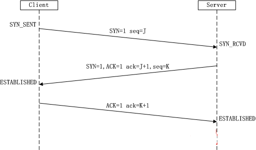
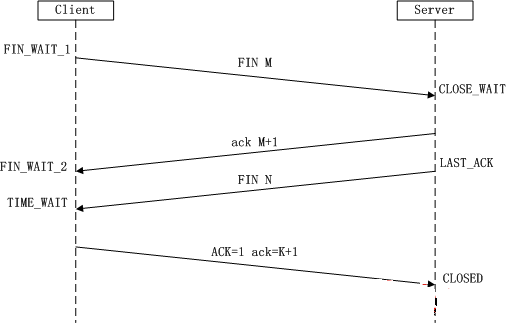

# Android 高级面试-5：网络基础

## 1、TCP/UDP

- TCP 与 UDP 区别与应用（三次握手和四次挥手）涉及到部分细节（如 client 如何确定自己发送的消息被 server 收到） 
- TCP 中 3 次握手和 4 次挥手的过程?
- TCP 与 UDP 的区别及应用?

**TCP**（Transmission Control Protocol 传输控制协议）是一种面向连接的、可靠的、基于字节流的传输层通信协议。**UDP** 是 User Datagram Protocol 的简称， 中文名是用户数据报协议。

**区别**：

1. TCP 协议是`有连接的`，有连接的意思是开始传输实际数据之前 TCP 的客户端和服务器端必须通过三次握手建立连接，会话结束之后也要结束连接。而 UDP 是无连接的。
2. TCP 协议保证数据`按序发送`，`按序到达`，提供`超时重传`来保证可靠性，但是 UDP `不保证按序到达`，甚至`不保证到达`，只是努力交付，即便是按序发送的序列，也不保证按序送到。
3. TCP 协议`所需资源多`，TCP 首部需 20 个字节（不算可选项），UDP 首部字段只需8个字节。
4. TCP 有`流量控制和拥塞控制`，UDP 没有，网络拥堵不会影响发送端的发送速率。
5. TCP 是`一对一`的连接，而 UDP 则可以支持`一对一、多对多、一对多`的通信。
6. TCP 面向的是`字节流`的服务，UDP 面向的是`报文`的服务。

**应用**：因此根据它们的特点，TCP 被用在对不能容忍数据丢失的场景中，比如用来发送 Http；UDP 用来可以容忍丢失的场景，比如网络视频流的传输。

**TCP 中 3 次握手和 4 次挥手的过程**：

1. 客户端通过 TCP 向服务器发送 **SYN 报文段**。它不包含应用层信息，其中的 **SYN标志位为1**，然后选择一个 **初始序号 (client_isn)**，并将其放置在报文段的序号字段中。
2. 当 SYN 报文段到达服务器之后，服务器为该 TCP 连接分配 TCP 缓存和变量，并向该客户端发送**SYNACK 报文段**。它不包含应用层信息，其中个的 **SYN 置为1**，**确认号字段**被置为client_isn+1，最后服务器选择自己的 **初始序号 (server_isn)** 放在序号字段中。
3. 客户端收到 SYNACK 报文段之后，为连接分配缓存和变量，然后向服务器发送另一个报文段，其中将 server_isn+1 放在**确认字段**中，并将**SYN 位置为 0**.

1. 客户端向服务器发送关闭连接报文段，其中 FIN 置为 1。
2. 服务器接收到该报文段之后向发送方会送一个确认字段。
3. 服务器向客户端发送自己的终止报文段。
4. 客户端对服务器终止报文段进行确认。

- 三次握手建立连接时，发送方再次发送确认的必要性？

主要是为了防止已失效的连接请求报文段突然又传到了B,因而产生错误。假定出现一种异常情况，即A发出的第一个连接请求报文段并没有丢失，而是在某些网络结 点长时间滞留了，一直延迟到连接释放以后的某个时间才到达B，本来这是一个早已失效的报文段。但B收到此失效的连接请求报文段后，就误认为是A又发出一次 新的连接请求，于是就向A发出确认报文段，同意建立连接。假定不采用三次握手，那么只要B发出确认，新的连接就建立了，这样一直等待A发来数据，B的许多 资源就这样白白浪费了。

- 四次挥手释放连接时，等待 2MSL 的意义？

1. 为了保证 A 发送的最后一个 ACK 报文段能够到达 B。这个 ACK 报文段有可能丢失，因而使处在 LAST-ACK 状态的 B 收不到对已发送的 FIN 和 ACK 报文段的确认。B 会超时重传这个 FIN 和 ACK 报文段，而 A 就能在 2MSL 时间内收到这个重传的 ACK+FIN 报文段。接着 A 重传一次确认。
2. 防止上面提到的已失效的连接请求报文段出现在本连接中，A 在发送完最有一个 ACK 报文段后，再经过 2MSL，就可以使本连接持续的时间内所产生的所有报文段都从网络中消失。

## 2、Http

- HTTP 协议
- HTTP 报文结构

**Http 协议概念**：

1. 全称**超文本传输协议**。
2. HTTP使用 **TCP** 作为它的支撑协议，TCP 默认使用 80 端口。
3. 它是**无状态的**，就是说它不会记录你之前是否访问过某个对象，它不保存任何关于客户的信息。
4. 它有两种连接方式，**非持续连接和持续连接**。它们的区别在于，非持续连接发送一个请求获取内容之后，对内容里的链接会再分别发送 TCP 请求获取；持续连接当获取到内容之后，使用之前的 TCP 获取相关的内容。后者节省了建立连接的时间，效率更高。

**HTTP 请求报文的结构**

HTTP 请求包含以下三个部分：1). 请求方法-统一资源标识符(URI)-协议/版本；2). 请求头；3). 实体。

如下所示：

    GET /somedir/page.jsp HTTP/1.1
    Accept: text/plain; text/html
    Accept-Language: en-gb
    Connection: keep-Alive
    Host: localhost
    User-Agent: Mozilla/4.0
    Content-Length: 33
    Content-Type: application/x-www-form-urlencoded
    Accept-Encoding: gzip, deflate
    
    lastName=Franks&firstName=Michael

1. 请求方法共有**GET、POST、HEAD、PUT和DELETE**等，其中 GET 大约占 90%。HEAD 类似 GET，但不返回请求对象。PUT 表示上传对象到服务器。DELETE 表示删除服务器上的对象。
2. **URI** 是相应的 **URL** 的后缀，通常被解释为相对于服务器根目录的路径；
3. 请求头包含客户端和实体正文的相关信息，各个请求头之间使用 **“换行/回车”符(CRLF)** 隔开；
4. 请求头和实体之间有一个空行，该空行只有 CRLF 符，对 HTTP 格式非常重要。
5. **Host** 指明对象主机，它在 Web 代理高速缓存中有作用；
6. **Connection** 可取的值有 keep-Alive 和 close，分别对应持续连接和非持续连接；
7. **User-Agent** 指明向服务器发送请求的浏览器。

**HTTP 响应报文**

HTTP响应报文包含以下三部分：1). 协议-状态码-描述；2). 响应头；3). 响应实体段。

如下所示：

    HTTP/1.1 200 OK
    Server: Microft-IIS/4.0
    Date: Mon, 5 Jan 2004 12:11：22 GMT
    Content-Type: text/html
    Last-Modified: Mon, 5 Jan 2004 11:11:11 GMT
    Content-Length: 112

    <html>.....</html>

1. 响应头和响应实体之间使用一个 CRLF 符分隔;
2. Last-Modified 缓存服务器中有作用；
3. 状态码的五种可能取值：
	1. 1xx：指示信息--表示请求已接收，继续处理
	2. 2xx：成功--表示请求已被成功接收、理解、接受
	3. 3xx：重定向--要完成请求必须进行更进一步的操作
	4. 4xx：客户端错误--请求有语法错误或请求无法实现
	5. 5xx：服务器端错误--服务器未能实现合法的请求
3. 常见的状态码:
	1. 200 OK：请求成功；
	2. 301 Moved Permanelty: 请求对象被永久转移；
	3. 400 Bad Request: 请求不被服务器理解；
	4. 404 Not Found: 请求的文档不在服务器；
    5. 503 Service Unavailable：服务器出错的一种返回状态；
	6. 505 HTTP Version Not Supperted： 服务器不支持的HTTP协议。

- Https 请求慢的解决办法，DNS，携带数据，直接访问 IP
- HTTP 相关 

- 描述一次网络请求的流程?

TCP UDP HTTP HTTP2 HTTPS

以及 HTTP 的各种概念

- https 相关，如何验证证书的合法性，https 中哪里用了对称加密，哪里用了非对称加密，对加密算法（如RSA）等是否有了解

- 提到过 Websocket 问了 WebSocket 相关以及与socket的区别
- 多线程断点续传原理

- HTTP 1.0 与 2.0 的区别

- HTTP 与 HTTPS 的区别以及如何实现安全性
- HTTPS 原理
- 谈谈你对 WebSocket 的理解
- WebSocket 与 socket 的区别
- 视频加密传输

