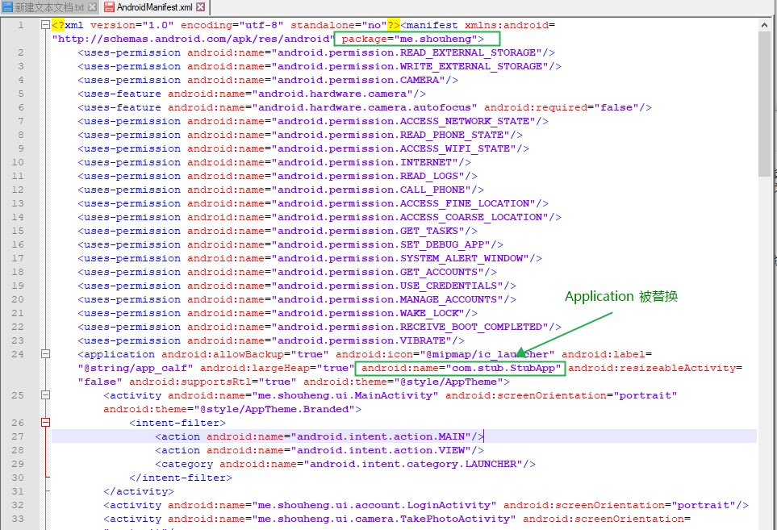

# Android 高级面试：插件化和热修复相关

## 1、dex 和 class 文件结构

class 是 JVM 可以执行的文件类型，由 javac 编译生成；dex 是 DVM 执行的文件类型，由 dx 编译生成。

class 文件结构的特点：

1. 是一种 8 位二进制字节流文件；
2. 各个数据按顺序紧密的排列，无间隙；
3. 每个类或者借口都单独占据一个 class 文件；

class 文件的文件结构：

```
1. magic                           加密字段
2. minor_version                   支持最低版本的jdk
3. major_version                   编译使用的jdk版本
4. constant_pool_count             常量池的数量
5. cp_info constant_pool           常量池的结构体，数量不定
6. access_flags                    访问级别
7. this_class                      当前类
8. super_class                     父类
9. interfaces_count                类实现接口的数量
10. fields_count                   类成员变量的数量
11. methods_count                  类方法的数量
12. method_info methods            类方法的结构体
13. attributes_count               类属性的数量
14. attribute_info attributes      类属性的结构体
```

dex 文件的结构的特点：

```
1. 是一种 8 位二进制字节流文件；
2. 各个数据按顺序紧密的排列，无间隙；
3. 一般情况下，整个应用所有 java 源文件都放在一个 dex 文件中。
```

dex 的文件结构分成 3 个区：

```
1. 第一个区是 header，包括：
    1. header_item dex_header 这个结构体，
2. 第二个区是索引区，包括：
    1. string_id_list dex_string_ids（字符串索引
    2. type_id_list dex_type_ids（类型索引）
    3. proto_id_list dex_proto_ids（方法原型索引）
    4. field_id_list dex_field_ids（域索引）
    5. method_id_list dex_method_ids（方法索引）
3. 第三个区是数据区，包括：
    1. class_def_item_list dex_class_defs（类的定义）
    2. data
    3. link_data(so)
```

两者的主要区别：

1. class 中只包含了一个 java 文件的信息，dex 中包含了多个 java 文件的的信息；
2. dex 中包含了很多类的信息，它会把类的信息进行拆分，然后把拆分后的信息分配到指定的索引区域中。比如方法索引区域就包含了所有类的方法的索引。

## 2、加固的原理

加固的过程分成几个步骤：

1. 要加固的 APK + 壳程序 dex 合成新的 dex；
2. 然后用新合成的 dex 替换克 apk 中的 dex 得到新的 APK.

第一步的时候可以对 APK 进行加密，然后在运行时对 APK 进行解密。合成新 APK 的本质过程是对 dex 进行拼接，将 APK 文件附加到 dex 文件后面。因为此时 dex 的信息已经发生了变化，所以需要对 dex 的文件头进行修改，包括魔数、检验码和 SHA-1 签名的修改。本质上拼接的过程可以通过读取二进制数组，然后通过数组拷贝将 APK 附加到 dex 末尾。

第二部就是一个打包的过程。不过这个过程会修改 Manifest 文件，将程序中的 Application 替换掉。替换后的 Application 会在程序启动的时候将我们的 APK 加载进来。下面是 360 加固之后的 Manifest 文件：



加固的过程有些类似于插件化的流程，也是将 APK 解压到磁盘之后，通过反射替换掉 AssertsManager，并将其指向我们解压之后的资源的路径。

360 加固的核心算法在 native 层实现，里面针对不同的平台提供了各种 so 库，运行时在 java 层判断平台版本，调用 so 库。

## 3、热修复的原理

根据修复的类型分成几种：类的修复，资源修复和 so 修复。

类的修复：

## 4、插件化的原理


