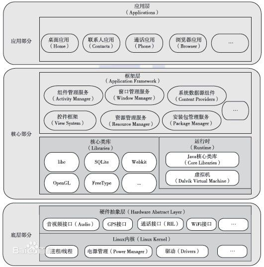

# Android 系统架构

如下所示的时Andriod系统的架构图：

总结：

*Android 架构 = 应用部分 + 核心部分 + 底层部分*

1. *应用部分 = 系统应用 + 第三方应用*

2. *核心部分 = 框架层 + 核心类库 + 运行时*
    1. 框架层：Java 编写，可以称为 Java 框架层，提供应用开发所需要的API；
    2. 核心类库：Android 的库文件，如数据库、浏览器和 OpenGL 等；
    3. 运行时：由 Java 核心库和 Dalvik 虚拟机组成。

3. *底层部分 = 硬件抽象层 + Linux内核*
    1. 硬件抽象层：位于操作系统内核与硬件电路之间的接口层，目的在于将硬件抽象化；
    2. Linux 内核：在 Linux 内核之上增加了 Android 驱动，系统的安全、内存、进程和网络等的管理都依赖于它。

