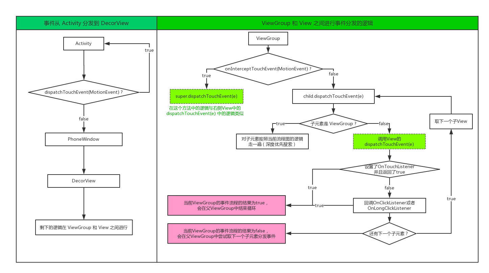

# View 体系详解：坐标系、滑动、手势和事件分发机制

## 1、位置

### 1.1 坐标系

下面是 Android 中的 View 坐标系的基本图。要获得一个 View 的位置，我们可以借助两个对象，一个是 View ，一个是 MotionEvent。以下是它们的一些方法的位置的含义：


在 View 中共有 `mLeft`, `mRight`, `mTop` 和 `mBottom` 四个变量包含 View 的坐标信息，你可以在源码中获取它们的含义：

1. `mLeft`：指定控件的左边缘距离其父控件左边缘的位置，单位：像素；
2. `mRight`：指定控件的右边缘距离其父控件左边缘的位置，单位：像素；
3. `mTop`：指定控件的上边缘距离其父控件上边缘的位置，单位：像素；
4. `mBottom`：指定控件的下边缘距离其父控件上边缘的位置，单位：像素。

此外，View 中还有几个方法用来获取控件的位置等信息，实际上就是上面四个变量的 getter 方法：

1. `getLeft()`：即 `mLeft`；
2. `getRight()`：即 `mRight`；
3. `getTop()`：即 `mTop`；
4. `getBottom()`：即 `mBottom`；

所以，我们可以得到两个获取 View 高度和宽度信息的方法：

1. `getHeight()`：即 `mBottom - mTop`；
2. `getWidth()`：即 `mRight - mLeft`；

另外，就是 View 中的 `getX()` 和 `getY()` 两个方法，你需要注意将其与 MotionEvent 中的同名方法进行区分。在没有对控件进行平移的时候，`getX()` 与 `getLeft()` 返回结果相同，只是前者会在后者的基础上加上平移的距离：

1. `getX()`：即 `mLeft + getTranslationX()`，即控件的左边缘加上 X 方向平移的距离；
2. `getY()`：即 `mTop + getTranslationY()`，即控件的上边缘加上 Y 方向平移的距离；

以上是我们对 View 中获取控件位置的方法的梳理，你可以到源码中查看它们更加相详尽的定义，那更有助于自己的理解。

### 1.2 MotionEvent

通常当你对控件进行触摸监听的时候会用到 MotionEvent ，它封住了触摸的位置等信息。下面我们对 MotionEvent 中的获取点击事件的位置的方法进行梳理，它主要涉及下面四个方法：

1. `MotionEvent.getX()`：获取点击事件距离控件左边缘的距离，单位：像素；
2. `MotionEvent.getY()`：获取点击事件距离控件上边缘的距离，单位：像素；
3. `MotionEvent.getRawX()`：获取点击事件距离屏幕左边缘的距离，单位：像素；
4. `MotionEvent.getRawY()`：获取点击事件距离屏幕上边缘的距离，单位：像素。

另外是触摸事件中的三种典型的行为，按下、移动和抬起。接下来的代码示例中我们会用到它们来判断手指的行为，并对其做响应的处理：

1. `MotionEvent.ACTION_DOWN`：按下的行为；
2. `MotionEvent.ACTION_MOVE`：手指在屏幕上移动的行为；
3. `MotionEvent.ACTION_UP`：手指抬起的行为。

## 2、滑动

我们有几种方式实现 View 的滑动：

### 2.1 layout() 方法

调用控件的 `layout()` 方法进行滑动，下面是该方法的定义：

```java
public void layout(int l, int t, int r, int b) { /*...*/ }
```

其中的四个参数 `l`, `t`, `r`, `b`分别表示控件相对于父控件的左、上、右、下的距离，分别对应于上面的 `mLeft`, `mTop`, `mRight` 和 `mBottom`。所以，调用该方法同时可以改变控件的高度和宽度，但有时候我们不需要改变控件的高度和宽度，只要移动其位置即可。所以，我们又有方法 `offsetLeftAndRight()` 和 `offsetTopAndBottom()` 可以使用，后者只会对控件的位置进行平移。因此，我们可以进行如下的代码测试：

```java
    private int lastX, lastY;

    private void layoutMove(MotionEvent event) {
        int x = (int) event.getX(), y = (int) event.getY();
        switch (event.getAction()) {
            case MotionEvent.ACTION_DOWN:
                lastX = x;
                lastY = y;
                break;
            case MotionEvent.ACTION_MOVE:
                int offsetX = x - lastX, offsetY = y - lastY;
                getBinding().v.layout(getBinding().v.getLeft() + offsetX,
                        getBinding().v.getTop() + offsetY,
                        getBinding().v.getRight() + offsetX,
                        getBinding().v.getBottom() + offsetY);
                break;
            case MotionEvent.ACTION_UP:
                break;
        }
    }
```

上面的代码的效果是指定的控件会随着手指的移动而移动。这里我们先记录下按下的位置，然后手指移动的时候记录下平移的位置，最后调用 `layout()` 即可。

### 2.2 offsetLeftAndRight() 和 offsetTopAndBottom()

上面已经提到过这两个方法，它们只改变控件的位置，无法改变大小。我们只需要对上述代码做少量修改就可以实现同样的效果：

```java
    getBinding().v.offsetLeftAndRight(offsetX);
    getBinding().v.offsetTopAndBottom(offsetY);
```

### 2.3 改变布局参数

通过获取并修改控件的 `LayoutParams`，我们一样可以达到修改控件的位置的目的。毕竟，本身这个对象就代表着控件的布局：

```java
    FrameLayout.LayoutParams lp = (FrameLayout.LayoutParams) getBinding().v.getLayoutParams();
    lp.leftMargin = getBinding().v.getLeft() + offsetX;
    lp.topMargin = getBinding().v.getTop() + offsetY;
    getBinding().v.setLayoutParams(lp);
```

### 2.4 动画

使用动画我们也可以实现控件移动的效果，这里所谓的动画主要是操作 View 的 `transitionX` 和 `transitionY` 属性：

```java
    getBinding().v.animate().translationX(5f);
    getBinding().v.animate().translationY(5f);
```

关于动画的内容，我们会在后面详细介绍。

### 2.5 scrollTo() 和 scrollBy()

`scrollBy()` 方法内部调用了 `scrollTo()`，以下是这部分的源码。`scrollBy()` 表示在当前的位置上面进行平移，而 `scrollTo()` 表示平移到指定的位置：

```java
    public void scrollBy(int x, int y) {
        scrollTo(mScrollX + x, mScrollY + y);
    }
```

同样对上述代码进行修改，我们也可以实现之前的效果：

```java
    ((View) getBinding().v.getParent()).scrollBy(-offsetX, -offsetY);
```

或者

```java
    View parent = ((View) getBinding().v.getParent());
    parent.scrollTo(parent.getScrollX()-offsetX, parent.getScrollY()-offsetY);
```

此外，还有一个需要注意的地方是：与上面的 `offsetLeftAndRight()` 和 `offsetTopAndBottom()` 不同的是，这里我们用了平移的值的相反数。原因很简单，因为我们要使用这两个方法的时候需要对指定的控件所在的父容器进行调用（正如上面是先获取父控件）。当我们希望控件相对于之前的位置向右下方向移动，就应该让父容器相对于之前的位置向左上方向移动。因为实际上该控件相对于父控件的位置没有发生变化，变化的是父控件的位置。（参考的坐标系不同）

### 2.6 Scroller

上面，我们的测试代码是让指定的控件随着手指移动，但是假如我们希望控件从一个位置移动到另一个位置呢？当然，它们也可以实现，但是这几乎就是在瞬间完成了整个操作，实际的UI效果肯定不会好。所以，为了让滑动的过程看起来更加流畅，我们可以借助 `Scroller` 来实现。

在使用 `Scroller` 之前，我们需要先实例化一个 `Scroller` ：

```java
    private Scroller scroller = new Scroller(getContext());
```

然后，我们需要覆写自定义控件的 `computeScroll()` 方法，这个方法会在绘制 View 的时候被调用。所以，这里的含义就是，当 View 重绘的时候会调用 `computeScroll()` 方法，而 `computeScroll()` 方法会判断是否需要继续滚动，如果需要继续滚动的时候就调用 `invalidate()` 方法，该方法会导致 View 进一步重绘。所以，也就是靠着这种不断进行重绘的方式实现了滚动的效果。

滑动效果最终结束的判断是通过 `Scroller` 的 `computeScrollOffset()` 方法实现的，当滚动停止的时候，该方法就会返回 `false`，这样不会继续调用 `invalidate()` 方法，因而也就不会继续绘制了。下面是该方法典型的覆写方式：

```java    
    @Override
    public void computeScroll() {
        super.computeScroll();
        if (scroller.computeScrollOffset()) {
            ((View) getParent()).scrollTo(scroller.getCurrX(), scroller.getCurrY());
            invalidate();
        }
    }
```

然后，我们再加入一个滚动到指定位置的方法，在该方法内部我们使用了 2000ms 来指定完成整个滑动所需要的时间：

```java
    public void smoothScrollTo(int descX, int descY) {
        scroller.startScroll(getScrollX(), getScrollY(), descX - getScrollX(), descY - getScrollY(), 2000);
        invalidate();
    }
```

这样定义了之后，我们只需要在需要滚动的时候调用自定义 View 的 `smoothScrollTo()` 方法即可。

## 3、手势

### 3.1 ViewConfiguration

在类 `ViewConfiguration` 中定义了一些列的常量用来标志指定的行为，比如，`TouchSlop` 就是滑动的最小的距离。你可以通过 `ViewConfiguration.get(context)` 来获取 `ViewConfiguration` 实例，然后通过它的 getter 方法来获取这些常量的定义。

### 3.2 VelocityTracker

`VelocityTracker` 用来检测手指滑动的速率，它的使用非常简单。在使用之前，我们先使用它的静态方法 `obtain()` 获取一个实例，然后在 `onTouch()` 方法中调用它的 `addMovement(MotionEvent)` 方法：

```java
    velocityTracker = VelocityTracker.obtain();
```

随后，当我们想要获得速率的时候，先调用 `computeCurrentVelocity(int)` 传入一个时间片段，单位是毫秒，然后调用 `getXVelocity()` 和 `getYVelocity()` 分别获得在水平和竖直方向上的速率即可：

```java
    velocityTracker.computeCurrentVelocity((int) duration);
    getBinding().tvVelocity.setText("X:" + velocityTracker.getXVelocity() + "\n"
            + "Y:" + velocityTracker.getYVelocity());
```

本质上，计算速率的时候是用指定时间的长度变化除以我们传入的时间片。当我们使用完了 `VelocityTracker` 之后，需要回收资源：

```java
    velocityTracker.clear();
    velocityTracker.recycle();
```

### 3.3 GestureDectector

`GestureDectector` 用来检测手指的手势。在使用它之前我们需要先获取一个 `GestureDetector` 的实例：

```java
    mGestureDetector = new GestureDetector(getContext(), new MyOnGestureListener());
```

这里我们用了 `GestureDetector` 的构造方法，需要传入一个 `OnGestureListener` 对象。这里我们用了 `MyOnGestureListener` 实例。 `MyOnGestureListener` 是一个自定义的类，实现了 `OnGestureListener` 接口：

```java
    private class MyOnGestureListener extends GestureDetector.SimpleOnGestureListener {

        @Override
        public boolean onSingleTapUp(MotionEvent e) {
            ToastUtils.makeToast("Click detected");
            return false;
        }

        @Override
        public void onLongPress(MotionEvent e) {
            LogUtils.d("Long press detected");
        }

        @Override
        public boolean onDoubleTap(MotionEvent e) {
            LogUtils.d("Double tab detected");
            return true;
        }

        @Override
        public boolean onFling(MotionEvent e1, MotionEvent e2, float velocityX, float velocityY) {
            LogUtils.d("Fling detected");
            return true;
        }
    }
```

在 `MyOnGestureListener` 中，我们覆写了它的一些方法。比如，单击、双击和长按等等，当检测到相应的手势的时候这些方法就会被调用。

然后，我们可以这样使用 `GestureDetector`，只要在控件的触摸事件回调中调用即可：

```java
    getBinding().vg.setOnTouchListener((v, event) -> {
        mGestureDetector.onTouchEvent(event);
        return true;
    });
```

## 4、事件分发机制

### 4.1 事件传递的过程

当讨论事件分发机制的时候，我们首先要了解 Android 中 `View` 的组成结构。在 Android 中，一个 Activity 包含一个 `PhoneWindow`，当我们在 Activity 中调用 `setContentView()` 方法的时候，会调用该 `PhoneWindow` 的 `setContentView()` 方法，并在这个方法中生成一个 `DecorView` 作为 Activity 的跟 `View`。

根据上面的分析，当一个点击事件被触发的时候，首先接收到该事件的是 `Activity`。因为，`Activity` 覆盖了整个屏幕，我们需要先让它接收事件，然后它把事件传递给根 `View` 之后，再由根 `View` 向下继续传递。这样不断缩小搜索的范围，直到最顶层的 `View`。当然，任何的父容器都可以决定这个事件是不是要继续向下传递，因此，我们可以大致得到下面这个事件传递的图：


左边的图是一个 Activity 内部的 `View` 和 `Window` 的组织结构。右面的图可以看作它的切面图，其中的黑色箭头表示事件的传递过程。这里事件传递的过程是先从下到上，然后再从上到下。也就是从大到小，不断定位到触摸的控件，其中每个父容器可以决定是否将事件传递下去。（需要注意的地方是，如果一个父容器有多个子元素的话，那么在这些子元素中进行遍历的时候，顺序是从上往下的，也就是按照展示的顺序）。

上面我们分析了 Android 事件传递的过程，相信你有了一个大致的了解。但是，想要了解整个事件传递过程具体涉及了哪些方法、如何作用等，还需要我们对源码进行分析。

### 4.2 事件传递的原理

当触摸事件发生的时候，首先会被 Activity 接收到，然后该 Activity 会通过其内部的 `dispatchTouchEvent(MotionEvent)` 将事件传递给内部的 `PhoneWindow`；接着 `PhoneWindow` 会把事件交给 `DecorView`，再由 `DecorView` 交给根 `ViewGroup`。剩下的事件传递就只在 `ViewGroup` 和 `View` 之间进行。我们可以通过覆写 Activity 的 `dispatchTouchEvent(MotionEvent)` 来阻止把事件传递给 `PhoneWindow`。实际上，在我们开发的时候不会对 `Window` 的事件传递方法进行重写，一般是对 `ViewGroup` 或者 `View`。所以，下面我们的分析只在这两种控件之间进行。

当讨论 View 的事件分发机制的时候，无外乎下面三个方法：

1. `boolean onInterceptTouchEvent(MotionEvent ev)`：用来对事件进行拦截，该方法只存在于 ViewGroup 中。一般我们会通过覆写该方法来拦截触摸事件，使其不再继续传递给子 View。
2. `boolean dispatchTouchEvent(MotionEvent event)`：用来分发触摸事件，一般我们不覆写该方法，返回 `true` 则表示事件被处理了。在 View 中，它负责根据手势的类型和控件的状态对事件进行处理，会回调我们的 `OnTouchListener` 或者 `OnClickListener`；在 ViewGroup 中，该方法被覆写，它的责任是对事件进行分发，会对所有的子 View 进行遍历，决定是否将事件分发给指定的 View。
3. `boolean onTouchEvent(MotionEvent event)`：用于处理触摸事件，返回 `true` 表示触摸事件被处理了。ViewGroup 没有覆写该方法，故在 ViewGroup 中与 View 中的功能是一样的。需要注意的是，如果我们为控件设置了 `OnTouchListener` 并且在或者中返回了 `true`，那么这个方法不会被调用，也就是 `OnTouchListener` 比该方法的优先级较高。对我们开发来说，就是 `OnTouchListener` 比 `OnClickListener` 和 `OnLongClickListener` 的优先级要高。

于是，我们可以得到如下的伪代码。这段代码是存在于 ViewGroup 中的，也就是事件分发机制的核心代码：

```java
    boolean dispatchTouchEvent(MotionEvent e) {
        boolean result;
        if (onInterceptTouchEvent(e)) {
            result = super.dispatchTouchEvent(e);
        } else {
            result = child.dispatchTouchEvent(e);
        }
        return result;
    }
```

按照上述分析，触摸事件经过 Activity 传递给根 ViewGroup 之后：

如果 ViewGourp 覆写了 `onInterceptTouchEvent()` 并且返回了 `true` 就表示希望拦截该方法，于是就把触摸事件交给当前 ViewGroup 进行处理（触发  `OnTouchListener` 或者  `OnClickListener` 等）；否则，会交给子元素的继续分发。如果该子元素是 ViewGroup 的话，就会在该子 View 中执行一遍上述逻辑，否则会在当前的子元素中对事件进行处理（触发  `OnTouchListener` 或者  `OnClickListener` 等）……就这样一层层地遍历下去，本质上是一个深度优先的搜索算法。

这里我们对整个事件分发机制的整体做了一个素描，在接下来的文章中我们会对各个方法的细节进行源码分析，为了防止您在接下来的行文中迷路，我们先把这个整体逻辑按下图进行描述：



### 4.3 事件传递的源码分析

上述我们分析了事件分发机制的原理，下面我们通过源代码来更具体地了解这块是如何设计的。同样，我们的焦点也只在那三个需要重点关注的方法。

#### 4.3.1 决定是否拦截事件

首先，我们来看 ViewGroup 中的 `dispatchTouchEvent(MotionEvent)` 方法，我们节选了其一部分：

```java
    @Override
    public boolean dispatchTouchEvent(MotionEvent ev) {
        // ...
        boolean handled = false;
        if (onFilterTouchEventForSecurity(ev)) {
            final int action = ev.getAction();
            final int actionMasked = action & MotionEvent.ACTION_MASK;
            if (actionMasked == MotionEvent.ACTION_DOWN) { // 1
                // 这里表示如果是一个新的触摸事件就要重置所有的状态，其中包括将 mFirstTouchTarget 置为 null
                cancelAndClearTouchTargets(ev);
                resetTouchState();
            }
            // 在这里检查是否拦截了事件，mFirstTouchTarget 是之前处理触摸事件的 View 的封装
            final boolean intercepted;
            if (actionMasked == MotionEvent.ACTION_DOWN || mFirstTouchTarget != null) {
                // 这里判断该 ViewGroup 是否禁用了拦截，由 requestDisallowInterceptTouchEvent 设置
                final boolean disallowIntercept = (mGroupFlags & FLAG_DISALLOW_INTERCEPT) != 0;
                if (!disallowIntercept) {
                    intercepted = onInterceptTouchEvent(ev);
                    ev.setAction(action);
                } else {
                    intercepted = false;
                }
            } else {
                // 非按下事件并且 mFirstTouchTarget 为 null，说明判断过拦截的逻辑并且启用了拦截
                intercepted = true;
            }
            // ...           
        }
        // ...
        return handled;
    }
```

上面代码是我们节选的 ViewGroup 拦截事件的部分代码，这里的逻辑显然比伪代码复杂的多。不过，尽管如此，这些代码确实必不可少的。因为，当我们要去判断是否拦截一个触摸事件的时候，此时触摸的事件仍然在继续，这意味着这个方法会被持续调用；抬起的时候再按下，又是另一次调用。考虑到这个连续性，我们需要多做一些逻辑。

这里我们首先在 1 处通过行为是否是“按下”的来判断是否是一次新的触摸事件，如果是的话我们需要重置当前的触摸状态。其次，我们需要根据事件的类型来决定是否应该调用 `onInterceptTouchEvent()`，因为对一次触摸事件，我们只需要在“按下”的时候判断一次就够了。所以，显然我们需要将 `MotionEvent.ACTION_DOWN` 作为一个判断条件。然后，我们使用 `mFirstTouchTarget` 这个全局的变量来记录上次拦截的结果——如果之前的事件交给过子元素处理，那么它就不为空。

除了 `mFirstTouchTarget`，我们还需要用 `mGroupFlags` 的 `FLAG_DISALLOW_INTERCEPT` 标志位来判断该 ViewGroup 是否禁用了拦截。这个标志位可以通过 ViewGroup 的 `requestDisallowInterceptTouchEvent(boolean)` 来设置。只有没有禁用拦截事件的时候我们才需要调用 `onInterceptTouchEvent()` 判断是否开启了拦截。

#### 4.3.2 分发事件给子元素

如果在上面的操作中事件没有被拦截并且没有被取消，那么就会进入下面的逻辑。这部分代码处在 `dispatchTouchEvent()` 中。在下面的逻辑中会根据子元素的状态将事件传递给子元素：

```java
    // 对子元素进行倒序遍历，即从上到下进行遍历
    final View[] children = mChildren;
    for (int i = childrenCount - 1; i >= 0; i--) {
        final int childIndex = getAndVerifyPreorderedIndex(childrenCount, i, customOrder);
        final View child = getAndVerifyPreorderedView(preorderedList, children, childIndex);
        // ...
        // 判断子元素是否能接收触摸事件：能接收事件并且不是正在进行动画的状态
        if (!canViewReceivePointerEvents(child) || !isTransformedTouchPointInView(x, y, child, null)) {
            ev.setTargetAccessibilityFocus(false);
            continue;
        }
        // ...
        // 在这里调用了 dispatchTransformedTouchEvent() 方法将事件传递给子元素
        if (dispatchTransformedTouchEvent(ev, false, child, idBitsToAssign)) {
            // ... 记录一些状态信息
            // 在这里完成对 mFirstTouchTarget 的赋值，表示触摸事件被子元素处理
            newTouchTarget = addTouchTarget(child, idBitsToAssign);
            alreadyDispatchedToNewTouchTarget = true;
            // 结束循环，完成子元素的遍历
            break;
        }
        // 显然，如果到了这一步，那么子元素的遍历仍将继续
    }
```

当判断了指定的 View 可以接收触摸事件之后会调用 `dispatchTransformedTouchEvent()` 方法分发事件。其定义的节选如下：

```java
    private boolean dispatchTransformedTouchEvent(MotionEvent event, boolean cancel, View child, int desiredPointerIdBits) {
        final boolean handled;
        // ...
        if (child == null) {
            // 本质上逻辑与 View 的 dispatchTouchEvent() 一致
            handled = super.dispatchTouchEvent(transformedEvent);
        } else {
            // ...
            // 交给子元素继续分发事件
            handled = child.dispatchTouchEvent(transformedEvent);
        }
        return handled;
    }
```

`dispatchTransformedTouchEvent()` 会根据传入的 `child` 是否为 `null` 分成两种调用的情形：事件没有被拦截的时候，让子元素继续分发事件；另一种是当事件被拦截的时候，调用当前的 ViewGroup 的 `super.dispatchTouchEvent(transformedEvent)` 处理事件。

#### 4.3.3 View 中的 dispatchTouchEvent

上面我们分析的 `dispatchTouchEvent(MotionEvent)` 是 ViewGroup 中重写之后的方法。但是，正如我们上面的分析，重写之前的方法总是会被调用，只是对象不同。这里我们就来分析以下这个方法的作用。

```java
    public boolean dispatchTouchEvent(MotionEvent event) {
        // ...
        boolean result = false;
        // ....
        if (onFilterTouchEventForSecurity(event)) {
            if ((mViewFlags & ENABLED_MASK) == ENABLED && handleScrollBarDragging(event)) {
                result = true;
            }
            // 这里回调了 setOnTouchListener() 方法传入的 OnTouchListener
            ListenerInfo li = mListenerInfo;
            if (li != null && li.mOnTouchListener != null
                    && (mViewFlags & ENABLED_MASK) == ENABLED
                    && li.mOnTouchListener.onTouch(this, event)) {
                result = true;
            }
            // 如果 OnTouchListener 没有被回调过或者返回了 false，就会调用 onTouchEvent() 进行处理
            if (!result && onTouchEvent(event)) {
                result = true;
            }
        }
        // ...
        return result;
    }
```

根据上面的源码分析，我们知道，如果当前的 View 设置过 `OnTouchListener`, 并且在 `onTouch()` 回调方法中返回了 `true`，那么 `onTouchEvent(MotionEvent)` 将不会得到调用。那么，我们再来看一下 `onTouchEvent()` 方法： 

```java
    public boolean onTouchEvent(MotionEvent event) {
        // ...
        // 判断当前控件是否是可以点击的：实现了点击、长按或者设置了可点击属性
        final boolean clickable = ((viewFlags & CLICKABLE) == CLICKABLE
                || (viewFlags & LONG_CLICKABLE) == LONG_CLICKABLE)
                || (viewFlags & CONTEXT_CLICKABLE) == CONTEXT_CLICKABLE;
        // ...
        if (clickable || (viewFlags & TOOLTIP) == TOOLTIP) {
            switch (action) {
                case MotionEvent.ACTION_UP:
                    // ...
                    if (!focusTaken) {
                        if (mPerformClick == null) {
                            mPerformClick = new PerformClick();
                        }
                        if (!post(mPerformClick)) {
                            performClick();
                        }
                    }
                    // ...
                    break;
                case MotionEvent.ACTION_DOWN:
                    // ...
                    if (!clickable) {
                        checkForLongClick(0, x, y);
                        break;
                    }
                    // ...
                    break;
                // ...
            }
            return true;
        }
        return false;
    }
```

这里先判断指定的控件是否是可点击的，即是否设置过点击或者长按的事件。然后会在手势抬起的时候调用 `performClick()` 方法，并会在这个方法中尝试从 `ListenerInfo` 取 `OnClickListener` 进行回调；会在长按的时候进行监听以调用相应长按事件；其他的事件与之类似，可以自行分析。所以，我们可以得出结论，当为控件的触摸事件进行了赋值并且在其中返回了 `false` 那么就代表这个触摸事件被消耗了。这个触摸事件的优先级比较高，即使设置过单击和长按事件的回调，它们也不会被调用。

经过上述分析，我们可以知道 View 中的 `dispatchTouchEvent(MotionEvent)` 方法就是用来对手势进行处理的，所以回到 `4.3.2`，那里的意思就是：如果 ViewGroup 拦截了触摸事件，那么它就自己来对事件进行处理；否则就把触摸事件传递给子元素，让它来进行处理。

#### 4.4.4 总结

以上就是我们对 Android 中事件分发机制的详解，你可以通过图片和代码结合来更透彻得了解这方面的内容。虽然这部分代码比较多、比较长，但是每个地方的设计都是合情合理的。

## 源代码

你可以在Github获取以上程序的源代码： [Android-references](https://github.com/Shouheng88/Android-references)。
