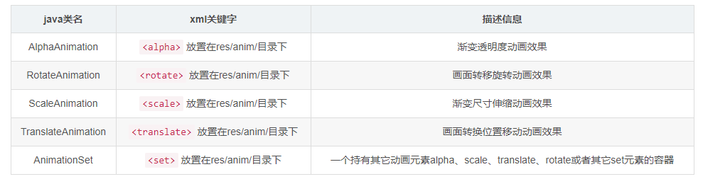

# Android 动画详解：属性动画、View 动画和帧动画

在 Android 中，基本的动画共有三种类型：

1. **View 动画**：也叫视图动画或者补间动画，主要是指 `android.view.animation` 包下面的一些类，只能被用来设置给 View，缺点是比如当控件移动之后，接收点击的控件的位置不会跟随移动，并且能够实现的效果只有移动、缩放、旋转和淡入淡出操作四种及其组合。
2. **Drawable 动画**：也叫 Frame 动画或者帧动画，其实可以划分到视图动画的类别，实现方式是将一些列的 Drawable 像幻灯片一样一个一个地显示。
3. **Property 动画**： 属性动画主要是指 `android.animation` 包下面的一些类，只对 `API 11` 以上版本的Android 系统才有效，但我们可以通过兼容库做低版本兼容。这种动画可以设置给任何 Object，包括那些还没有渲染到屏幕上的对象。这种动画是可扩展的，可以让你自定义任何类型和属性的动画。

## 1、Drawable 动画

在这里，我们先对 Drawable 动画进行讲解，因为它相对于后面的两种动画比较简单。在示例程序我们准备了一系列图片资源，并在 drawable 文件夹下面定义了动画资源 record_anim.xml：

```
<?xml version="1.0" encoding="utf-8"?>
<animation-list android:oneshot="false"
    xmlns:android="http://schemas.android.com/apk/res/android">
    <item android:drawable="@drawable/record0" android:duration="500"/>
    <item android:drawable="@drawable/record1" android:duration="500"/>
    <item android:drawable="@drawable/record2" android:duration="450"/>
    <item android:drawable="@drawable/record3" android:duration="400"/>
    <item android:drawable="@drawable/record4" android:duration="350"/>
    <item android:drawable="@drawable/record5" android:duration="400"/>
    <item android:drawable="@drawable/record6" android:duration="400"/>
</animation-list>
```

然后，我们在代码中使用该资源，并将其赋值给 ImageView。然后，我们从该控件中获取该 Drawable 并将其转换成 AnimationDrawable，随后我们调用它的 `start()` 方法就开启了 Drawable 动画：

    getBinding().ivRecord.setImageResource(R.drawable.record_anim);
    animDraw = (AnimationDrawable) getBinding().ivRecord.getDrawable();
    animDraw.start();

此外，我们可以调用该 Drawable 的 `stop()` 方法停止动画。

###  帧动画的注意事项

使用帧动画的时候要注意设置的图片不宜过多、过大，以防止因为内存不够而出现 OOM。

## 2、View 动画

### 2.1 基本 View 动画

该动画的资源处在 `android.view.animation` 包下，主要有以下几个类，它们都继承自 `Animation` ，我们可以使用它们来实现复杂的动画。这些动画类分别有对应的 xml 标签，所以，我们可以在 xml 中定义动画，也可以在代码中实现动画效果。这里的 `AnimationSet` 可以用来将多个动画效果进行组合，各预定义动画的对照可以参考下面这张图表：



### 2.2 View 动画属性

当然，要实现一种动画效果会有许多属性需要指定，在 xml 中，我们用标签的属性指定，在代码中我们用对象的 setter 方法指定。于是，我们可以得到下面这个对应关系：


上面的对应关系是所有的 View 动画共用的，对各个具体的动画类型还有其独有的属性。你可以在各个动画的构造方法中，通过它们从 `AttributeSet` 中获取了哪些字段来了解它们都定义了哪些属性，这里我们不对其一一进行说明。各预定义的属性动画分别按照不同的方式实现了 `Animation` 的 `applyTransformation` 方法，具体的这些属性如何使用以及 View 动画的效果是如何实现的，都可通过阅读该方法的定义得知。

对于 `AnimationSet`，它内部维护了一个 `Animation` 列表，并且其本身也是一个 `Animation`，所以，`AnimationSet` 内部可以添加子 `AnimationSet`。

### 2.3 插值器

上文中我们提到过，View 动画的具体实现是通过覆写 `Animation` 的 `applyTransformation` 方法来完成的。这里我们以 `AlphaAnimation` 为例来看它是如何作用的，同时你应该注意插值器的作用原理。该方法会在 `Animation` 中被循环调用，调用的时候会根据插值器计算出一个时间，并将其传递到 `applyTransformation` 方法中。

`Animation` 的 `getTransformation` 方法片段：

    if ((normalizedTime >= 0.0f || mFillBefore) && (normalizedTime <= 1.0f || mFillAfter)) {
        if (!mStarted) {
            fireAnimationStart();
            mStarted = true;
            if (NoImagePreloadHolder.USE_CLOSEGUARD) {
                guard.open("cancel or detach or getTransformation");
            }
        }

        if (mFillEnabled) normalizedTime = Math.max(Math.min(normalizedTime, 1.0f), 0.0f);

        if (mCycleFlip) {
            normalizedTime = 1.0f - normalizedTime;
        }

        final float interpolatedTime = mInterpolator.getInterpolation(normalizedTime);
        applyTransformation(interpolatedTime, outTransformation);
    }

`AlphaAnimation` 的 `applyTransformation` 方法:

    protected void applyTransformation(float interpolatedTime, Transformation t) {
        final float alpha = mFromAlpha;
        t.setAlpha(alpha + ((mToAlpha - alpha) * interpolatedTime));
    }

显然，这里的 `interpolatedTime` 的是一个比例。比如，假如一个透明动画需要持续 `10s`，透明度需要从 `0.5f` 到 `1.0f`，而插值的规则是一个二次函数。那么第 `t (0<t<10)` 秒的时候控件的透明度应该是：

    alpha = 0.5f + (1.0f - 0.5f) * t^2 / 100

以上就是插值器的作用原理，你也可以按照自己的需求实现自己的插值器，从而实现期待的动画效果。

### 2.4 使用 View 动画

作为一个例子，这里我们实现一个让控件抖动的动画。在 anim 文件夹下面，我们定义一个平移的动画，并使用插值器使其重复：

`anim/shake.xml` 的定义：

    <?xml version="1.0" encoding="utf-8"?>
    <translate xmlns:android="http://schemas.android.com/apk/res/android"
        android:duration="700"
        android:fromXDelta="0.0"
        android:interpolator="@anim/cycle_7"
        android:toXDelta="15.0" />

插值器 `anim/cicle_7.xml` 的定义：

    <?xml version="1.0" encoding="utf-8"?>
    <cycleInterpolator xmlns:android="http://schemas.android.com/apk/res/android"
        android:cycles="4.0" />

然后，我们在代码中加载 `Animation` 并调用控件的 `startAnimation()` 方法开启动画：

    getBinding().v.startAnimation(AnimationUtils.loadAnimation(this, R.anim.shake));

对于 `View` ，我们有 `startAnimation()` 用来对 `View` 开始动画；有 `clearAnimation()` 用来取消 `View` 在执行的动画。

不使用 xml，仅使用代码我们一样可以实现上述的效果，这里我们不再进行说明。

### 2.5 View 动画的特殊使用场景

#### 2.5.1 LayoutAnimation

`LayoutAnimation` 作用于 `ViewGroup`，可以使其子元素出场时都均有某种动画效果，通常用于 `ListView`。我们可以像下面这样定义布局动画：

    <?xml version="1.0" encoding="utf-8"?>
    <layoutAnimation 
        android:delay="500"
        android:animation="@anim/shake"
        xmlns:android="http://schemas.android.com/apk/res/android" />

显然，这里我们需要引用一个其他的动画。然后，我们可以在 `ListView` 的 `layoutAnimation` 属性中指定布局动画。或者调用 `ListView` 的 `setLayoutAnimation()` 方法应用上述动画。

#### 2.5.2 Activity 切换

我们可以通过在 `Activity` 中调用 `overridePendingTransition(R.anim.shake, R.anim.shake);` 方法来重写 `Activity` 的切换动画。注意这个方法应该在 `startActivity(Intent)` 或者 `finish()` 之后立即调用。
 
## 3、属性动画

### 3.1 基础梳理

我们可以对比 View 动画来学习属性动画。

1. 属性动画主要是指 `android.animation` 包下面的一些类。
2. 属性动画基础的动画类是 `Animator`；属性动画也为我们提供了几个预定义的类：`AnimatorSet`, `ObjectAnimator`, `TimeAnimator` 和 `ValueAnimator`；这几个预定义类之间的继承关系是，`AnimatorSet` 和 `ValueAnimator` 直接继承自 `Animator`，而 `ObjectAnimator` 和 `TimeAnimator` 继承自 `ValueAnimator`。
3. 与 View 动画不同的是，属性动画的使用范围更加宽泛，它不局限于 View，本质上它是通过修改控件的属性值实现的动画。当你尝试对某个对象的某个属性进行修改的时候会有一些限制，即属性动画要求该对象必须提供了该属性的 `setter` 方法。
4. 属性动画也有 `xml` 和代码两种定义方式，它的 `xml` 通常定义在 `animator` 文件夹下面，而 View 动画定义在 `anim` 文件夹下面。
5. 属性动画提供了类似于 `AnimationUtils` 的方法用来从布局文件夹中加载属性动画：`AnimatorInflater` 类的 `loadAnimator()` 方法。
6. 属性动画也有自己的插值器：`TimeInterpolator`，并且也提供了几个预定义的插值器。
7. 我们也可以调用 `View` 的方法来使用属性动画，我们可以通过 View 的 `animate()` 方法获取一个 `ViewPropertyAnimator`，然后调用 `ViewPropertyAnimator` 的其他方法进行链式调用以实现复杂的属性动画效果。

下面是属性动画的代码实现和 `xml` 实现两种方式的对比：


上文中，我们总结了属性动画的一些知识，并将其与 View 动画进行了对比。这里是一个简单的梳理，在下文中我们会对属性动画进行更加详细的介绍。

### 3.2 使用属性动画

#### 3.2.1 ValueAnimator

上面说过 `ValueAnimator` 是 `ObjectAnimator` 和 `TimeAnimator` 的基类，我们可以这样使用它：

    ValueAnimator anim = ValueAnimator.ofFloat(0f, 1f);
    anim.setDuration(300);
    anim.addUpdateListener(new ValueAnimator.AnimatorUpdateListener() {
        @Override
        public void onAnimationUpdate(ValueAnimator animation) {
            float currentValue = (float) animation.getAnimatedValue();
            Log.d("TAG", "cuurent value is " + currentValue);
        }
    });
    anim.start();

这里我们使用 `log` 输出了值渐变的过程，从日志中可以看出它的效果是值从 `0` 不断递增直到 `1`。如果我们在这个监听方法中根据值修改控件的属性一样可以实现动画效果。除了 `ofFloat()` 还有 `ofInt()` 等方法，它们的效果相似。 

#### 3.2.2 ObjectAnimator

上面，如果我们想要实现动画效果，需要在 `ValueAnimator` 的监听事件中修改对象的属性，这里的 `ObjectAnimator` ，我们只需要传入对象实例和属性的字符串名称，修改对象属性的操作就可以自动完成。比如下面的程序的效果是控件 `textview` 的透明度会在 `5s` 之内从 1 变成 0 再变回 1.

    ObjectAnimator animator = ObjectAnimator.ofFloat(textview, "alpha", 1f, 0f, 1f);
    animator.setDuration(5000);
    animator.start();

注意这里我们传入的是 `alpha`，这个字段本身并不存在于控件中，而是有一个 `setAlpha()` 的方法。也就是说，`ObjectAnimator` 作用的原理是通过反射触发 `setter` 方法而不是修改属性来实现的。你可以在类 `PropertyValuesHolder` 中更详细地了解这方面的内容。

`PropertyValuesHolder` 包装了我们要修改的属性的对象和方法等信息，然后会使用反射触发指定对象的方法来完成对对象属性的修改。其中

    void setupSetter(Class targetClass) {
        Class<?> propertyType = mConverter == null ? mValueType : mConverter.getTargetType();
        mSetter = setupSetterOrGetter(targetClass, sSetterPropertyMap, "set", propertyType);
    }

会去寻找我们要修改属性的 `setter` 方法，然后

    void setAnimatedValue(Object target) {
        if (mProperty != null) {
            mProperty.set(target, getAnimatedValue());
        }
        if (mSetter != null) {
            try {
                mTmpValueArray[0] = getAnimatedValue();
                mSetter.invoke(target, mTmpValueArray);
            } catch (InvocationTargetException e) {
                Log.e("PropertyValuesHolder", e.toString());
            } catch (IllegalAccessException e) {
                Log.e("PropertyValuesHolder", e.toString());
            }
        }
    }
    
会去触发 `setter` 方法，以修改对象的属性。

#### 3.2.3 AnimatorSet

`AnimatorSet` 内部提供了一个构建者 `AnimatorSet.Builder` 来帮助我们构建组合动画，`AnimatorSet.Builder` 提供了下面四种方法：

1. `after(Animator anim)`：将现有动画插入到传入的动画之后执行
2. `after(long delay)`：将现有动画延迟指定毫秒后执行
3. `before(Animator anim)`：将现有动画插入到传入的动画之前执行
4. `with(Animator anim)`：将现有动画和传入的动画同时执行

当我们调用 `AnimatorSet` 的 `play()` 方法的时候就能获取一个 `AnimatorSet.Builder` 实例，然后我们就可以使用构建者的方法进行链式调用了：

    ObjectAnimator moveIn = ObjectAnimator.ofFloat(textview, "translationX", -500f, 0f);
    ObjectAnimator rotate = ObjectAnimator.ofFloat(textview, "rotation", 0f, 360f);
    ObjectAnimator fadeInOut = ObjectAnimator.ofFloat(textview, "alpha", 1f, 0f, 1f);
    AnimatorSet animSet = new AnimatorSet();
    animSet.play(rotate).with(fadeInOut).after(moveIn);
    animSet.setDuration(5000);
    animSet.start();

#### 3.2.4 TypeEvaluator

正如前文所述，属性动画也有自己的插值器，我们可以通过插值函数指定在某个时间段内属性改变的速率。插值函数得到的是一个比例，是没有意义的。在 View 动画的 `AlphaAnimation` 中，如果我们指定了起止的透明度，那么我们可以通过透明度的计算规则得到某个时刻的透明度。但是对于属性动画，因为它可以应用于任何属性，这个属性又可能是任何类型的，那么这个属性将采用什么样的计算规则呢？这就需要我们使用 `TypeEvaluator` 来指定一个计算规则。也就是说，`TypeEvaluator` 是属性动画的属性的计算规则。

下面是 `TypeEvaluator` 的定义，这里的三个参数的含义分别是，`fraction` 是当前的比例，可以通过插值器计算得到；`startValue` 和 `endValue` 分别是属性变化的起止值。它的返回结果就是在某个时刻某个属性的值。

    public interface TypeEvaluator<T> {
        public T evaluate(float fraction, T startValue, T endValue);
    }

属性动画中已经为我们提供了几个预定义的 `TypeEvaluator`，比如 `FloatEvaluator`：

    public class FloatEvaluator implements TypeEvaluator<Number> {
        public Float evaluate(float fraction, Number startValue, Number endValue) {
            float startFloat = startValue.floatValue();
            return startFloat + fraction * (endValue.floatValue() - startFloat);
        }
    }

在属性动画的 `PropertyValuesHolder` 中会根据属性的类型选择预定义的 `TypeEvaluator`。但是如果我们的属性的类型不在预定义的范围之内就需要自己实现一个 `TypeEvaluator`。下面我们以日期类型为例来实现一个 `TypeEvaluator`。

当我们使用 `ValueAnimator` 的 `ofObject()` 方法获取 `ValueAnimator` 实例的时候，要求我们传入一个 `TypeEvaluator`，于是我们可以像下面这样定义：

    private static class DateEvaluator implements TypeEvaluator<Date> {

        @Override
        public Date evaluate(float fraction, Date startValue, Date endValue) {
            long startTime = startValue.getTime();
            return new Date((long) (startTime + fraction * (endValue.getTime() - startTime)));
        }
    }

然后，我们可以这样使用它：

    ValueAnimator animator = ValueAnimator.ofObject(new DateEvaluator(), new Date(0), new Date());
    animator.setDuration(5000);
    animator.addUpdateListener(animation -> {
        Date date = (Date) animation.getAnimatedValue();
        LogUtils.d(date);
    });
    animator.start();

这样就可以得到在 5s 之内输出的从时间戳为0，到当前时刻的所有的日期变化。

#### 3.2.5 TimeInterpolator

就像 View 动画一样，我们可以为属性动画指定一个插值器。插值器的作用是用来设置指定时间段内数值的变化的速率。在属性动画中，插值器是 `TimeInterpolator`，同样也有几个默认的实现：

1. `AccelerateDecelerateInterolator`：先加速后减速。
2. `AccelerateInterpolator`：加速。
3. `DecelerateInterpolator`：减速。
4. `AnticipateInterpolator`：先向相反方向改变一段再加速播放。
5. `AnticipateOvershootInterpolator`：先向相反方向改变，再加速播放，会超出目标值然后缓慢移动至目标值，类似于弹簧回弹。
6. `BounceInterpolator`：快到目标值时值会跳跃。
7. `CycleIinterpolator`：动画循环一定次数，值的改变为一正弦函数：Math.sin(2 * mCycles * Math.PI * input)。
8. `LinearInterpolator`：线性均匀改变。
9. `OvershottInterpolator`：最后超出目标值然后缓慢改变到目标值。

#### 3.2.6 在 xml 中使用属性动画

我们可以像下面这样定义一个属性动画，

    <set android:ordering=["together" | "sequentially"]>
        <objectAnimator
            android:propertyName="string"
            android:duration="int"
            android:valueFrom="float | int | color"
            android:valueTo="float | int | color"
            android:startOffset="int"
            android:repeatCount="int"
            android:repeatMode=["repeat" | "reverse"]
            android:valueType=["intType" | "floatType"]/>
        <animator
            android:duration="int"
            android:valueFrom="float | int | color"
            android:valueTo="float | int | color"
            android:startOffset="int"
            android:repeatCount="int"
            android:repeatMode=["repeat" | "reverse"]
            android:valueType=["intType" | "floatType"]/>
        <set>
            ...
        </set>
    </set>

这里的`android:ordering`用于控制子动画启动方式是先后有序的还是同时进行，两个可选参数： `sequentially` 表示动画按照先后顺序；`together`(默认)表示动画同时启动。

这里的 `<objectAnimator>` 标签的含义如下：


这样在 XML 中定义了属性动画之后，我们可以在代码中通过工具类获取到动画实例并使用：

    AnimatorSet set = (AnimatorSet) AnimatorInflater.loadAnimator(myContext, R.animtor.property_animator);
    set.setTarget(myObject);
    set.start();

## 4、使用动画的注意事项

1. **内存耗尽**：使用帧动画的时候防止因为图片过多导致 OOM。
2. **View 动画并没有真正改变 View 的位置**：`View` 动画并没有真正改变 `View` 的属性，即 `View` 动画执行之后并未改变 `View` 的真实布局属性值。譬如我们在布局中有一个 `Button` 在屏幕上方，我们设置了平移动画移动到屏幕下方然后保持动画最后执行状态呆在屏幕下方，这时如果点击屏幕下方动画执行之后的 `Button` 是没有任何反应的，而点击原来屏幕上方没有 `Button` 的地方却响应的是点击 `Button` 的事件。
3. **内存泄漏**：使用属性动画的时候，当使用无限循环动画，需要在 Activity 退出的时候停止动画，不然可能会因为无法释放资源而导致 Activity 内存泄漏。
4. **动画兼容**：当 APP 需要兼容到 API 11 以下的时候就需要注意动画的兼容问题。
5. **使用 dp 而不是 px**：因为 `px` 在不同设备上面的兼容问题，使用动画的时候尽量使用 `dp` 作为单位。
6. **硬件加速**：使用硬件加速可以提升动画的流畅性。

