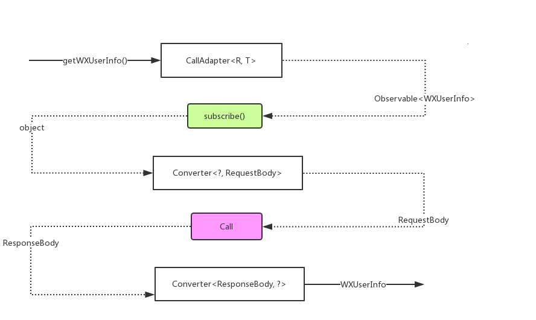
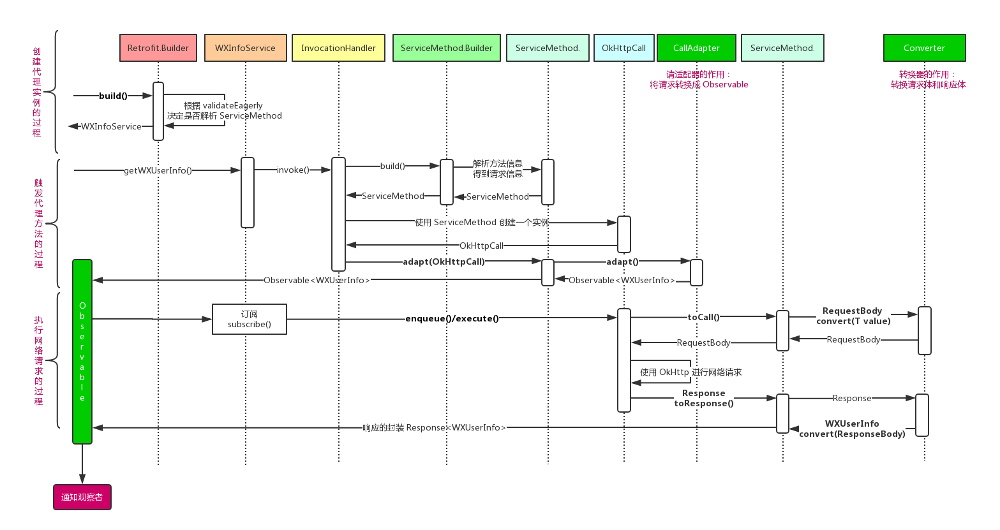

# 动态代理在 Android 中的应用：Retrofit 源码解析

在之前的文章 [《Andriod 网络框架 OkHttp 源码解析》](https://shouheng88.github.io/2018/10/17/Andriod%20%E7%BD%91%E7%BB%9C%E6%A1%86%E6%9E%B6%20OkHttp%20%E6%BA%90%E7%A0%81%E8%A7%A3%E6%9E%90/#more) 中我们分析了 OkHttp 的源代码。现在我们就来分析一下 OkHttp 的兄弟框架 Retrofit。关于 Retrofit 的注解的使用，可以参考其官方文档：[https://square.github.io/retrofit/](https://square.github.io/retrofit/)。

Retrofit 也是 Square 发布的一个开源的库，它是一个类型安全的 Http 客户端，适用于 Android 和 Java。本质上，Retrofit 使用了 Java 的动态代理，内部使用 OkHttp 来进行网络访问，并且可以通过指定 “请求适配器” 和 “类型转换器” 来完成方法参数到 OkHttp 的请求的转换，以及 OkHttp 响应到用户指定的实体类型的转换。

## 1、基本使用

Retrofit 设计的一个好的地方就是它把我们上面提到的 “请求适配器” 和 “类型转换器” 使用策略模式解耦出来。用户可以根据自己的需求通过实现指定的接口来自定义自己的类型转换器。所以，当我们使用 Gson 和 RxJava2 转换器的时候，就需要指定下面三个依赖：

    api 'com.squareup.retrofit2:retrofit:2.4.0'
    api 'com.squareup.retrofit2:converter-gson:2.4.0'
    api 'com.squareup.retrofit2:adapter-rxjava2:2.4.0'

然后，我们需要根据自己的 API 接口的信息，在代码里用一个接口来对该 API 接口进行声明：

	public interface WXInfoService {
	    @GET("/sns/userinfo")
	    Observable<WXUserInfo> getWXUserInfo(
            @Query("access_token") String accessToken, @Query("openid") String openId);
	}

这里的 WXUserInfo 是由该 API 接口返回的 Json 生成的 Java 对象。然后，我们可以像下面这样获取一个该接口的代理对象：

	WXInfoService wXInfoService = new Retrofit.Builder()
        .baseUrl("https://api.weixin.qq.com/")
        .addConverterFactory(GsonConverterFactory.create())
        .addCallAdapterFactory(RxJava2CallAdapterFactory.create())
        .client(okHttpClient)
        .build().create(WXInfoService.class);

然后，我们就可以使用该对象并调用其方法来获取接口返回的信息了：

    Disposable disposable = wxInfoService.getWXUserInfo(accessToken, openId)
        .subscribeOn(Schedulers.io())
        .observeOn(AndroidSchedulers.mainThread())
        .subscribe(wxUserInfo -> { /*...拿到结果之后进行处理...*/ });

上面我们只是使用了 Retrofit 的最基础的 `GET` 接口。当然，Retrofit 本身的功能远比这要丰富得多，关于其更多的使用，可以参考其官方的文档。

## 2、动态代理：魔力发生的地方

上面我们使用 Retrofit 进行网络请求，实际其内部使用 OkHttp 来完成网络请求的，然后，使用我们传入的 “类型转换器” 把响应转换成我们指定的类型。定义了一个接口并调用了该接口的方法，然后就拿到了请求的结果，这看上去非常简洁，而这其中的最功不可没的就是动态代理。

当我们使用 `Retrofit.Builder` 的 `create()` 方法获取一个 `WXInfoService` 实例的时候，实际返回的是经过代理之后的对象。该方法内部会调用 `Proxy` 的静态方法 `newProxyInstance()` 来得到一个代理之后的实例。为了说明这个方法的作用，我们写了一个例子：

    public static void main(String...args) {
        Service service = getProxy(Service.class);
        String aJson = service.getAInfo();
        System.out.println(aJson);
        String bJson = service.getBInfo();
        System.out.println(bJson);
    }

    private static <T> T getProxy(final Class<T> service) {
        InvocationHandler h = (proxy, method, args) -> {
            String json = "{}";
            if (method.getName().equals("getAInfo")) {
                json = "{A请求的结果}";
            } else if (method.getName().equals("getBInfo")) {
                json = "{B请求的结果}";
            }
            return json;
        };
        return (T) Proxy.newProxyInstance(service.getClassLoader(), new Class<?>[]{service}, h);
    }

该程序的输出结果是：

     {A请求的结果}
     {B请求的结果}

在上面的这个例子中，我们先使用 `getProxy()` 获取一个代理之后的实例，然后依次调用它的 `getAInfo()` 和 `getBInfo()` 方法，来模拟调用 A 接口和 B 接口的情形，并依次得到了 A 请求的结果和 B 请求的结果。上面的效果近似于我们使用 Retrofit 访问接口的过程。为了说明这个过程中发生了什么，我们需要先了解一下这里的 `newProxyInstance()` 方法：

    public static Object newProxyInstance(ClassLoader loader, Class<?>[] interfaces, InvocationHandler h) {
        // ...
    }

该方法接收三个参数：第一个是类加载器；第二个是接口的 Class 类型；第三个是一个处理器，你可以将其看作一个用于回调的接口。当我们的代理实例触发了某个方法的时候，会调用该回调接口的方法进行处理。`InvocationHandler` 是一个接口，它内部定义了一个方法如下：

    public Object invoke(Object proxy, Method method, Object[] args) throws Throwable;

该方法也接收三个参数：第一个是触发该方法的代理实例；第二个是代理类触发的方法；第三个是触发的方法的参数。`invoke()` 方法的返回结果会作为代理类的方法执行的结果。

所以，当了解了 `newProxyInstance()` 方法的定义之后，我们可以做如下总结：当我们使用 `newProxyInstance()` 方法获取了一个代理实例 `service` 并调用其 `getAInfo()` 方法之后，该方法的信息和参数信息会分别通过 `method` 和 `args` 传入到 `h` 的 `invoke()` 中。所以，最终的效果就是，当我们调用 `service` 的 `getAInfo()` 时候会触发 `h` 的 `invoke()`。然后，在该方法中我们根据 `method` 得知触发的方法是 `getAInfo`。于是，我们把它对应的请求从 `invoke()` 方法中返回，并作为 `service.getAInfo()` 的返回结果。

所以，我们可以总结 Retrofit 的大致工作流程：当我们获取了接口的代理实例，并调用它的 `getWXUserInfo()` 方法之后，该 API 的请求参数会传递到代理类的 `InvocationHandler.invoke()` 方法中。然后在该方法中，我们将其转换成 OkHttp 的 `Request`，然后使用 OkHttp 进行访问。当拿到结果之后，我们使用传入的 “转换器” 将响应转换成接口指定的 Java 类型。

上面是 Retrofit 请求处理的基本流程，下面我们看一下 Retrofit 的代理方法内部究竟发生了什么。

## 3、Retrofit 的源码解析

### 3.1 创建 Retrofit

根据上面的例子，当使用 Retrofit 的时候，首先我们需要使用 Retrofit 的构建者来创建 Retrofit 的实例。这里有几个重要的方法需要提及一下：

#### 3.1.1 addConverterFactory 方法

该方法用来向 Retrofit 中添加一个 `Converter.Factory`。`Converter.Factory`，顾名思义是一种工厂模式，它是一个接口需要实现两个重要的方法。每个方法需要返回一个转换器：一个是某种数据类型到请求体的转换器，另一个是响应体到我们需要的数据类型的转换器。当我们使用 Gson 来完成这个转换，那么我们就需要使用 `GsonConverterFactory.create()` 来得到一个适用于 Gson 的 `Converter.Factory`。

    public Builder addConverterFactory(Converter.Factory factory) {
      converterFactories.add(checkNotNull(factory, "factory == null"));
      return this;
    }

#### 3.1.2 addCallAdapterFactory 方法

`CallAdapter.Factory` 用于获取 `CallAdapter` 对象， `CallAdapter` 对象用于把原生的 OkHttp 的 `Call` 转换成我们指定的请求类型。比如，转换成 RxJava2 的 Observable 类型。下面是该方法的定义：

    public Builder addCallAdapterFactory(CallAdapter.Factory factory) {
      callAdapterFactories.add(checkNotNull(factory, "factory == null"));
      return this;
    }

#### 3.1.3 build 方法

当根据用户的自定义设置完了参数之后，就可以调用 `build()` 方法，来获取一个 Retrofit 的实例。在该方法中会将上述的工厂实例添加到一个列表中，然后根据请求、响应的类型来获取工厂实例，然后分别获取一个转换器或者适配器。

#### 3.1.4 小结

为了说明适配器 `CallAdapter` 和转换器 `Converter` 的作用，我们绘制了下图：



从上面我们看出，`CallAdapter` 主要用来将某个请求转换成我们指定的类型。比如，在我们最开始的例子中，要将请求转换成 `Observable<WXUserInfo>`。如果转换之后的请求是 `Observable` 类型的，那么当我们对转换后的请求进行订阅的时候，就启动了 OkHttp 的网络请求过程。

在进行网络请求之前会先使用 `Converter` 将请求的参数转换成一个 `RequestBody`。这里将其作为一个接口的好处是便于解耦。比如，上面我们用 Gson 来完成转换过程，你也可以通过自定义转换器来使用其他的框架，比如 Moshi 等。当拿到了响应之后，我们又会再次使用 `Converter` 来将响应体 `ResponseBody` 转换成我们要求的类型。比如，上面的例子中应该转换为 `WXUserInfo`。

最后，OkHttp 那里得到的响应会在 `CallAdapter` 方法内部被包装成 `Observable<WXUserInfo>` 并返回给观察者。这样，我们就拿到了这个请求的结果。

从上面我们看出，Retrofit 设计的非常妙的地方就在于上面的两个过程的解耦（策略模式+工厂模式）。一次是将请求转换成 `Observable` 的过程，一次是将请求体和响应体转换成 OkHttp 要求的 `RequestBody` 和 `ResponseBody` 的过程。对于前者，不论我们使用的是 RxJava 1 还是 RxJava 2，只要传入一个 `CallAdapter` 即可。对于后者，不论我们使用哪种 Json 转换框架，只要实现了 `Converter` 接口皆可。

### 3.2 获取代理实例

#### 3.2.1 划分平台：Platform

创建了 Retrofit 的实例之后，我们就可以使用它的 `create()` 方法来获取代理之后的服务实例。下面是这个方法的定义。在这里，我们会先根据 `validateEagerly` 变量来判断是否立即对传入的服务接口的方法进行解析。然后，我们使用 `Proxy` 的静态方法获取一个代理实例。

    public <T> T create(final Class<T> service) {
        Utils.validateServiceInterface(service);
        // 这里的 validateEagerly 在 Retrofit 构建的时候设置
        if (validateEagerly) {
            // 是否立即对 Service 方法的内容进行解析
            eagerlyValidateMethods(service);
        }
        // 获取代理实例
        return (T) Proxy.newProxyInstance(service.getClassLoader(), new Class<?>[] { service },
                new InvocationHandler() {
                    private final Platform platform = Platform.get();
                    @Override public Object invoke(Object proxy, Method method, @Nullable Object[] args)
                            throws Throwable {
                        // 该方法是 Object 的方法，直接触发该方法
                        if (method.getDeclaringClass() == Object.class) {
                            return method.invoke(this, args);
                        }
                        // 如果是 default 方法，那么使用该 Java8 平台的方法执行
                        if (platform.isDefaultMethod(method)) {
                            return platform.invokeDefaultMethod(method, service, proxy, args);
                        }
                        // 获取服务方法的信息，并将其包装成 ServiceMethod
                        ServiceMethod<Object, Object> serviceMethod =
                                (ServiceMethod<Object, Object>) loadServiceMethod(method);
                        OkHttpCall<Object> okHttpCall = new OkHttpCall<>(serviceMethod, args);
                        return serviceMethod.adapt(okHttpCall);
                    }
                });
    }

这里的 `eagerlyValidateMethods()` 方法定义如下：

    private void eagerlyValidateMethods(Class<?> service) {
        // 获取程序当前运行的平台
        Platform platform = Platform.get();
        for (Method method : service.getDeclaredMethods()) {
            // 判断该方法是否是 default 方法
            if (!platform.isDefaultMethod(method)) {
                loadServiceMethod(method);
            }
        }
    }

它的作用是立即对服务接口的方法进行解析，并将解析之后的结果放进一个缓存中。这样，当这个服务方法被触发的时候，直接从缓存当中获取解析之后的 `ServiceMethod` 来使用即可。该方法会先会根据当前程序运行的平台来决定是否应该加载服务的方法。因为，Java 8 之后，我们可以为接口增加 `default` 类型的方法，所以，如果是 `default` 类型的话，我们不会调用 `loadServiceMethod()` 进行解析，而是调用 Java8 平台的 `invokeDefaultMethod()` 来处理。在 `invokeDefaultMethod()` 中，会根据传入的信息创建一个实例并使用反射触发它的方法。此时，就间接地触发了该 `default` 方法。

判断平台的时候，使用了如下这段代码：

    platform.isDefaultMethod(Method)

这里的 platform 是调用 `Platform.get()` 的时候得到的。它会在 `get()` 方法中尝试使用反射去获取一个只有 Java8 平台才具有的类，以此来判断是否是 Java8 的环境。在 Retrofit 中，提供了 `Java8` 和 `Android` 两个类来区分所在的平台，并会根据运行环境来决定返回哪个实例。

从上面我们看出，Platform 算是一种策略的设计模式，以根据平台的不同做不同的处理。但在当前的版本中，它的主要作用是对 `default` 类型的方法进行处理。

#### 3.2.2 解析服务方法：ServiceMethod

上面我们提到过 `loadServiceMethod()` 方法，它的主要作用：首先会尝试从缓存当中获取该方法对应的 `ServiceMethod` 实例，如果取到的话，就将其返回；否则，就使用构建者模式创建一个并放进缓存中，然后将其返回。

    ServiceMethod<?, ?> loadServiceMethod(Method method) {
        // 从缓存中进行获取
        ServiceMethod<?, ?> result = serviceMethodCache.get(method);
        if (result != null) return result;
        synchronized (serviceMethodCache) {
            result = serviceMethodCache.get(method);
            if (result == null) {
                // 创建ServiceMethod实例
                result = new ServiceMethod.Builder<>(this, method).build();
                serviceMethodCache.put(method, result);
            }
        }
        return result;
    }

`ServiceMethod` 的构建过程比较简单，只需要把当前的 `Retrofit` 实例和服务方法 `method` 传入进去，然后调用它的 `build()` 方法就完成了整个创建过程。在 `build()` 方法中，会完成对 `method` 的解析，比如根据注解判断是什么类型的请求，根据方法的参数来解析请求的请求体等等。`ServiceMethod` 内部的变量主要是与请求的相关的信息，同时它也提供了一些方法，用于获取 OkHttp 的请求和响应。

所以，`ServiceMethod` 的作用是缓存服务方法对应的请求信息，这样下次我们就不需要再次解析了。同时，它提供了以下几个方法，它们的主要作用是用来从 `ServiceMethod` 中获取请求相关的信息。

`toCall()` 用来获取用于 OkHttp 请求的 `Call` 对象：

    okhttp3.Call toCall(@Nullable Object... args) throws IOException {
        RequestBuilder requestBuilder = new RequestBuilder(httpMethod, baseUrl, relativeUrl, headers,
                contentType, hasBody, isFormEncoded, isMultipart);
        // ...
        return callFactory.newCall(requestBuilder.build());
    }

`toResponse(ResponseBody)` 用来把 OkHttp 得到的响应体转换成 Java 对象等（在示例中是`WXUserInfo`）：

    R toResponse(ResponseBody body) throws IOException {
        return responseConverter.convert(body);
    }

`adapt(Call<R>)` 用来将 OkHttp 的请求转换成我们的服务方法的返回类型（在示例中是`Observable<WXUserInfo>`）：

    T adapt(Call<R> call) {
        return callAdapter.adapt(call);
    }

#### 3.2.3 请求封装：OkHttpCall

解析完毕服务方法之后，我们得到了 `ServiceMethod` 实例。然后，我们使用它来创建 `OkHttpCall` 实例。这里的 `OkHttpCall` 实现了 Retrofit 中定义的 `Call` 接口，会在方法内调用 `ServiceMethod` 的 `toCall()` 方法来获取 OkHttp 中的 `Call` 对象，然后使用它进行网络访问。当拿到了请求的结果之后又使用 `ServiceMethod` 的 `toResponse()` 把响应转换成我们指定的类型。下面是该类中的几个比较重要的方法：

1. `execute()` 方法，用来同步执行网络请求：

```
    @Override
    public Response<T> execute() throws IOException {
        okhttp3.Call call;
        synchronized (this) {
            // ...
            call = rawCall;
            if (call == null) {
                try {
                    // 创建 OkHttp 的 Call 实例
                    call = rawCall = createRawCall();
                } catch (IOException | RuntimeException | Error e) {
                    throwIfFatal(e);
                    creationFailure = e;
                    throw e;
                }
            }
        }
        if (canceled) {
            call.cancel();
        }
        // 同步执行请求，并解析结果
        return parseResponse(call.execute());
    }
```

2. `createRawCall()` 用来创建 OkHttp 的 `Call` 实例：

```
    // 使用 serviceMethod 的 toCall 方法获取 OkHttp 的 Call 实例
    private okhttp3.Call createRawCall() throws IOException {
        okhttp3.Call call = serviceMethod.toCall(args);
        if (call == null) {
            throw new NullPointerException("Call.Factory returned null.");
        }
        return call;
    }
```

3. `parseResponse()` 用来将 OkHttp 的响应转换成我们接口中定义的类型。比如，在我们的例子中，返回的是 `Observable<WXUserInfo>`:

```
    // 使用 serviceMethod 的 toResponse 方法获取 OkHttp 的 Response 实例
    Response<T> parseResponse(okhttp3.Response rawResponse) throws IOException {
        ResponseBody rawBody = rawResponse.body();
        rawResponse = rawResponse.newBuilder()
                .body(new NoContentResponseBody(rawBody.contentType(), rawBody.contentLength()))
                .build();
        // ...
        ExceptionCatchingRequestBody catchingBody = new ExceptionCatchingRequestBody(rawBody);
        try {
            // 使用 serviceMethod 的 toResponse 方法获取 OkHttp 的 Response 实例
            T body = serviceMethod.toResponse(catchingBody);
            return Response.success(body, rawResponse);
        } catch (RuntimeException e) {
            catchingBody.throwIfCaught();
            throw e;
        }
    }
```

### 3.3 Retrofit 的工作过程

上面是 Retrofit 框架设计中几个关键的部分的功能的解析。下面，我们再来具体看一下，从触发代理类的方法到拿到响应的结果，这一整个过程中，都有哪些类的哪些方法参与，以及它们在什么时候，扮演什么样的角色。这里我们仍然使用最初的示例：



上图中，我们将 Retrofit 的请求的过程分成三个过程来进行说明：

1. **创建代理实例的过程**：在这个过程中主要是调用 `Proxy.newProxyInstance()` 来获取一个代理实例。相关的主要参数是 `validateEagerly`，我们会使用它来决定是否立即对传入的接口的方法进行解析。不论我们什么时候进行解析，都会把解析的结果缓存起来。
2. **触发代理方法的过程**：触发代理方法是整个请求的第二过程，这个时候，我们调用了 `WXInfoService` 代理实例的 `getWXUserInfo()` 方法。此时，会触发 `InvocationHandler` 的 `invoke()` 方法。在该方法内部会调用 `ServiceMethod` 的构建者模式来创建 `ServiceMethod` 实例。当调用构建者模式的 `build()` 方法的时候，会对方法 `getWXUserInfo()` 的信息进行解析。然后，使用 `ServiceMethod` 实例创建 `OkHttpCall`。最后，使用 `ServiceMethod` 实例的 `adapt()` 方法将 `OkHttpCall` 实例转换成 `Observable<WXUserInfo>`。此时，会使用 `CallAdapter` 的 `adapt()` 方法来完成适配过程。
3. **执行网络请求的过程**：拿到了 `Observable<WXUserInfo>` 之后，需要对其进行订阅才能触发网络请求。相关的逻辑在 `CallAdapter` 中完成。首先，它会根据你使用同步还是异步的来决定使用哪个执行器。这里存在两个执行器，它们的区别是一个会在内部调用 `OkHttpCall` 的 `enqueue()`，另一个会在执行器中调用 `OkHttpCall` 的 `execute()` 方法。不论调用 `enqueue()` 还是 `execute()`，都会先使用 `OkHttpCall` 的 `toCall()` 方法获取一个 `Call` 请求。获取请求的过程中会使用 `Converter` 来将某个实例转换成请求体。拿到了请求之后，使用该请求来进行网络访问。当从网络中拿到了响应之后，会使用 `Converter` 来将响应体转换成对象。这样，拿到了实际的结果之后，就会调用 `Observer` 的 `onNext()` 方法把结果通知给观察者。

## 4、总结

在这篇文章中，我们先简单介绍了 Retrofit 的使用，然后，因为 Retrofit 内部使用动态代理来实现的，所以，我们对动态代理相关内容进行了介绍。最后，我们对 Retrofit 的源码进行了分析，先从设计思路，后从各个环节的执行过程进行了说明。最后的最后，我们将两者结合起来用一个时序图做了说明。

从上文中可以看出来，Retrofit 设计的几个值得我们借鉴的地方：

1. 使用运行时注解和反射简化请求描述，但是考虑到反射的效率比较低，所以将一次反射之后的结果缓存起来，以便于下次使用。
2. 动态代理：使用接口描述请求的好处是它简洁，而且 “描述” 本来就是它的责任。但是，一般我们需要去实现接口才能使用。而这里告诉我们，使用动态代理一样可以使用接。
3. 解耦：从我们上面的图中也可以看出来，Retrofit 的设计的思路是比较清晰的。它将一个请求的几个过程解耦出来。首先是我们 `Observable` 到请求的转换，这里使用适配器来完成；然后是请求体和响应体的转换，基本就是 Json 的转换，使用转换器来完成。这样，不论你使用 RxJava 1 还是 RxJava 2，不论是 Gson 还是 FastXml 都可以和 Retrifut 配合使用。

以上就是我们对 Retrofit 的源码的分析。