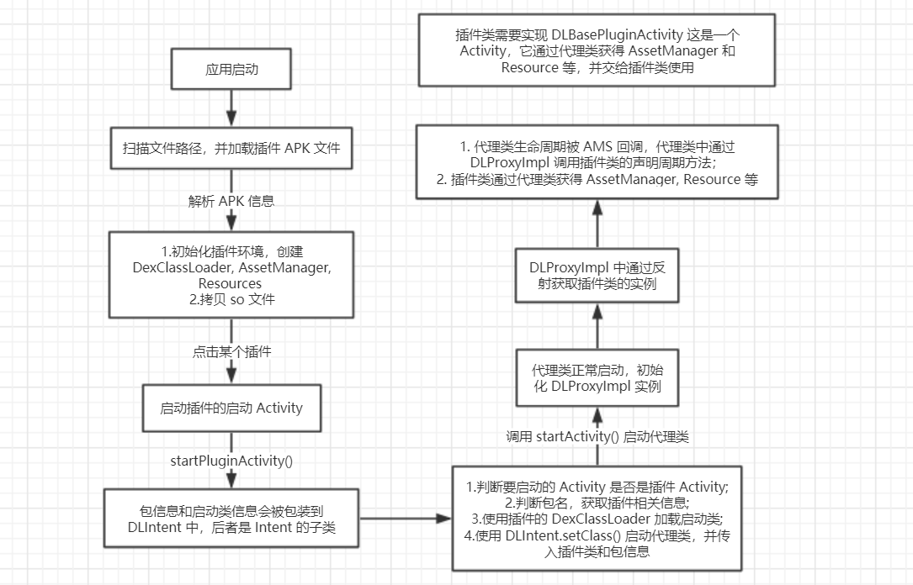

# Android 插件化框架 DynamicLoadApk 源码分析

DynamicLoadApk 应该算是 Android 插件化诸多框架中资历比较老的一个了。它的项目地址在：[dynamic-load-apk](https://github.com/singwhatiwanna/dynamic-load-apk)。该项目运行之后的效果是，使用 Gradle 编译出插件包和宿主包，都是以 APK 的形式。安装宿主包之后，通过 ADB 将插件包 push 到手机中。启动宿主包时，它会自动进行扫描将插件加载到应用中。点击插件之后，进入到插件的应用界面。

印象中最初接触的插件都是以单独安装的形式存在的，比如我可以做一个基础的应用，然后在该应用的基础上开发插件。用户可以对插件进行选择，然后下载并安装，以让自己的应用具有更丰富的功能。插件化也算是一种比较实用的技术，毕竟我们使用 Chrome 和 AS 的时候不是一样要加载插件。只是比较反感的是去修改底层的代码，容易给系统带来不稳定因素不说，技术到了一些人手里，你知道他用来干什么。插件化挺好，但真的要去推广这项技术，还是看好 Google 官方去进行规范。

技术要服务于产品，好的产品不一定要高超的技术，技术并不是最重要的，重要的是你究竟想要表达什么。这就像国内很多人只注重数理化，不注重人文学科。相比于国内的技术精英，我还是比较赞同 Google 站在整个生态的角度去考虑技术演进。前些日子社区里对插件化的讨论：[移动开发的罗曼蒂克消亡史](https://infoq.cn/article/V4623ZeOsEI*HGKmX2M1)。好吧，我自己的理解是，这从来就不是什么罗曼蒂克。

DynamicLoadApk 插件化的实现方式还是挺有意思的，它使用纯 Java 实现，没有涉及 Native 层的代码，下面我理了下 DynamicLoadApk 的 Demo 程序的整个执行过程。后续的文章我们就围绕这张图进行，



首先是扫描文件路径并加载 APK，这里需要解析 APK 文件的信息，它是本质上是通过 PMS 实现的；

```java
    public DLPluginPackage loadApk(final String dexPath, boolean hasSoLib) {
        mFrom = DLConstants.FROM_EXTERNAL;

        // 通过 PMS 获取包信息，这里获取了 Activity 和 Service 的信息
        PackageInfo packageInfo = mContext.getPackageManager().getPackageArchiveInfo(dexPath,
                PackageManager.GET_ACTIVITIES | PackageManager.GET_SERVICES);
        if (packageInfo == null) {
            return null;
        }

        DLPluginPackage pluginPackage = preparePluginEnv(packageInfo, dexPath);
        if (hasSoLib) {
            copySoLib(dexPath);
        }

        return pluginPackage;
    }
```

然后，它通过调用 `preparePluginEnv()` 方法来创建 AssetManager, DexClassLoader 和 Resource 等。我们的插件类加载各种资源和类的时候使用的就是这哥仨：

```java
    private DLPluginPackage preparePluginEnv(PackageInfo packageInfo, String dexPath) {

        DLPluginPackage pluginPackage = mPackagesHolder.get(packageInfo.packageName);
        if (pluginPackage != null) {
            return pluginPackage;
        }
        DexClassLoader dexClassLoader = createDexClassLoader(dexPath);
        AssetManager assetManager = createAssetManager(dexPath);
        Resources resources = createResources(assetManager);
        // create pluginPackage
        pluginPackage = new DLPluginPackage(dexClassLoader, resources, packageInfo);
        mPackagesHolder.put(packageInfo.packageName, pluginPackage);
        return pluginPackage;
    }

    private DexClassLoader createDexClassLoader(String dexPath) {
        File dexOutputDir = mContext.getDir("dex", Context.MODE_PRIVATE);
        dexOutputPath = dexOutputDir.getAbsolutePath();
        DexClassLoader loader = new DexClassLoader(dexPath, dexOutputPath, mNativeLibDir, mContext.getClassLoader());
        return loader;
    }

    private AssetManager createAssetManager(String dexPath) {
        try {
            AssetManager assetManager = AssetManager.class.newInstance();
            Method addAssetPath = assetManager.getClass().getMethod("addAssetPath", String.class);
            addAssetPath.invoke(assetManager, dexPath);
            return assetManager;
        } catch (Exception e) {
            e.printStackTrace();
            return null;
        }
    }

    private Resources createResources(AssetManager assetManager) {
        Resources superRes = mContext.getResources();
        Resources resources = new Resources(assetManager, superRes.getDisplayMetrics(), superRes.getConfiguration());
        return resources;
    }
```

然后点击插件的时候要启动插件的 Activity，

```java
    PluginItem item = mPluginItems.get(position);
    DLPluginManager pluginManager = DLPluginManager.getInstance(this);
    pluginManager.startPluginActivity(this, new DLIntent(item.packageInfo.packageName, item.launcherActivityName));
```

这里会把要启动的包名和启动类名包装到 DLIntent 中。DLIntent 是 Intent 的子类。启动插件的进一步的逻辑在 DLPluginManager 的 `startPluginActivity()` 方法中。按照上文的描述，这里主要做了以下四件事情：

1. 判断要启动的 Activity 是否是插件 Activity：因为要启动的类也可能不是插件类，所以我们需要分成两种情况来进行处理，普通的 Activity 直接调用 `Context.startActivity()` 插件 Activity 需要调用代理 Activity 来执行。
2. 判断包名，获取插件相关信息：这里就算是一个安全的校验吧，主要是从之前解析的 APK 信息中进行校验。
3. 使用插件的 DexClassLoader 加载启动类：先要使用类加载器加载插件的 Activity 到内存中，插件 Activity 的信息会作为 Intent 的参数一起传递给代理 Activity。
4. 使用 `DLIntent.setClass()` 启动代理类：要启动的代理类可能是 DLProxyFragmentActivity 和 DLProxyActivity，所以这里我们先使用 `getProxyActivityClass()` 得到代理类。该方法中使用了 Class 的 `isAssignableFrom()` 方法来判断某个实例是否是指定类型的。比如 `DLBasePluginActivity.class.isAssignableFrom(clazz)` 表示 clazz 是否是 DLBasePluginActivity 类型的。

```java
    @TargetApi(Build.VERSION_CODES.ICE_CREAM_SANDWICH)
    public int startPluginActivityForResult(Context context, DLIntent dlIntent, int requestCode) {
        // 1.判断要启动的 Activity 是否是插件 Activity
        if (mFrom == DLConstants.FROM_INTERNAL) {
            dlIntent.setClassName(context, dlIntent.getPluginClass());
            performStartActivityForResult(context, dlIntent, requestCode);
            return DLPluginManager.START_RESULT_SUCCESS;
        }

        // 2.判断包名，获取插件相关信息
        String packageName = dlIntent.getPluginPackage();
        if (TextUtils.isEmpty(packageName)) {
            throw new NullPointerException("disallow null packageName.");
        }

        DLPluginPackage pluginPackage = mPackagesHolder.get(packageName);
        if (pluginPackage == null) {
            return START_RESULT_NO_PKG;
        }

        // 3.使用插件的 DexClassLoader 加载启动类
        final String className = getPluginActivityFullPath(dlIntent, pluginPackage);
        Class<?> clazz = loadPluginClass(pluginPackage.classLoader, className);
        if (clazz == null) {
            return START_RESULT_NO_CLASS;
        }

        Class<? extends Activity> activityClass = getProxyActivityClass(clazz);
        if (activityClass == null) {
            return START_RESULT_TYPE_ERROR;
        }

        // 4.使用 DLIntent.setClass() 启动代理类，并传入插件类和包信息
        dlIntent.putExtra(DLConstants.EXTRA_CLASS, className);
        dlIntent.putExtra(DLConstants.EXTRA_PACKAGE, packageName);
        dlIntent.setClass(mContext, activityClass);
        performStartActivityForResult(context, dlIntent, requestCode);
        return START_RESULT_SUCCESS;
    }

    private Class<? extends Activity> getProxyActivityClass(Class<?> clazz) {
        Class<? extends Activity> activityClass = null;
        if (DLBasePluginActivity.class.isAssignableFrom(clazz)) {
            activityClass = DLProxyActivity.class;
        } else if (DLBasePluginFragmentActivity.class.isAssignableFrom(clazz)) {
            activityClass = DLProxyFragmentActivity.class;
        }

        return activityClass;
    }

    private void performStartActivityForResult(Context context, DLIntent dlIntent, int requestCode) {
        if (context instanceof Activity) {
            ((Activity) context).startActivityForResult(dlIntent, requestCode);
        } else {
            context.startActivity(dlIntent);
        }
    }
```

这里需要注意下，我们的插件 Activity 是需要继承 DLBasePluginActivity 或者 DLProxyFragmentActivity。这两个类中重写了 Activity 的许多生命周期方法。在代理 Activity 启动之后，代理 Activity 会被传递到前面两个基类中。比如，当插件类想要获取 AssetsManager 的时候，会调用到这两个基类的 `getAssetsManager()`，然后基类通过代理类得到之前我们创建的 AssetsManager. 

按照上述流程，代理类被正常启动。启动之后它会创建 DLProxyImpl 实例，并在 `onCreate()` 方法中调用 DLProxyImpl 的 `onCreate()` 方法:

```java
    public void onCreate(Intent intent) {
        intent.setExtrasClassLoader(DLConfigs.sPluginClassloader);

        mPackageName = intent.getStringExtra(DLConstants.EXTRA_PACKAGE);
        mClass = intent.getStringExtra(DLConstants.EXTRA_CLASS);

        mPluginManager = DLPluginManager.getInstance(mProxyActivity);
        mPluginPackage = mPluginManager.getPackage(mPackageName);
        mAssetManager = mPluginPackage.assetManager;
        mResources = mPluginPackage.resources;

        initializeActivityInfo();
        handleActivityInfo();
        launchTargetActivity();
    }

    @TargetApi(Build.VERSION_CODES.ICE_CREAM_SANDWICH)
    protected void launchTargetActivity() {
        try {
            Class<?> localClass = getClassLoader().loadClass(mClass);
            Constructor<?> localConstructor = localClass.getConstructor(new Class[] {});
            Object instance = localConstructor.newInstance(new Object[] {});
            mPluginActivity = (DLPlugin) instance;
            ((DLAttachable) mProxyActivity).attach(mPluginActivity, mPluginManager);
            mPluginActivity.attach(mProxyActivity, mPluginPackage);

            Bundle bundle = new Bundle();
            bundle.putInt(DLConstants.FROM, DLConstants.FROM_EXTERNAL);
            mPluginActivity.onCreate(bundle);
        } catch (Exception e) {
            e.printStackTrace();
        }
    }
```

这里的主要逻辑在上述两个方法中。第一个方法中会根据包名从 DLPluginManager 中获取包的类加载器，然后使用该加载其加载器加载插件类，反射触发其构造方法，获取实例。然后调用代理 Activity 的 `attach()` 方法将该插件类复制给代理类。然后当 AMS 回调代理类的各个生命周期的时候，代理类调用插件类的各个生命周期。（这里会使用类加载器再次加载插件类，其实这是没必要的，我们可以直接使用 Intent 将插件类的 Class 通过序列化的方式传递过来，然后直接触发其构造方法即可，无需再次执行类加载逻辑。）

好了，以上就是 DynamicLoadApk 的原理，其实本质就是：插件类作为一个普通的类被调用，它不归 AMS 负责。当我们启动插件的时候，实际启动的是代理类，当 AMS 回调代理类的生命周期的时候，代理类再调用插件类的各个生命周期方法。只是，对资源和类加载的部分需要注意下，因为我们需要进行自定义配置来把它们的路径指向我们的插件包。


