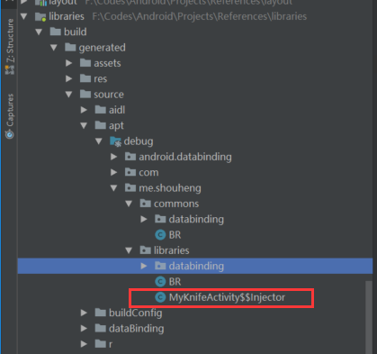

# Java 注解及其两种使用方法

一般的，注解在 Android 中有两种应用方式，一种方式是基于反射的，即在程序的运行期间获取类信息进行反射调用；另一种是使用注解处理，在编译期间生成许多代码，然后在运行期间通过调用这些代码来实现目标功能。

在本篇文章中，我们会先重温一下 Java 的注解相关的知识，然后分别介绍一下上面两种方式的实际应用。

## 1、Java 注解回顾

### 1. Java 注解的基础知识

Java 中的注解分成标准注解和元注解。标准注解是 Java 为我们提供的预定义的注解，共有四种：`@Override`、`@Deprecated`、`@SuppressWarnnings`和`@SafeVarags`。元注解是用来提供给用户自定义注解用的，共有五种（截止到Java8）：`@Target`、`@Retention`、`@Documented`、`@Inherited`和`@Repeatable`，这里我们重点介绍这五种元注解。

不过，首先我们还是先看一下一个基本的注解的定义的规范。下面我们自定义了一个名为`UseCase`的注解，可以看出我们用到了上面提及的几种元注解：

```java
	@Documented
	@Retention(RetentionPolicy.RUNTIME)
	@Target(value={METHOD, FIELD})
	public @interface UseCase {
        public int id();
        public String description() default "default value";
	}
```

这是一个普通的注解的定义。从上面我们也可以总结出，在定义注解的时候，有以下几个地方需要注意：

1. 使用`@interface`声明并且指定注解的名称；
2. 注解的定义类似于接口中的方法的定义，但要注意两者之间本质上是不同的；
3. 可以通过`default`为指定的元素指定一个默认值，如果用户没有为其指定值，就使用默认值。

### 2. 元注解

好的，看完了一个基本的注解的定义，我们来看一下上面用到的 Java 元注解的含义。

#### @Target

`@Target`用来指定注解能够修饰的对象的类型。因为`@Target`本身也是一个注解，所以你可以在源码中查看它的定义。该注解接收的参数是一个`ElementType`类型的数组，所以，就是说我们自定义的注解可以应用到多种类型的对象，而对象的类型由`ElementType`定义。`ElementType`是一个枚举，它的枚举值如下：

- TYPE：类、接口或者enum声明
- FIELD：域声明，包括enum实例
- METHOD：方法声明
- PARAMETER：参数声明
- CONSTRUCTOR：构造器声明
- LOCAL_VARIABLE：局部变量声明
- ANNOTATION_TYPE：注解声明
- PACKAGE：包声明
- TYPE_PARAMETER：类型参数声明
- TYPE_USE：使用类型

所以，比如根据上面的内容，我们可以直到我们的自定义注解`@UseCase`只能应用于方法和字段。

#### @Retention

用来指定注解的保留策略，比如有一些注解，当你在自己的代码中使用它们的时候你会把它写在方法上面，但是当你反编译之后却发现这些注解不在了；而有些注解反编译之后依然存在，发生这种情况的原因就是在使用该注解的时候指定了不同的参数。

与`@Target`相同的是这个注解也使用枚举来指定值的类型，不同的是它只能指定一个值，具体可以看源码。这里它使用的是`RetentionPolicy`枚举，它的几个值的含义如下：

- SOURCE：注解将被编译器丢弃
- CLASS：注解在class文件中使用，但会被JVM丢弃
- RUNTIME：VM将在运行期保留注解，故可以通过反射读取注解的信息

当我们在 Android 中使用注解的时候，一种是在运行时使用的，所以我们要用`RUNTIME`；另一种是在编译时使用的，所以我们用`CLASS`。

#### @Documented、@Inherited 和 @Repeatable

这三个元注解的功能比较简单和容易理解，这里我们一起给出即可：

- `@Documented`表示此注解将包含在 javadoc 中；
- `@Inherited`表示允许子类继承父类的注解；
- `@Repeatable`是 Java8 中新增的注解，表示指定的注解可以重复应用到指定的对象上面。

上文，我们回顾了 Java 中注解相关的知识点，相信你已经对注解的内容有了一些了解，那么我们接下来看一下注解在实际开发中的两种应用方式。

## 2、注解的两种使用方式

在我开始为我的开源项目[马克笔记](https://github.com/Shouheng88/MarkNote)编写数据库的时候，我考虑了使用注解来为数据库对象指定字段的信息，并根据这心信息来拼接出创建数据库表的 SQL 语句。当时也想用反射来动态为每个字段赋值的，但是考虑到反射的性能比较差，最终放弃了这个方案。但是，使用注解处理的方式可以完美的解决我们的问题，即在编译的时候动态生成一堆代码，实际赋值的时候调用这些方法来完成。这前后两种方案就是我们今天要讲的注解的两种使用方式。

### 2.1 基于反射使用注解

这里为了演示基于反射的注解的使用方式，我们写一个小的 Java 程序，要实现的目的是：定义两个个注解，一个应用于方法，一个应用于字段，然后我们使用这两个注解来定义一个类。我们想要在代码中动态地打印出使用了注解的方法和字段的信息和注解信息。

这里我们先定义两个注解，应用于字段的`@Column`注解和应用于方法`@Important`注解：

```java
    @Target(value = {ElementType.FIELD})
    @Retention(RetentionPolicy.RUNTIME)
    public @interface Column {
        String name();
    }

    @Target(value = {ElementType.METHOD})
    @Retention(RetentionPolicy.RUNTIME)
    public @interface WrappedMethod {

    }
```

然后我们定义了一个Person类，并使用注解为其中的部分方法和字段添加注解：

```java
    private static class Person {

        @Column(name = "id")
        private int id;

        @Column(name = "first_name")
        private String firstName;

        @Column(name = "last_name")
        private String lastName;

        private int temp;

        @WrappedMethod()
        public String getInfo() {
            return id + " :" + firstName + " " + lastName;
        }

        public String method() {
            return "Nothing";
        }
    }
```

然后，我们使用Person类来获取该类的字段和方法的信息，并输出具有注解的部分：

```java
    public static void main(String...args) {
        Class<?> c = Person.class;
        Method[] methods = c.getDeclaredMethods();
        for (Method method : methods) {
            if (method.getAnnotation(WrappedMethod.class) != null) {
                System.out.print(method.getName() + " ");
            }
        }
        System.out.println();
        Field[] fields = c.getDeclaredFields();
        for (Field field : fields) {
            Column column = field.getAnnotation(Column.class);
            if (column != null) {
                System.out.print(column.name() + "-" + field.getName() + ", ");
            }
        }
    }
```

输出结果：

    getInfo
    id-id, first_name-firstName, last_name-lastName, 

在上面的代码的执行结果，我们可以看出：使用了注解和反射之后，我们成功的打印出了使用了注解的字段。这里我们需要先获取指定的类的 Class 类型，然后用反射获取它的所有方法和字段信息并进行遍历，通过判断它们的`getAnnotation()`方法的结果来确定这个方法和字段是否使用了指定类型的注解。

上面的代码可以解决一些问题，但同时，我们还有一些地方需要注意：

1. **如果指定的方法或者字段名被混淆了怎么办？** 对于一些可以自定义名称的情景，我们可以在注解中加入参数为该字段或者方法指定一个名称；
2. **上面使用了很多的反射，这会影响程序的性能吗？** 使用注解的方式肯定性能不会高，但是如果注解的使用没有那么频繁，上面方法不会有特别大的性能损耗，比如拼接 SQL 这样的操作，可能只需要执行一次。不过，根本的解决办法是使用注解的第二种使用方式！

### 2.2 基于 annotationProcessor 使用注解

也许你之前已经使用过 ButterKnife 这样的注入框架，不知道你是否记得在 Gradle 中引用它的时候加入了下面这行依赖：

```groovy
    annotationProcessor 'com.jakewharton:butterknife-compiler:8.8.1'
```

这里的 annotationProcessor 就是我们这里要讲的**注解处理**。本质上它会在编译的时候，在你调用`ButterKnife.bind(this);`方法的那个类所在的包下面生成一些类，当调用`ButterKnife.bind(this);`的时候实际上就完成了为使用注解的方法和控件绑定的过程。也就是，本质上还是调用了`findViewById()`，只是这个过程被隐藏了，不用你来完成了，仅此而已。

下面，我们就使用注解处理的功能来制作一个类似于 ButterKnife 的简单库。不过，在那之前我们还需要做一些准备——一些知识点需要进行说明。即[Javapoet](https://github.com/square/javapoet)和`AbstractProcessor`。

#### Javapoet & AbstractProcessor

Javapoet 是一个用来生成`.java`文件的 Java API，由 Square 开发，你可以在它的 Github 主页中了解它的基本使用方法。它的好处就是对方法、类文件和代码等的拼接进行了封装，有了它，我们就不用再按照字符串的方式去拼接出一段代码了。相比于直接使用字符串的方式，它还可以生成代码的同时直接`import`对应的引用，可以说是非常方便、快捷的一个库了。

这里的`AbstractProcessor`是用来生成类文件的核心类，它是一个抽象类，一般使用的时候我们只要覆写它的方法中的4个就可以了。下面是这些方法及其定义：

1. `init`：在生成代码之前被调用，可以从它参数`ProcessingEnvironment`获取到非常多有用的工具类；
2. `process`：用于生成代码的 Java 方法，可以从参数`RoundEnvironment`中获取使用指定的注解的对象的信息，并包装成一个`Element`类型返回；
3. `getSupportedAnnotationTypes`：用于指定该处理器适用的注解；
4. `getSupportedSourceVersion`：用来指定你使用的 Java 的版本。

这几个方法中，除了`process`，其他方法都不是必须覆写的方法。这里的`getSupportedAnnotationTypes`和`getSupportedSourceVersion`可以使用注`@SupportedAnnotationTypes`和`@SupportedSourceVersion`来替换，但是不建议这么做。因为前面的注解接收的参数是字符串，如果你使用了混淆可能就比较麻烦，后面的注解只能使用枚举，相对欠缺了灵活性。

另一个我们需要特别说明的地方是，继承`AbstractProcessor`并实现了我们自己的处理器之后还要对它进行注册才能使用。一种做法是在与`java`相同的目录下面创建一个`resources`文件夹，并在其中创建`META-INF/service`文件夹，然后在其中创建一个名为`javax.annotation.processing.Processor`的文件，并在其中写上我们的处理器的完整路径。另一种做法是使用谷歌的`@AutoService`注解，你只需要在自己的处理器上面加上`@AutoService(Processor.class)`一行代码即可。当然，前提是你需要在自己的项目中引入依赖：

```groovy
    compile 'com.google.auto.service:auto-service:1.0-rc2'
```

按照后面的这种方式一样会在目录下面生成上面的那个文件，只是这个过程不需要我们来操作了。你可以通过查看buidl出的文件来找到生成的文件。

#### MyKnife 的最终结果

在定制之前，我们先看一下程序的最终执行结果，也许这样会更有助于理解整个过程的原理。我们程序的最终的执行结果是，在编译的时候，在使用我们的工具的类的相同级别的包下面生成一个类。如下图所示：



这里的`me.shouheng.libraries`是我们应用 MyKnife 的包，这里我们在它下面生成了一个名为`MyKnifeActivity$$Injector`的类，它的定义如下：

```java
    public class MyKnifeActivity$$Injector implements Injector<MyKnifeActivity> {
      @Override
      public void inject(final MyKnifeActivity host, Object source, Finder finder) {
        host.textView=(TextView)finder.findView(source, 2131230952);
        View.OnClickListener listener;
        listener = new View.OnClickListener() {
          @Override
          public void onClick(View view) {
            host.OnClick();
          }
        };
        finder.findView(source, 2131230762).setOnClickListener(listener);
      }
    }
```

因为我们应用`MyKnife`的类是`MyKnifeActivity`，所以这里就生成了名为`MyKnifeActivity$$Injector`的类。通过上面的代码，可以看出它实际上调用了`Finder`的方法来为我们的控件`textView`赋值，然后使用控件的`setOnClickListener()`方法为点击事件赋值。这里的`Finder`是我们封装的一个对象，用来从指定的源中获取控件的类，本质上还是调用了指定源的`findViewById()`方法。

然后，与 ButterKnife 类似的是，在使用我们的工具的时候，也需要在 Activity 的`onCreate()`中调用`bind()`方法。这里我们看下这个方法做了什么操作：

```java
    public static void bind(Object host, Object source, Finder finder) {
        String className = host.getClass().getName();
        try {
            Injector injector = FINDER_MAPPER.get(className);
            if (injector == null) {
                Class<?> finderClass = Class.forName(className + "$$Injector");
                injector = (Injector) finderClass.newInstance();
                FINDER_MAPPER.put(className, injector);
            }
            injector.inject(host, source, finder);
        } catch (ClassNotFoundException e) {
            e.printStackTrace();
        } catch (IllegalAccessException e) {
            e.printStackTrace();
        } catch (InstantiationException e) {
            e.printStackTrace();
        }
    }
```

从上面的代码中可以看出，调用`bind()`方法的时候会从`FINDER_MAPPER`尝试获取指定`类名$$Injector`的文件。所以，如果说我们应用`bind()`的类是`MyKnifeActivity`，那么这里获取到的类将会是`MyKnifeActivity$$Injector`。然后，当我们调用`inject`方法的时候就执行了我们上面的注入操作，来完成对控件和点击事件的赋值。这里的`FINDER_MAPPER`是一个哈希表，用来缓存指定的`Injector`的。所以，从上面也可以看出，这里进行值绑定的时候使用了反射，所以，在应用框架的时候还需要对混淆进行处理。

OK，看完了程序的最终结果，我们来看一下如何生成上面的那个类文件。

#### API 和注解的定义

首先，我们需要定义注解用来提供给用户进行事件和控件的绑定，

```java
    @Target(ElementType.FIELD)
    @Retention(RetentionPolicy.CLASS)
    public @interface BindView {
        int id();
    }

    @Target(ElementType.METHOD)
    @Retention(RetentionPolicy.CLASS)
    public @interface OnClick {
        int[] ids();
    }
```

如上面的代码所示，可以看出我们分别用了`ElementType.FIELD`和`ElementType.METHOD`指定它们是应用于字段和方法的，然后用了`RetentionPolicy.CLASS`标明它们不会被保留到程序运行时。

然后，我们需要定义`MyKnife`，它提供了一个`bind()`方法，其定义如下：

```java
    public static void bind(Object host, Object source, Finder finder) {
        String className = host.getClass().getName();
        try {
            Injector injector = FINDER_MAPPER.get(className);
            if (injector == null) {
                Class<?> finderClass = Class.forName(className + "$$Injector");
                injector = (Injector) finderClass.newInstance();
                FINDER_MAPPER.put(className, injector);
            }
            injector.inject(host, source, finder);
        } catch (ClassNotFoundException e) {
            e.printStackTrace();
        } catch (IllegalAccessException e) {
            e.printStackTrace();
        } catch (InstantiationException e) {
            e.printStackTrace();
        }
    }
```

这里的三个参数的含义分别是：`host`是调用绑定方法的类，比如 Activity 等；`source`是从用来获取绑定的值的数据源，一般理解是从`source`中获取控件赋值给`host`中的字段，通常两者是相同的；最后一个参数`finder`是一个接口，是获取数据的方法的一个封装，有两默认的实现，一个是`ActivityFinder`，一个是`ViewFinder`，分别用来从 Activity 和 View 中查找控件。

我们之前已经讲过`bind()`方法的作用，即使用反射根据类名来获取一个`Injector`，然后调用它的`inject()`方法进行注入。这里的`Injector`是一个接口，我们不会写代码去实现它，而是在编译的时候让编译器直接生成它的实现类。

#### 代码的生成过程

在介绍 Javapoet 和 AbstractProcessor 的时候，我们提到过 Element，它封装了应用注解的对象（方法、字段或者类等）的信息。我们可以从 Element 中获取这些信息并将它们封装成一个对象来方便我们调用。于是就产生了`BindViewField`和`OnClickMethod`两个类。它们分别用来描述使用`@BindView`注解和使用`@OnClick`注解的对象的信息。此外，还有一个`AnnotatedClass`，它用来描述使用注解的整个类的信息，并且其中定义了`List<BindViewField>`和`List<OnClickMethod>`，分别用来存储该类中应用注解的字段和方法的信息。

与生成文件和获取注解的对象信息相关的几个字段都是从 AbstractProcessor 中获取的。如下面的代码所示，我们可以从 AbstractProcessor 的`init()`方法的`ProcessingEnvironment`中获取到`Elements`、`Filer`和`Messager`。它们的作用分别是：`Elements`类似于一个工具类，用来从`Element`中获取注解对象的信息；`Filer`用来支持通过注释处理器创建新文件；`Messager`提供注释处理器用来报告错误消息、警告和其他通知的方式。

```java
    @Override
    public synchronized void init(ProcessingEnvironment processingEnvironment) {
        super.init(processingEnvironment);
        elements = processingEnvironment.getElementUtils();
        messager = processingEnvironment.getMessager();
        filer = processingEnvironment.getFiler();
    }
```

然后在 AbstractProcessor 的`process()`方法中的`RoundEnvironment`参数中，我们又可以获取到指定注解对应的`Element`信息。代码如下所示：

```java
    private Map<String, AnnotatedClass> map = new HashMap<>();

    @Override
    public boolean process(Set<? extends TypeElement> set, RoundEnvironment roundEnvironment) {
        map.clear();
        try {
            // 分别用来处理我们定义的两种注解
            processBindView(roundEnvironment);
            processOnClick(roundEnvironment);
        } catch (IllegalArgumentException e) {
            return true;
        }

        try {
            // 为缓存的各个使用注解的类生成类文件
            for (AnnotatedClass annotatedClass : map.values()) {
                annotatedClass.generateFinder().writeTo(filer);
            }
        } catch (Exception e) {
            e.printStackTrace();
        }
        return true;
    }

    // 从RoundEnvironment中获取@BindView注解的信息
    private void processBindView(RoundEnvironment roundEnv) {
        for (Element element : roundEnv.getElementsAnnotatedWith(BindView.class)) {
            AnnotatedClass annotatedClass = getAnnotatedClass(element);
            BindViewField field = new BindViewField(element);
            annotatedClass.addField(field);
        }
    }

    // 从RoundEnvironment中获取@OnClick注解的信息
    private void processOnClick(RoundEnvironment roundEnv) {
        for (Element element : roundEnv.getElementsAnnotatedWith(OnClick.class)) {
            AnnotatedClass annotatedClass = getAnnotatedClass(element);
            OnClickMethod method = new OnClickMethod(element);
            annotatedClass.addMethod(method);
        }
    }

    // 获取使用注解的类的信息，先尝试从缓存中获取，缓存中没有的话就实例化一个并放进缓存中
    private AnnotatedClass getAnnotatedClass(Element element) {
        TypeElement encloseElement = (TypeElement) element.getEnclosingElement();
        String fullClassName = encloseElement.getQualifiedName().toString();
        AnnotatedClass annotatedClass = map.get(fullClassName);
        if (annotatedClass == null) {
            annotatedClass = new AnnotatedClass(encloseElement, elements);
            map.put(fullClassName, annotatedClass);
        }
        return annotatedClass;
    }
```

上面的代码的逻辑是，在调用`process()`方法的时候，会根据传入的`RoundEnvironment`分别处理两种注解。两个注解的相关信息都会被解析成`List<BindViewField>`和`List<OnClickMethod>`，然后把使用注解的整个类的信息统一放置在`AnnotatedClass`中。为了提升程序的效率，这里用了缓存来存储类信息。最后，我们调用了`annotatedClass.generateFinder()`获取一个JavaFile，并调用它的`writeTo(filer)`方法生成类文件。

上面的代码重点在于解析使用注解的类的信息，至于如何根据类信息生成类文件，我们还需要看下`AnnotatedClass`的`generateFinder()`方法，其代码如下所示。这里我们用了之前提到的 Javapoet 来帮助我们生成类文件：

```java
    public JavaFile generateFinder() {
        // 这里用来定义inject方法的签名
        MethodSpec.Builder builder = MethodSpec.methodBuilder("inject")
                .addModifiers(Modifier.PUBLIC)
                .addAnnotation(Override.class)
                .addParameter(TypeName.get(typeElement.asType()), "host", Modifier.FINAL)
                .addParameter(TypeName.OBJECT, "source")
                .addParameter(TypeUtils.FINDER, "finder");
        // 这里用来定义inject方法中@BindView注解的绑定过程
        for (BindViewField field : bindViewFields) {
            builder.addStatement("host.$N=($T)finder.findView(source, $L)",
                    field.getFieldName(),
                    ClassName.get(field.getFieldType()),
                    field.getViewId());
        }
        // 这里用来定义inject方法中@OnClick注解的绑定过程
        if (onClickMethods.size() > 0) {
            builder.addStatement("$T listener", TypeUtils.ONCLICK_LISTENER);
        }
        for (OnClickMethod method : onClickMethods) {
            TypeSpec listener = TypeSpec.anonymousClassBuilder("")
                    .addSuperinterface(TypeUtils.ONCLICK_LISTENER)
                    .addMethod(MethodSpec.methodBuilder("onClick")
                            .addAnnotation(Override.class)
                            .addModifiers(Modifier.PUBLIC)
                            .returns(TypeName.VOID)
                            .addParameter(TypeUtils.ANDROID_VIEW, "view")
                            .addStatement("host.$N()", method.getMethodName())
                            .build())
                    .build();
            builder.addStatement("listener = $L", listener);
            for (int id : method.getIds()) {
                builder.addStatement("finder.findView(source, $L).setOnClickListener(listener)", id);
            }
        }
        // 这里用来获取要生成的类所在的包的信息
        String packageName = getPackageName(typeElement);
        String className = getClassName(typeElement, packageName);
        ClassName bindClassName = ClassName.get(packageName, className);

        // 用来最终组装成我们要输出的类
        TypeSpec finderClass = TypeSpec.classBuilder(bindClassName.simpleName() + "$$Injector")
                .addModifiers(Modifier.PUBLIC)
                .addSuperinterface(ParameterizedTypeName.get(TypeUtils.INJECTOR, TypeName.get(typeElement.asType())))
                .addMethod(builder.build())
                .build();
        return JavaFile.builder(packageName, finderClass).build();
    }
```

上面就是我们用来最终生成类文件的方法，这里用了 Javapoet ，如果对它不是很了解可以到 Github 上面了解一下它的用法。

这样我们就完成了整个方法的定义。

#### 使用 MyKnife

使用我们定义的 MyKnife ，我们只需要在 Gradle 里面引入我们的包即可：

```groovy
    implementation project(':knife-api')
    implementation project(':knife-annotation')
    annotationProcessor project(':knife-compiler')
```

也许你在有的地方看到过要使用`android-apt`引入注解处理器，其实这里的`annotationProcessor`与之作用是一样的。这里推荐使用`annotationProcessor`，因为它更加简洁，不需要额外的配置，也是官方推荐的使用方式。

然后，我们只需要在代码中使用它们就可以了：

```java
public class MyKnifeActivity extends CommonActivity<ActivityMyKnifeBinding> {

    @BindView(id = R.id.tv)
    public TextView textView;

    @OnClick(ids = {R.id.btn})
    public void OnClick() {
        ToastUtils.makeToast("OnClick");
    }

    @Override
    protected int getLayoutResId() {
        return R.layout.activity_my_knife;
    }

    @Override
    protected void doCreateView(Bundle savedInstanceState) {
        MyKnife.bind(this);
        textView.setText("This is MyKnife demo!");
    }
}
```

这里有几个地方需要注意：

1. 使用注解的方法和字段需要至少是`protected`，因为我们使用了直接引用的方式，而生成的文件和上面的类包相同，所以至少应该保证包级别访问权限；
2. 上面使用注解的方式只能在当前 Module 作为 application 的时候使用，作为 library 的时候无法使用，这是因为只有当 Module 作为 application 的时候，R文件中的 id 是 final 的，作为 library 的时候是非 final 的。

#### 总结

这里我们总结一下按照第二种方式使用注解的时候需要步骤：

1. 首先，我们需要按照自己的需要考虑如何定义注解。
2. 然后，我们需要实现 AbstractProcessor ，覆写各个方法，注册，并在 process 方法中完成生成类文件的操作。

## 3、总结

以上就是注解的两种比较常见的使用方式。第一种是通过反射来进行的，因为反射本身的效率比较低，所以比较适用于发射比较少的场景；第二种方式是在编译期间通过编译器生成代码来实现的，相比于第一种，它还是可能会用到反射的，但是不必在运行时对类的每个方法和字段进行遍历，因而效率高得多。

以上。

获取源码：[Android-references](https://github.com/Shouheng88/Android-references)