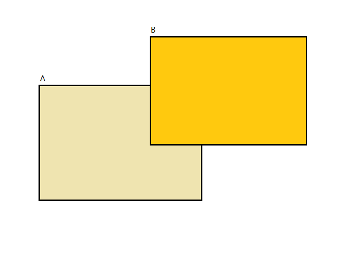

# 浅谈 LiveData 的通知机制

LiveData 和 ViewModel 一起是 Google 官方的 MVVM 架构的一个组成部分。巧了，昨天分析了一个问题是 ViewModel 的生命周期导致的。今天又遇到了一个问题是 LiveData 通知导致的。而 ViewModel 的生命周期和 LiveData 的通知机制是它们的主要责任。所以，就这个机会我们也来分析一下 LiveData 通知的实现过程。

1. 关于 ViewModel 的生命周期：[《浅谈 LiveData 的通知机制》](高阶技术/浅谈ViewModel生命周期控制.md);
2. 关于 MVVM 设计模式的基本应用，你可以参考这篇文章：[《Android 架构设计：MVC、MVP、MVVM和组件化》](高阶技术/探索Android架构设计.md).

## 1、一个 LiveData 的问题

今天所遇到的问题是这样的，



有两个页面 A 和 B，A 是一个 Fragment ，是一个列表的展示页；B 是其他的页面。首先，A 会更新页面，并且为了防止连续更新，再每次更新之前需要检查一个布尔值，只有为 false 的时候才允许从网络加载数据。每次加载数据之前会将该布尔值置为 true，拿到了结果之后置为 false. 这里拿到的结果是借助 LiveData 来通知给页面进行更新的。

现在，A 打开了 B，B 中对列表中的数据进行了更新，然后发了一条类似于广播的消息。此时，A 接收了消息并进行数据加载。过了一段时间，B 准备退出，再退出的时候又对列表中的项目进行了更新，所以此时又发出了一条消息。

B 关闭了，我们回到了 A 页面。但是，此时，我们发现 A 页面中的数据只包含了第一次的数据更新，第二次的数据更新没有体现在列表中。

用代码来描述的话大致是下面这样，

```java
    // 类 A
    public class A extends Fragment {
    
        private boolean loading = false;

        private MyViewModel vm;

        // ......

        /**
         * Register load observer.
         */
        public void registerObservers() {
            vm.getData().observe(this, resources -> {
                loading = false;
                // ... show in list
            })
        }

        /**
         * Load data from server.
         */
        public void loadData() {
            if (loading) return;
            loading = true;
            vm.load();
        }

        /**
         * On receive message.
         */
        public void onReceive() {
            loadData();
        }
    }

    public class B extends Activity {

        public void doBusiness1() {
            sendMessage(MSG); // Send message when on foreground.
        }

        @Override
        public void onBackpressed() {
            // ....
            sendMessage(MSG); // Send message when back
        }
    }

    public class MyViewModel extends ViewModel {

        private MutableLiveData<Resoucres<Object>> data;

        public MutableLiveData<Resoucres<Object>> getData() {
            if (data == null) {
                data = new MutableLiveData<>();
            }
            return data;
        }

        public void load() {
            Object result = AsyncGetData.getData(); // Get data
            if (data != null) {
                data.setValue(Resouces.success(result));
            }
        }
    }
```

A 打开了 B 之后，A 处于后台，B 处于前台。此时，B 调用 `doBusiness1()` 发送了一条消息 MSG，A 中在 `onReceive()` 中收到消息，并调用 `loadData()` 加载数据。然后，B 处理完了业务，准备退出的时候发现其他数据发生了变化，所以又发了一条消息，然后 `onReceive()` 中收到消息，并调用 `loadData()`. 但此时发现 loading 为 true. 所以，我们后来对数据的修改没有体现到列表上面。

## 2、问题的原因

如果用上面的示例代码作为例子，那么出现问题的原因就是当 A 处于后台的时候。虽然调用了 `loadData()` 并且从网络中拿到了数据，但是调用 `data.setValue()` 方法的时候无法通知到 A 中。所以，`loading = false` 这一行无法被调用到。第二次发出通知的时候，一样调用到了 `loadData()`，但是因为此时 `loading` 为 true，所以并没有执行加载数据的操作。而当从 B 中完全回到 A 的时候，第一次加载的数据被 A 接收到。所以，列表中的数据是第一次加载时的数据，第二次加载事件丢失了。

解决这个问题的方法当然比较简单，可以当接收到事件的时候使用布尔变量监听，然后回到页面的时候发现数据发生变化再执行数据加载：

```java
    // 类 A
    public class A extends Fragment {
    
        private boolean dataChanged;

        /**
         * On receive message.
         */
        public void onReceive() {
            dataChanged = true;
        }

        @Override
        public void onResume() {
            // ...
            if (dataChanged) {
                loadData();
            }
        }
    }
```

对于上面的问题，当我们调用了 `setValue()` 之后将调用到 LiveData 类的 `setValue()` 方法，

```java
    @MainThread
    protected void setValue(T value) {
        assertMainThread("setValue");
        mVersion++;
        mData = value;
        dispatchingValue(null);
    }
```

这里表明该方法必须在主线程中被调用，最终事件的分发将会交给 `dispatchingValue()` 方法来执行：

```java
    private void dispatchingValue(@Nullable ObserverWrapper initiator) {
        if (mDispatchingValue) {
            mDispatchInvalidated = true;
            return;
        }
        mDispatchingValue = true;
        do {
            mDispatchInvalidated = false;
            if (initiator != null) {
                considerNotify(initiator);
                initiator = null;
            } else {
                for (Iterator<Map.Entry<Observer<T>, ObserverWrapper>> iterator =
                        mObservers.iteratorWithAdditions(); iterator.hasNext(); ) {
                    // 发送事件
                    considerNotify(iterator.next().getValue());
                    if (mDispatchInvalidated) {
                        break;
                    }
                }
            }
        } while (mDispatchInvalidated);
        mDispatchingValue = false;
    }
```

然后，会调用 `considerNotify()` 方法来最终将事件传递出去，

```java
    private void considerNotify(ObserverWrapper observer) {
        // 这里会因为当前的 Fragment 没有处于 active 状态而退出方法
        if (!observer.mActive) {
            return;
        }
        if (!observer.shouldBeActive()) {
            observer.activeStateChanged(false);
            return;
        }
        if (observer.mLastVersion >= mVersion) {
            return;
        }
        observer.mLastVersion = mVersion;
        observer.mObserver.onChanged((T) mData);
    }
```

这里会因为当前的 Fragment 没有处于 active 状态而退出 `considerNotify()` 方法，从而消息无法被传递出去。

## 3、LiveData 的通知机制

LiveData 的通知机制并不复杂，它的类主要包含在 `livedata-core` 包下面，总共也就 3 个类。LiveData 是一个抽象类，它有一个默认的实现就是 MutableLiveData. 

LiveData 主要依靠内部的变量 `mObservers` 来缓存订阅的对象和订阅信息。其定义如下，使用了一个哈希表进行缓存和映射，

```java
private SafeIterableMap<Observer<T>, ObserverWrapper> mObservers = new SafeIterableMap<>();
```

每当我们调用一次 `observe()` 方法的时候就会有一个映射关系被加入到哈希表中，

```java
    public void observe(@NonNull LifecycleOwner owner, @NonNull Observer<T> observer) {
        if (owner.getLifecycle().getCurrentState() == DESTROYED) {
            // 持有者当前处于被销毁状态，因此可以忽略此次观察
            return;
        }
        LifecycleBoundObserver wrapper = new LifecycleBoundObserver(owner, observer);
        ObserverWrapper existing = mObservers.putIfAbsent(observer, wrapper);
        if (existing != null && !existing.isAttachedTo(owner)) {
            throw new IllegalArgumentException("Cannot add the same observer"
                    + " with different lifecycles");
        }
        if (existing != null) {
            return;
        }
        owner.getLifecycle().addObserver(wrapper);
    }
```

从上面的代码我们可以看出，添加到映射关系中的类会先被包装成 `LifecycleBoundObserver` 对象。然后使用该对象对 owner 的生命周期进行监听。

这的 `LifecycleBoundObserver` 和 `ObserverWrapper` 两个类的定义如下，

```java
    class LifecycleBoundObserver extends ObserverWrapper implements GenericLifecycleObserver {
        @NonNull final LifecycleOwner mOwner;

        LifecycleBoundObserver(@NonNull LifecycleOwner owner, Observer<T> observer) {
            super(observer);
            mOwner = owner;
        }

        @Override
        boolean shouldBeActive() {
            return mOwner.getLifecycle().getCurrentState().isAtLeast(STARTED);
        }

        @Override
        public void onStateChanged(LifecycleOwner source, Lifecycle.Event event) {
            if (mOwner.getLifecycle().getCurrentState() == DESTROYED) {
                removeObserver(mObserver);
                return;
            }
            activeStateChanged(shouldBeActive());
        }

        @Override
        boolean isAttachedTo(LifecycleOwner owner) {
            return mOwner == owner;
        }

        @Override
        void detachObserver() {
            mOwner.getLifecycle().removeObserver(this);
        }
    }

    private abstract class ObserverWrapper {
        final Observer<T> mObserver;
        boolean mActive;
        int mLastVersion = START_VERSION;

        ObserverWrapper(Observer<T> observer) {
            mObserver = observer;
        }

        abstract boolean shouldBeActive();

        boolean isAttachedTo(LifecycleOwner owner) {
            return false;
        }

        void detachObserver() {}

        void activeStateChanged(boolean newActive) {
            if (newActive == mActive) {
                return;
            }
            mActive = newActive;
            boolean wasInactive = LiveData.this.mActiveCount == 0;
            LiveData.this.mActiveCount += mActive ? 1 : -1;
            if (wasInactive && mActive) {
                onActive();
            }
            if (LiveData.this.mActiveCount == 0 && !mActive) {
                onInactive();
            }
            if (mActive) {
                dispatchingValue(this);
            }
        }
    }
```

上面的类中我们先来关注 `LifecycleBoundObserver` 中的 `onStateChanged()` 方法。该方法继承自 `LifecycleObserver`. 这里的 `Lifecycle.Event` 是一个枚举类型，定义了一些与生命周期相关的枚举值。所以，当 Activity 或者 Fragment 的生命周期发生变化的时候会回调这个方法。从上面我们也可以看出，该方法内部又调用了基类的 `activeStateChanged()` 方法，该方法主要用来更新当前的 Observer 是否处于 Active 的状态。我们上面无法通知也是因为在这个方法中 mActive 被置为 false 造成的。

继续看 `activeStateChanged()` 方法，我们可以看出在最后的几行中，它调用了 `dispatchingValue(this)` 方法。所以，当 Fragment 从处于后台切换到前台之后，会将当前缓存的值通知给观察者。

那么值是如何缓存的，以及缓存了多少值呢？回到之前的 `setValue()` 和 `dispatchingValue()` 方法中，我们发现值是以一个单独的变量进行缓存的，

```java
    private volatile Object mData = NOT_SET;
```

因此，在我们的示例中，当页面从后台切换到前台的时候，只能将最后一次缓存的结果通知给观察者就真相大白了。

## 总结

从上面的分析中，我们对 LiveData 总结如下，

3. 当调用 `observe()` 方法的时候，我们的观察者将会和 LifecycleOwner (Fragment 或者 Activity) 一起被包装到一个类中，并使用哈希表建立映射关系。同时，还会对 Fragment 或者 Activity 的生命周期方法进行监听，依次来达到监听观察者是否处于 active 状态的目的。
2. 当 Fragment 或者 Activity 处于后台的时候，其内部的观察者将处于非 active 状态，此时使用 `setValue()` 设置的值会缓存到 LiveData 中。但是这种缓存只能缓存一个值，新的值会替换旧的值。因此，当页面从后台恢复到前台的时候只有最后设置的一个值会被传递给观察者。
3. 2 中的当 Fragment 或者 Activity 从后台恢复的时候进行通知也是通过监听其生命周期方法实现的。
4. 调用了 `observe()` 之后，Fragment 或者 Activity 被缓存了起来，不会造成内存泄漏吗？答案是不会的。因为 LiveData 可以对其生命周期进行监听，当其处于销毁状态的时候，该映射关系将被从缓存中移除。

以上。


